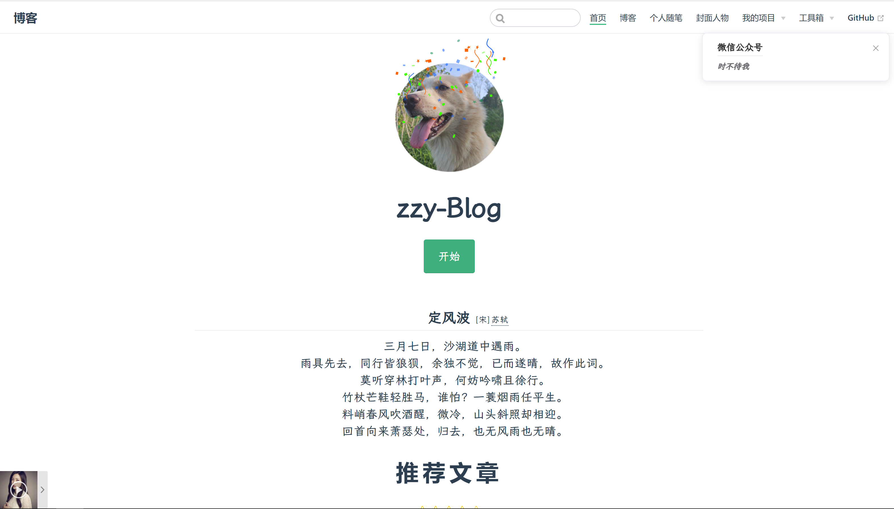
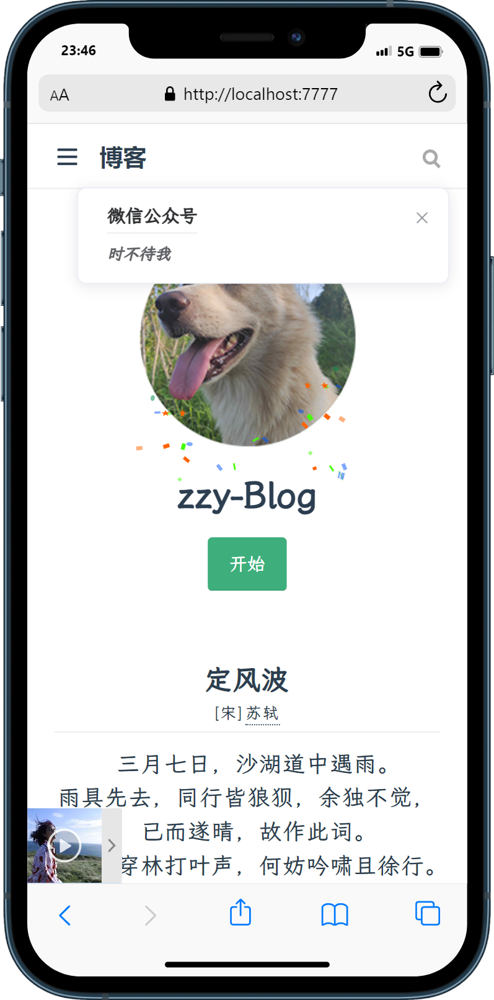

<p align="center">
  <a href="https://vuepress.vuejs.org/" target="_blank">
    
  </a>
</p>

<p align="center">
 </a>
  <a href="https://www.npmjs.com/package/vuepress"></a>
  <a href="https://github.com/vuejs/vuepress/blob/master/LICENSE"></a>
  <a href="https://discordapp.com/invite/HBherRA"></a>
</p>
## 特点

使用vuepress制作的[个人博客静态站点](http://www.zhangzhiyu.live:8900/vuepress/)





### 拥有以下特点

**:gift_heart:** **VuePress** 会将**Markdown**语言文件生成预渲染好的 HTML，具有非常好的加载性能和搜索引擎优化（SEO）

**:gift_heart:** **Markdown**既可以在本地预览编辑，并且vuepress可以直接进行网页编译渲染，不需要操作代码，专注于写作

**:gift_heart:** 非常好的自适应网页（包括PC，移动端，平板）

总而言之，vuepress最大的优点则是**不需要维护代码**，在本地写Markdown编译就是一个网页

### 集成了

**:gift_heart:** 静态全站搜索插件 **:gift_heart:** MD图表支持插件 **:gift_heart:** 音乐播放器插件 

**:gift_heart:** 饿了么UI库 **:gift_heart:** primevue组件库 **:gift_heart:** 霞鹜文楷字体

**:gift_heart:** vue-lottie动画库

### 修复了

**:gift_heart:** vuepress的中文URL路径错误问题 

**:gift_heart:** 中文URL锚点无法跳转问题 

**:gift_heart:** 滑动页面左侧导航栏未进行跟随问题 

**:gift_heart:** 全文搜索插件移动端适配问题 

**:gift_heart:** 音乐插件图片报错

本地音源没有自动注入vuepress的base基础路径

API报错导致无法正确加载等问题


## 运行&打包

首要

```bash
npm i
```

运行

```bash
npm run dev
```

打包

```bash
npm run build
```


## 使用组件

[vuepress-plugin-fulltext-search](https://github.com/leo-buneev/vuepress-plugin-fulltext-search) 静态的全文搜索插件

[vuepress-plugin-mermaidjs](https://github.com/eFrane/vuepress-plugin-mermaidjs) mermaid.js 图表的 Vuepress 插件 用以支持md语法中的图表

[vuepress-plugin-meting](https://github.com/moefyit/vuepress-plugin-meting) 播放器插件

[element-ui](https://element.eleme.cn/#/zh-CN/component/installation) UI组件库


## 使用相关文档请参见

 https://vuepress.vuejs.org/.


## License

[MIT](https://github.com/vuejs/vuepress/blob/master/LICENSE)
