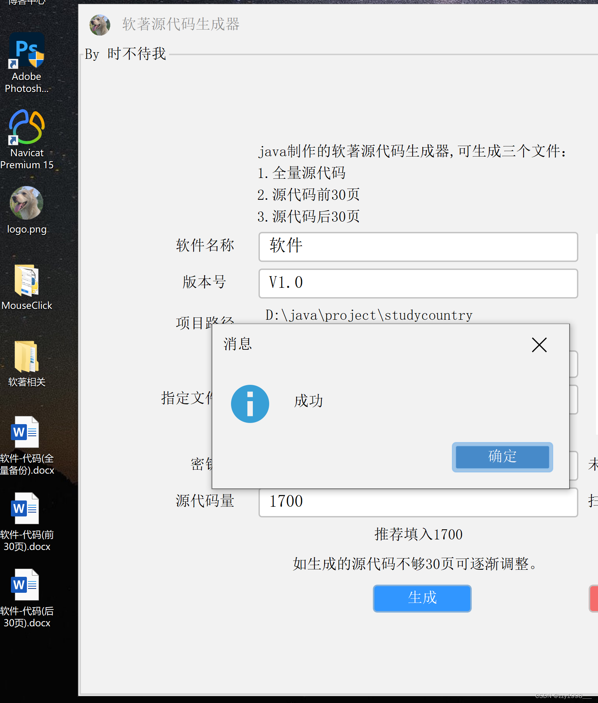

<!-- kinesis首页动画 -->

<!-- <template>

  <el-dialog
  title="支付宝红包又来啦"
  :visible.sync="dialogVisible"
center>
  

  

    
    <el-image
      style="width: 100%; height: 100%"
      src="./img/zhifubao.jpg"
      fit="cover"></el-image>
  

</el-dialog>

</template>

 -->

<template>
  

    

    

      <h2>定风波[宋]<abbr title="号东坡居士">苏轼</abbr></h2>
        

        三月七日，沙湖道中遇雨。 雨具先去，同行皆狼狈，余独不觉，已而遂晴，故作此词。 
        莫听穿林打叶声，何妨吟啸且徐行。 竹杖芒鞋轻胜马，谁怕？一蓑烟雨任平生。 
        料峭春风吹酒醒，微冷，山头斜照却相迎。 回首向来萧瑟处，归去，也无风雨也无晴。 
        

    

      <lottie
        class="lottie"
        :options="defaultOptions.confettiData"
        :height="300"
        v-on:animCreated="handleAnimation($event, 'confettiData')"
      />
      

        

          推荐文章
        

        <lottie
          class="starslottie"
          :options="defaultOptions.starsData"
          v-on:animCreated="handleAnimation($event, 'starsData')"
        />
        

          <router-link
            class="col-12 lg:col-4 cursor-pointer"
            to="./guide/python/人脸识别"
          >
            

              <Card class="card">
                <template #header>
                  
                </template>
                <template #title>
                  
人脸识别服务

                </template>
                <template #content>
                  

                    基于Face
                    Recognition，Mysql，PostgreSQL数据库的私有化人脸检索服务，可用于登陆，人脸考勤等.
                  

                </template>
                <template #footer> </template>
              </Card>
            

          </router-link>
          <router-link
            class="col-12 lg:col-4 cursor-pointer"
            to="./guide/plugInUnit/软著源代码材料生成器"
          >
            

              <Card class="hover:shadow-7 card">
                <template #header>
                  
                </template>
                <template #title>
                  
软著源代码材料生成器

                </template>
                <template #content>
                  

                    可一键生成软件著作权所需源代码材料。
                  

                </template>
                <template #footer> </template>
              </Card>
            

          </router-link>
          <router-link
            class="col-12 lg:col-4 cursor-pointer"
            to="./figure/EvanYou/尤雨溪谈Vue.js ：缔造自由与真我"
          >
            

              <Card class="hover:shadow-6 card">
                <template #header>
                  
                </template>
                <template #title>
                  
尤雨溪谈Vue.js

                </template>
                <template #content>
                  

                    前端框架Vue.js
                    作者，独立开源开发者，现居美国新泽西，现在全职开发和维护
                    Vue.js，vite，vitepress，vuepress。
                  

                </template>
                <template #footer> </template>
              </Card>
            

          </router-link>
        

      

    

  

</template>

