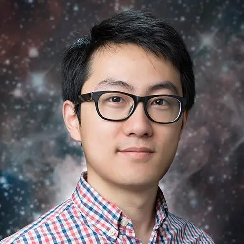
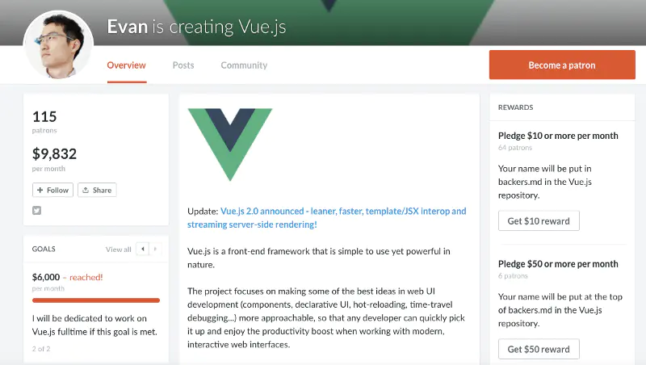
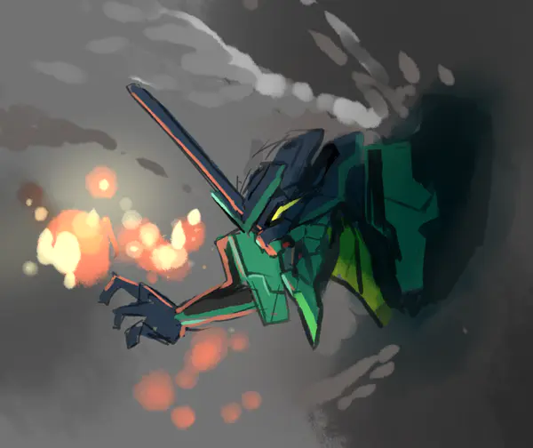

# 尤雨溪 — IT界华人的骄傲

> 尤雨溪 — IT界华人的骄傲

 原文链接：[medium.freecodecamp.com](https://links.jianshu.com/go?to=https%3A%2F%2Fmedium.freecodecamp.com%2Fbetween-the-wires-an-interview-with-vue-js-creator-evan-you-e383cbf57cc4) 

 

*我采访了尤雨溪，著名渐进式 JavaScript 框架 vuejs.org 的创造者。尤雨溪现通过 Patreon 平台众筹全职开发 Vue 的资金。他还曾在 Google 和 Meteor 工作过。*

*这篇文章[最初](https://links.jianshu.com/go?to=https%3A%2F%2Fbetweenthewires.org%2F2016%2F11%2F03%2Fevan-you%2F)发布在[Between the Wires](https://links.jianshu.com/go?to=https%3A%2F%2Fbetweenthewires.org%2F)，这是一个采访系列，专门采访那些为程序员开发产品的人。*

## 和我们讲讲你的童年和你的家乡吧

好的，我出生在中国，我的家乡叫无锡，一个中等规模的城市，离上海很近。然后我在上海念了三年高中，因此经常两地来回跑。高中毕业后我去了美国念大学。我感觉我接触电脑比较早，但是我当时并没有真正开始编程。我对游戏更感兴趣，我在高中时，就经常玩 Flash，因为我非常喜欢制作互动的效果来讲述故事。

  

1996 年尤雨溪和他的第一台电脑

## 谈一谈你的第一次编程经历？

「JavaScript 很吸引我，因为它能够快速构建一些东西并分享给别人。把它放在网上，通过一个网址，任何有浏览器的人都可以看到。这就是吸引我开始 Web 开发和 JavaScript 编程的原因。」

当我在美国上大学的时候，老实说，我不知道我想要做什么，而且我的专业是室内艺术和艺术史。当我快毕业时，我感觉很难找到和专业相关的工作。

我盘算着或许我可以去一个适合我的硕士课程，学习更多的技能。我去了 Parsons，读了一个美术设计和技术的硕士。这是一个非常好的专业，因为每个人都是既学习设计也学习编程。他们会教一些比如 openFrameworks，处理，动画算法之类的课程，而且你也必须写应用程序和交互界面。

Parsons 没有真正涉及很多的 JavaScript，但是 JavaScript 很吸引我，因为它能够快速构建一些东西并分享给别人。把它放在网上，通过一个网址，任何有浏览器的人都可以看到。这就是吸引我开始 Web 开发和 JavaScript 编程的原因。

当时[Chrome experiments](https://links.jianshu.com/go?to=https%3A%2F%2Fwww.chromeexperiments.com%2F)这个网站刚刚发布，我深深的被震撼了。我立即开始学习 JavaScript，并开始开发类似 Chrome experiments 的项目。我把这些项目放在我的简历上，然后被 Google 创意实验室的招聘人员注意到了。我加入了[Five program](https://links.jianshu.com/go?to=https%3A%2F%2Fwww.creativelab5.com%2F)。每年创意实验室会招五名应届毕业生，组成一个小组，一个人写文案，一个人搞技术，一个人做平面设计，一个人统筹安排和一个打杂的。

## 好的，什么时候或者是什么驱使你开发 Vue.js 的？

我在 Google 的工作需要在浏览器上进行大量原型设计，于是我想要尽快获得有形的东西。当时有些项目使用了[Angular](https://links.jianshu.com/go?to=https%3A%2F%2Fangular.io%2F)。Angular 提供了一些用数据绑定和数据驱动来处理 DOM 的方法，所以你不必自己碰 DOM。它也有一些副作用，就是按照它规定的方式来构建代码。对于当时的场景而言实在是太重了。

我想，我可以只把我喜欢的部分从 Angular 中提出来，建立一个非常轻巧的库，不需要那些额外的逻辑。我也很好奇 Angular 的源码到底是怎么设计的。我最开始只是想着手提取 Angular 里面很小的功能，如声明式数据绑定。Vue 大概就是这么开始的。

用过一段时间之后，我感觉我做的东西还有点前途，因为我自己就很喜欢用。于是我花了更多的时间把它封装好，取了一个名字叫做[Vue.js](https://links.jianshu.com/go?to=http%3A%2F%2Fvuejs.org%2F)，我记得那时还是 2013 年。后来我想『我花了这么多时间，不能只有我一个人用，我应该和别人分享，他们也会感觉到 Vue 的好处，他们也会喜欢上 Vue 的。』

2014 年 2 月，我第一次将它作为实际的项目发布在 Github 上，并把链接发送到了 Hacker News 上，它就被顶到了首页，然后它在首页待了好几个小时。后来，我写了[一篇文章](https://links.jianshu.com/go?to=http%3A%2F%2Fblog.evanyou.me%2F2014%2F02%2F11%2Ffirst-week-of-launching-an-oss-project)，分享了 Vue 第一周的使用数据以及我的感受。

那是我第一次看见这么多人在 Github 上为一个项目打星星。我当时一个星期收获了好几百个星星，整个人都激动坏了。

## 如果让你列出几个其它的框架和 Vue 的核心功能相比，那么你列举哪些？

我认为在所有的框架中，Vue 可能与[React](https://links.jianshu.com/go?to=https%3A%2F%2Ffacebook.github.io%2Freact)最像，但从更广泛的意义上说，在所有框架中，我自己创造了一个概念叫渐进的框架。因为 Vue 的核心组成只是数据绑定和组件，和 React 差不多。它只是解决了一小部分很重要的痛点。与 React 相比，Vue 可能更简单易用，只知道一些 HTML，JavaScript 和 CSS 知识的人都可以很快入门 Vue。

在框架层面上，我是用一个非常精简和尽可能小的的内核来构建的。但是当构建更复杂的应用的时候，有很多其他的问题需要解决。比如说路由，或者说怎么处理跨组件通信，怎么样在大型应用程序中共享状态，这样的话我们就还需要更多的构建工具来模块化我们的代码库。怎么样来组织样式和各种各样的静态资源？像[Ember](https://links.jianshu.com/go?to=http%3A%2F%2Femberjs.com%2F)或[Angular](https://links.jianshu.com/go?to=https%3A%2F%2Fangularjs.org%2F)这些非常完整的框架，它们就想解决所有可能遇到的这些问题，并把这些功能全都集成到框架中。

这就叫有得必有失吧。对用户使用情况的假设越多，框架最终的灵活性就越低。或者像 React 这样把很多问题都留给社区。React 社区是非常非常活跃的，经常有很多牛 X 的想法跳出来，当然也有不少不完美的想法。Vue 就是比较折中，仍然保持一个很小的核心，只提供一些最重要的功能。但是我们还是在逐渐提供一些更多的独立解决方案，比如说路由，状态管理，构建工具链和 CLI。它们都是官方维护的，有很好的文档，设计的也非常好，可以各种搭配使用，但重点是不需要的时候就可以不用。我认为这可能是 Vue 作为一个框架最大的特色。

## 你如何通过 Vue.js 来变现的？

「我为开发者们创造了价值，所以从理论上说，如果我能以某种方式得到接近于这些价值的钱，那么我应该能够养活自己。」

我为开发者们创造了价值，所以从理论上说，如果我能以某种方式得到接近于这些价值的钱，那么我应该能够养活自己。当然这也是比较复杂的事情，因为毕竟 JavaScript 生态大多是开源的，没有一个好的方式让开发者们支付和购买自己正在使用的框架。

Vue 的用户群非常有活力。许多 Vue 用户来自[Laravel](https://links.jianshu.com/go?to=https%3A%2F%2Flaravel.com%2F)社区，他们非常热情真诚，人很好。我就感觉众筹可能是个不错的想法。在[Patreon](https://links.jianshu.com/go?to=https%3A%2F%2Fwww.patreon.com%2F)上我只是想试试这个想法。实际上，React-Hot-Loader 和 Redux 的作者[Dan Abramov](https://links.jianshu.com/go?to=https%3A%2F%2Ftwitter.com%2Fdan_abramov)也在 Patreon 上搞过一个小的众筹，勾起了我的兴趣。我粗略地估计了一下有多少人在使用 Vue。假如有一万个人在用，其中百分之一的人愿意每月给我 10 美元就差不多了。

  

尤雨溪在 Patreon 的众筹

在二月份，我就在 Patreon 上挂出[众筹页面](https://links.jianshu.com/go?to=https%3A%2F%2Fwww.patreon.com%2Fevanyou)。主要是向两个目标群体，一个是针对使正在用 Vue 的个人开发者，当然他们肯定只会给一些小费，买买咖啡之类的。那么还有就是企业和公司，像初创公司或咨询公司，他们用 Vue 做了一些东西。他们肯定希望 Vue 在很长一段时间是稳定维护的。如果他们知道他们对我经济支持就可以让 Vue 持续稳定维护下去，他们也会很有安全感。

我还在 Patreon 众筹上加了一个附加奖励。如果有公司愿意赞助我，那么我可以把公司的标志放在 vuejs.org 的赞助商页面上，就相当于在社区给公司打了广告。Patreon 众筹得到的金额里有一半是来自个人的，其中还有一个人每月赞助我 2000 美元。我其实最开始也并不知道众筹可以成功，但目前为止还是不错的。当时我说如果在 Patreon 每个月众筹到 4000 美元我就全职开发 Vue，现在每月可以众筹到 9800 美元。

说服他们赞助你是不是花了很长时间？他们会不会有疑虑，说毕竟只是个比较新的框架，甚至可能坚持不到六个月？

当我开始 Patreon 众筹的时候，Vue 已经显示出了强劲的生命力。在 2015 年初，Vue 可能还算是一个比较随意的开源项目，但是 Laravel 社区已经开始全面使用 Vue。我觉得如果我不能通过 Vue 赚到一点点钱，这不太可能。

我要特别感谢[Strikingly](https://links.jianshu.com/go?to=https%3A%2F%2Fwww.strikingly.com%2F)，一家在上海的创业公司。他们在中国的 JavaScript 和 Ruby 社区非常活跃。他们实际上并没有使用 Vue，但他们有个基金用来每个月赞助开源项目。他们是第一个连续 6 个月每月 2000 美元的赞助商，在早期阶段真的帮了我很多。此外，Laravel 的作者[Taylor Otwell](https://links.jianshu.com/go?to=http%3A%2F%2Ftaylorotwell.com%2F)也赞助了 Vue。他开始的时候是给的 100 美元，然后涨到了 200，有时会高到 500 美元。

你刚刚说之所以能够得到赞助，是因为 Vue 成长很快。你有没有做什么推广和营销？或者说就任其自然发展？

我其实没有在营销中投钱，也没有买广告之类的。主要是写了一些博客文章。很多时候就是发发 Twitter。我感觉这就够了。有时候我还会在 Medium 上写些文章。

现在你在国际上有很大影响力，我们很想知道 Vue 是怎么开始国际化的，是什么吸引了美国以外的开发人员？

  

2015 年在中国的 JSConf 上

中国市场是非常重要和特殊的。我是中国人，我在中文 JavaScript 社区就很活跃。很多人知道 Vue，因为他们认识我。他们将 Vue 文档全部都翻译成了中文，让 Vue 在中国更具有影响力。很多中国开发者看了说「喔唷，这个框架的作者是中国人」他们当然就倾向于使用 Vue 了，我感觉这在早期对 Vue 的帮助是很大的。越来越多的中国公司也开始使用 Vue，像阿里巴巴，腾讯和百度的团队。这些都是中国的巨头公司。当然 React 在中国也很有影响力。

在中国有一个类似于 Quora 的网站叫[知乎](https://links.jianshu.com/go?to=http%3A%2F%2Fzhihu.com%2F)，网友在那里可以提各种问题，我在那里回答了很多 JavaScript 和 Vue.js 的问题。

## 对那些在不善于和国际社区交流的公司或开源项目有没有什么建议？

我感觉语言障碍可能是最难跨越的。如果你不努力把自己的产品推向中国，那么没有人会注意到，除非你和 React 一样牛。你需要一个可以说中文的人或者说一个中国人来做这件事。

还有一点很有意思，还有很多来其他地区的用户，像意大利，西班牙，葡萄牙和日本。尤其是日本的开发者非常的积极，他们真的非常认真地翻译文档。

## 写 Vue 的时候你是否有比较后悔的失误？

『我必须换个思路彻底重新思考这个问题，但是我认为这是每一个软件在开发过程中都不可避免的，因为很难第一次尝试就完美无瑕。』

确实有一些问题。目前为止 Vue 已经从头写了两次了。显然是因为之前的实现方式有问题不能通过局部的修改或者打补丁的方式改善，我才会去重写它。就像每次我看自己六个月之前写的代码库，我就会想，卧槽，这样都行？

我必须换个思路彻底重新思考这些问题，但是我认为这是每一个软件在开发过程中都不可避免的，因为很难第一次尝试就完美无瑕。

写 Vue 的过程也是我作为开发者不断成长的过程，因为随着时间的推移，我需要添加新的功能，维护它，修复 bug 并确保整个生态系统的正常发展。作为一个软件工程师遇到这些问题是很正常的，这只是一个不断学习的过程。

## 写 Vue 的时候有没有心情上的不顺或者是其它非技术上的障碍？

『没有哪一个真正的框架可以满足每一个开发者。更重要的是让喜欢并使用我的框架的人，能够继续保持对这个框架的喜爱。我会专心做我认为最有价值的事情，并且努力去做好，不用担心别人拿我的框架和别的相比。』

当然有了，毕竟竞争压力也是很大的。当 Vue 还是比较小众的时候，没什么压力，任何方面的讨论对我来说都很好，因为人们不会对我的框架抱很高的期望。但是，随着 Vue 越来越流行，人们开始把 Vue 与 Angular 或 React 进行比较，他们有时会说，「React 在这方面做的更好，Angular 在那方面做得更好。」

这时就给我带来很大鸭梨了，和那些巨头竞争压力显然很大。特别是现在我全职开发 Vue。Vue 在前端圈的生存能力基本上和我的工作有很大的关系。

但是最近我刚刚看过 Elm 的作者[Evan Czaplicki](https://links.jianshu.com/go?to=https%3A%2F%2Ftwitter.com%2Fczaplic)的演讲，他在演讲里说到了他开发 Elm 时的压力。因为有用在 React 上的 ClojureScript 界面[Om](https://links.jianshu.com/go?to=https%3A%2F%2Fgithub.com%2Fomcljs%2Fom)，还有可以编译为 JavaScript 的强类型语言[PureScript](https://links.jianshu.com/go?to=http%3A%2F%2Fwww.purescript.org%2F)，他也担心 Elm 怎么和那些库竞争。

后来他和 Python 的作者 Guido 交流，Guido 给了他一些建议，说『认真干自己的就可以了』，他言外之意是 Python 也有这个问题，Python 和许多动态语言，像 Ruby，JavaScript，Perl 这些语言也都有相互竞争的领域。结果所有这些语言都是成功的，他们有自己的社区和自己的用户群，有很多开发者喜欢和使用这些语言。

人们喜欢不同的语言，原因各不相同。对 JavaScript 框架而言也是一样，人们喜欢不同的框架，原因也各不相同。没有哪一个真正的框架可以满足每一个开发者。更重要的是让喜欢并使用我的框架的人，能够继续保持对这个框架的喜爱。我会专心做我认为最有价值的事情，并且努力去做好，不用担心别人拿我的框架和别的相比。

## 你认为 Vue.js 的成功给我们带了什么？

这个问题很难回答啊，因为 Vue.js 的影响范围随着时间的推移会不断增大。我们现在有整个基于 Vue 框架的生态系统，而且我们还在探索[Weex](https://links.jianshu.com/go?to=https%3A%2F%2Falibaba.github.io%2Fweex)这样的东西，可以把 Vue 用在写原生应用上。

我也非常注重 Vue 的简单和易用性，因为我坚信技术应该是能让更多的人可以开发自己想要的东西。

## 接下来的几个都是编程之外的问题，也很有趣。请问编程之外还有没有其它的兴趣？

动漫，我看了很多日本的动漫。不知道你有没有注意到，Vue 的发行版都是以动漫命名的。从 .09 开始，每个大的发行版的名称的首字母都按字母表的顺序递增。2.0 是 Ghost in the Shell。F 实际上是为 1.1 保留的。1.0 是 Evangelion。

  

  

我也很喜欢卡拉OK。

## 你最感兴趣的前沿技术或趋势是什么？

我比较感兴趣实用的技术。这可能比较奇怪，因为我对 AR 或 VR 现在还不是很动心。我更想谈谈和普通开发人员更近的事。像 Guillermo 开发的[Now](https://links.jianshu.com/go?to=https%3A%2F%2Fzeit.co%2F)。 开发人员为开发人员写工具，开发人员用这些工具的体验，同样也是用户体验。

## 在编程界有没有偶像？

那肯定是[TJ Holowaychuck](https://links.jianshu.com/go?to=https%3A%2F%2Ftwitter.com%2Ftjholowaychuk)和[Guillermo Rauch](https://links.jianshu.com/go?to=https%3A%2F%2Ftwitter.com%2Frauchg)。因为我不是计算机专业的。我基本上通过看网上的资源和书来学习编程，还有一个重要的学习方法就是看别人的代码。我看 TJ 的代码时，就总是感觉写得非常优雅。优雅是当时蹦到我脑海中的第一个词，并且对我的影响很大。TJ 绝对是我的偶像。