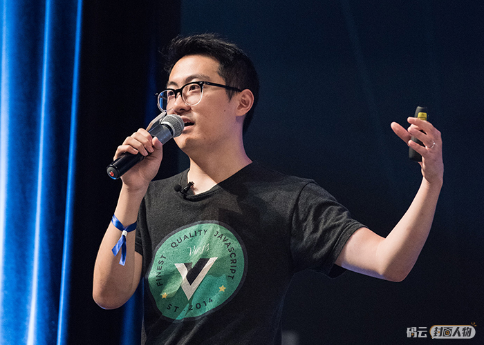

# 尤雨溪谈Vue.js ：缔造自由与真我

 [原文链接](https://gitee.com/gitee-stars/14 )

尤雨溪

前端框架Vue.js 作者，独立开源开发者，现居美国新泽西，现在全职开发和维护 Vue.js。

------

## 最初是什么动机促使了 Vue 的产生？

Vue 一开始完全是一个个人兴趣项目。2013 年的时候我还在 Google Creative Lab，那时候前端框架还处于比较草莽的阶段，React 刚刚发布还没几个人知道，最成熟的是 AngularJS (Angular 1)。我当时一方面是想自己实现一个简单的框架练练手，另一方面是想尝试一下用 ES5 的 Object.defineProperty 实现数据变动侦测。众所周知 AngularJS 使用的是脏检查，而当时大部分的应用还需要支持 IE8，所以不能全面使用 ES5，而个人项目则不需要考虑这些。Vue 就是这样作为一个实验性质的项目开始的。

## Vue 的发展历程是什么样？从 1.0 到 2.0 有哪些大方面的改动？？

Vue 的发展历程，从最初的实验阶段（2013 年中到 2014 年 2 月），0.x 阶段 (2014 年 2 月到 2015 年 10 月)，1.x 阶段 (2015 年 10 月到 2016 年 9 月)，到现在的2.x 阶段 (2016 年 9 月至今)，加上正式对外发布之前的时间，到今天已经有 足足5 年多的时间了。 0.x - 1.0 的改动主要集中在模版语法上，在 1.0 之后，模版语法就相对稳定，没有再经历过特别大的改动了。2.0 的改动则专注于内部的渲染机制变化，引入了 Virtual DOM，从而获得了服务端渲染、原生渲染、手写渲染函数等能力。目前 3.0 正在竭力的开发过程中，主要集中于利用 ES2015 的新特性、改进内部架构和性能优化上。

## 作为创始人，目前您对 Vue 的贡献与初期相比大概占多少比重呢？ 

现在的Vue 跟运行初期相比，最大的区别就是框架涵盖的范围变大了许多。一开始 Vue 只有一个核心库，现在则是包含了路由、状态管理、CLI 工具链、浏览器开发者插件、ESLint 插件等等的全套设施。目前只有核心库依然由我维护，其它子项目基本都交给团队成员去做日常维护了。

## Vue 的代码追求简约轻量，在实际开发中是怎么和“功能性”结合在一起的？

简约和功能之间的平衡确实是一个很有挑战性的设计问题。从我的角度来看，需要确保的是当用户不需要一个功能的时候，那么这个功能就不应该给用户造成额外的心智负担。比如说 Vue 的 动画组件，如果你不需要动画功能，那么你可以完全无视它的存在。从框架层面来说，这也体现在 Vue 的 “渐进式” 设计理念里面，比如如果你不需要客户端路由，那么你甚至不需要知道 vue-router 的存在。但对于需要这些功能的用户而言，这些功能都是包含在框架之内的。所以 Vue 的 API 列表看上去好像很长，但实际上手需要掌握的核心概念却很简单，用户只需要去了解功能的意义和价值就可以了。

## 目前市场上初创及中小型企业的技术团队为实现项目的高效开发及快速交付，对 Vue 的采用度非常高，那对于需要长期维护的项目能选择使用 Vue 吗？

当然也适合！但是需要团队有良好的开发规范，代码的可长期维护本质上是一个规范问题。要让一个人写出来的代码不仅能被以后的同一个人看懂，还能被团队里其它成员看懂，甚至是被很久以后新加入的人看懂。从这一点来说，灵活性跟长期可维护性肯定是有一定的冲突的，想要写出来的代码一致，就需要有制约。有人可能觉得 Vue 制约太少，但其实该有的都有，完全取决于你是否需要它们。如果你知道一个项目是要打长期战的，那么在启动项目的时候，就要有意识的选用框架所提供的有利于长期维护的功能。一方面是采用比如 Vuex 这样的状态管理方案 - Vuex 的代码是自带一定的强制规范的，它可以让大家写出来的修改状态代码都遵循一样的流程。另一方面则是需要团队制定严谨的开发规范，比如代码风格、静态检查、TypeScript、单元测试等等 —— 这些 Vue 都通过 Vue CLI 提供了工具层面的支持。我们在 3.0 中还会进一步加强和 TypeScript 的整合。

## 可以简单介绍一下目前 Vue 的团队和运营策略吗？

Vue 目前除了我之外还有一个全职成员蒋豪群，他现在负责我们 CLI 的维护工作。除此之外的成员分散在世界各地，都是志愿者，但绝大部分人的全职工作也都是天天要和 Vue 打交道的。这些成员维护着我们 GitHub 上的仓库以及文档，也有人主要负责社区，比如管理论坛、聊天室、各地的线下聚会等等。要说运营策略，其实没有什么策略，Vue 并不是一个商业项目，它现在几乎完全是由一个自发形成的社区在推动，这就是开源的精妙绝伦之处。

## Vue 是在什么时候开始以国际化社区的方式来运作的？

从始至终都是。我觉得开源不分国界，所以一切都是以尽可能让更多人参与到Vue的方式去运作的。

## 您认为 Vue 从个人开发者维护的开源项目到国际化社区运作的品牌，最大的变化是什么？有什么经验可以分享吗？

最大的变化就是我作为项目管理者工作上的转变吧，一开始只需要埋头写代码，偶尔修几个 bug 就行了，但是现在要做很多代码之外的工作，比如思考项目的整体规划，跟社区沟通开发计划，跟团队成员沟通项目状况，跟赞助商沟通赞助合同，飞到世界各地参加会议，协调社区里潜在的利益冲突等等，可以说现在更像是半个项目经理吧，这也是一个成长的过程。运营开源项目不仅仅是代码，更重要的是人。

## 与 Vue 国际化的团队协同工作，面向不同国家的开发者，您有什么有趣的发现或启发吗？

其实世界各地的 Vue 开发者共同语言远多于不同的地方，毕竟大家都是做同一行，用的又是同一个框架。

## Vue 是 作为 GitHub 2018 前端热门项目第一，同时也是开源中国 2018 年度最受欢迎开源软件第一，展现了 Vue 在国内外的巨大影响力，未来 Vue 有怎样的发展规划呢？

Vue 的定位就是为前端开发提供一个低门槛，高效率，但同时又能够伴随用户成长的框架。所谓的 “伴随用户成长”，就是当一个新手用户入门的时候，Vue 尽可能地让这个过程简单直接，而当之后用户开始做更复杂的应用了，有更复杂的需求了，他会发现 Vue 依然能够提供良好的支持。这样 Vue 可以在新手成长到进阶的开发者的一路上都提供价值。在这个大目标的前提下，Vue 会根据 web 平台和 JavaScript 语言本身的进化不断改进自己，确保自身可以始终胜任这个使命。

## 国内的大公司也开始使用 Vue 来开发项目，如滴滴开源的基于 Vue 实现的移动端组件库 Cube-UI，您怎么看 Vue 在国内的发展？

Vue 在国内确实有广大的用户群体，不光有各类大厂的组件库，现在还有基于 Vue 生成各种小程序的方案，这可能是中国市场比较独特的一个需求，拥有这个能力可能对 Vue 接下来在中国的发展还挺关键的。

## 您如何看待开源项目的商业化？

这个世界不会自动给予开源项目的维护者对应的经济回报，能获得多少回报，除了本身创造的价值，也取决于维护者选择怎样的变现方式。有些人可能一听到开源和变现这两个词放在一起就觉得不舒服了，但其实这是一个很现实的问题 —— 无论是作为公司本身需要的技术顺道开源也好，还是作为独立项目寻求捐助也好，严肃的、创造真正的价值的开源必然需要有某种形式的经济利益参与其中，才可能保证维护者的长期稳定的投入，不然就很可能需要以牺牲维护者的 life work balance 为代价，这种情况我也见过很多。

## 在个人职业发展方面，您是更倾向于专精技术还是转型管理？

如果选择权在我手里的话当然还是走技术路线，现在技术之外的工作都是不得不做才去做的，有时候会觉得 “就想安安静静写会儿代码”，哈哈。至于管理，我觉得它是随着你的项目复杂程度越来越高，和团队成员越来越多，而伴随产生的刚需能力吧，我也是不停的在学习和成长。

## 优秀的前端工程师都是艺术家，您个人从本科读艺术史到硕士读美术设计和技术专业的经历，是否更好的印证了这点？

这倒未必，毕竟前端现在也是一个很大的范畴了，做架构/工具链和做面向用户的组件就涉及很不一样的侧重点和知识领域。但整体上而言，前端因为是直接跟用户打交道的活，所以最根本的是要有同理心，也就是能够站在用户的角度去思考，理解用户体验和需求，从而找出能够达成这些体验和需求的技术方案。学习设计能够很好地锻炼这种站在用户的角度思考的能力，因为在进行艺术创作的时候是具有多维性和发散性的，这种思维方式在我优化Vue的过程中，确实是帮助了我能站在用户的角度，更多的去理解用户体验。

## 近些年国内前端开发的需求一直在增加，从码云 Gitee 上的开源项目就可见一斑。虽有大量人员涌入，但优秀的前端工程师并不多，很多人也只停留在切页面水平，对于未来的成长路线并不清楚，对此您有什么经验和建议分享？

现在由于互联网服务的爆发，对于前端的需求也大量增加，但同时也导致一些岗位的工作内容是同质化的，只要是掌握了基本技能的前端都可以做，那么这些岗位就变成了替代性很高的劳动力。如果学前端只是单纯为了找份工作，那长期发展肯定不会乐观。想要跳出这个层面需要对这门技术本身有足够的兴趣和热情，然后找到一个专精，比如你特别擅长性能优化，或者你写的组件用户体验特别好，甚至是你切页面能够切得 100% 还原了设计师给出的设计效果，甚至更加简洁优雅，这都是可以的。

## 工作之余是如何给自己充电的？ 平时都如何安排工作和生活？有什么业余爱好？

现在工作之余的时间都在带娃，哈哈！每年还要去世界各地开会，其实因为有时差都挺累的，但能够感受很多不同的国家城市也算是转换一下节奏。偶尔有那么一点点自己的时间，主要是看看漫画，玩玩游戏，是个典型的宅男。

## Vue 的发行版都是以动漫命名的，像是 1.0 的新世纪福音战士（Evangelion）和 2.0 的攻壳机动队（Ghost in the Shell），最近有看什么新的动漫吗？

最近因为战斗天使的电影很火，所以特意把原著《铳梦》和《铳梦 Last Order》从头到尾看了一遍，真是神作！

## Vue 给您带来的最大的收获是什么？

自由。当你可以做自己喜欢的工作来养活自己，同时又不受各种条条框框的约束，这种自由是无价的。可以这么说，我用键盘敲出了Vue，而Vue把自由和真实的本我馈赠给了我，现在的我很清晰的明白自己在做什么，我想要的Vue是什么样的，我能跟随自己内心的指引去开发出Vue更多的新功能，我现在根本无法想象再回到大公司去工作的那种情境。

