# 如何打造自己的ChatGPT，AzureAPI转换OpenAI

本文将学习如何将Azure OpenAI 接口转换为OpenAI接口，用OpenAI调用方式直接兼容Azure，以及打造自己的 ChatGPT

## 一.前言

当今人工智能技术不断发展，企业和个人都在积极探索其在各个领域中的应用。在自然语言处理方面，OpenAI 的 GPT 系列模型成为研究热点，尤其是 ChatGPT 引领了新一波 AI 应用的浪潮。各大科技公司纷纷推出类似产品，如百度的文心一言、Google 的 Bard 以及 Notion AI，但目前体验最佳的仍然是 ChatGPT。

作为 OpenAI 的大股东，Microsoft 充分利用其技术资源，推出了 GitHub Copilot、New Bing、Office 365 Copilot 和 GitHub Copilot X 等产品。此外，Microsoft Azure 是唯一提供 OpenAI 云服务的厂商，通过 Azure OpenAI 提供的 API，使用户能够轻松构建和部署自己的 ChatGPT。


## 二.对比

Azure OpenAI 和 OpenAI 官方提供的服务基本是一致的，但是目前前者还是处于预览版的状态，一些功能还没有完全开放。

注意：需要使用 Azure 国际版，[点此进行申请](https://azure.microsoft.com/en-us/products/cognitive-services/openai-service?WT.mc_id=DT-MVP-5003133)

优点：

- 不受地域限制，国内可以直接调用。
- 可以自己上传训练数据进行训练（据说很贵）。
- Azure 多语言 SDK 支持。
- 更适合企业私有化，数据可完全控制删除。

缺点：

- 部分功能未开放，但 ChatGPT 的功能是没问题的。
- 和 OpenAI 官方的 API 标准有差异，**无法直接用**一些只支持 OpenAI 官方API 的开源项目。

> Azure OpenAI 也已经支持 GPT-4 了，需要单独进行申请，博主的申请还没通过本文暂时以 GPT-3.5 进行演示。

## 三.使用 Auzre OpenAI

### 1.创建服务

进入 Azure 后，直接搜索 "Azure OpenAI"。

[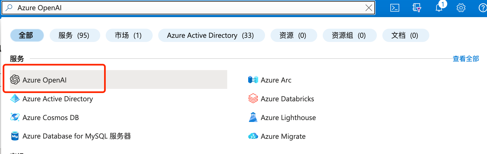](https://img2023.cnblogs.com/blog/668104/202303/668104-20230330112134470-1734533120.png)

选择你已经申请通过的订阅进行创建。

[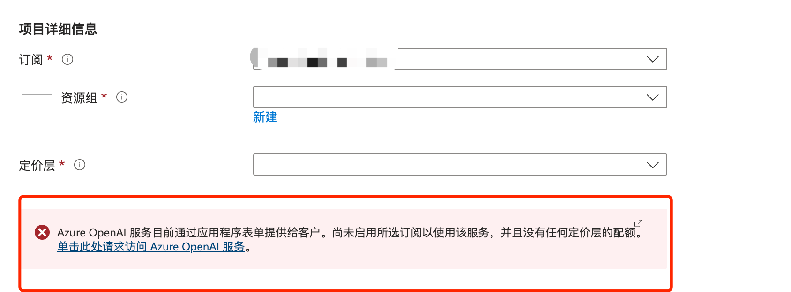](https://img2023.cnblogs.com/blog/668104/202303/668104-20230330112134049-825799611.png)

如果该订阅没有启动则不能创建。

### 2.创建模型部署

在资源管理->模型部署 选择需要的模型进行创建，每个模型只能创建1个部署。

[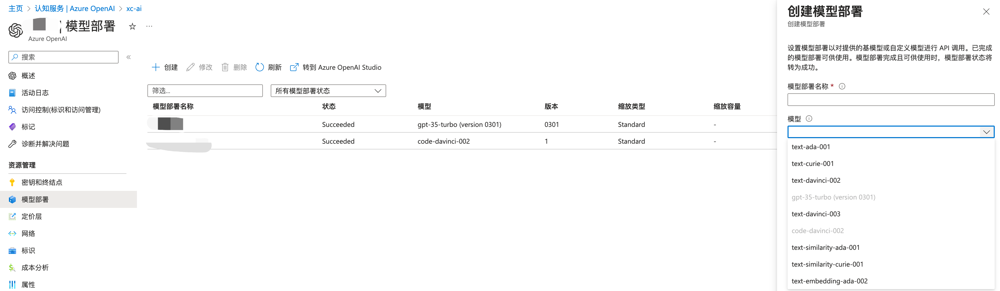](https://img2023.cnblogs.com/blog/668104/202303/668104-20230330112133573-87791564.png)

### 2.Azure OpenAI Studio

模型创建完成以后，我们可以直接使用 Azure OpenAI Studio 来进行快速的测试。

[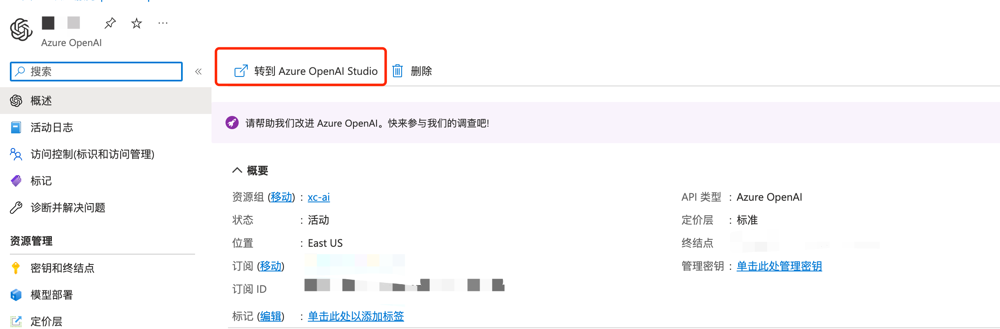](https://img2023.cnblogs.com/blog/668104/202303/668104-20230330112132873-883846957.png)

ChatGPT 测试。

[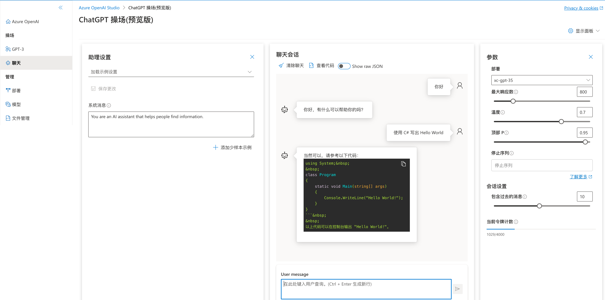](https://img2023.cnblogs.com/blog/668104/202303/668104-20230330112132092-1982776146.png)

上传自己的数据集。

[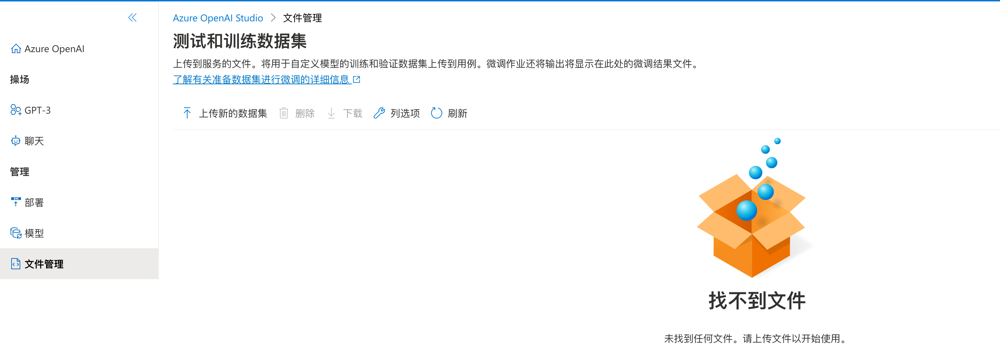](https://img2023.cnblogs.com/blog/668104/202303/668104-20230330112131128-159716041.png)

## 四.API 调用

在 资源管理->密钥和终结点 可以获取 API 地址以及调用密钥。

[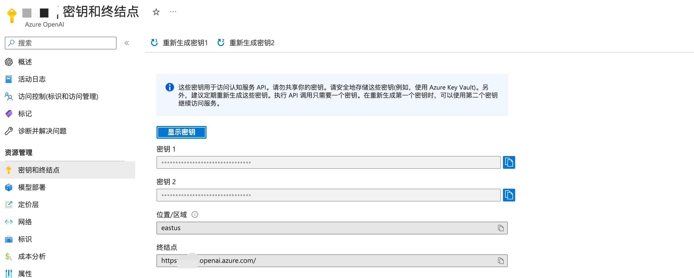](https://img2023.cnblogs.com/blog/668104/202303/668104-20230330112130344-1613106099.png)

查看 [API 文档](https://learn.microsoft.com/en-us/azure/cognitive-services/openai/chatgpt-quickstart?WT.mc_id=DT-MVP-5003133)

[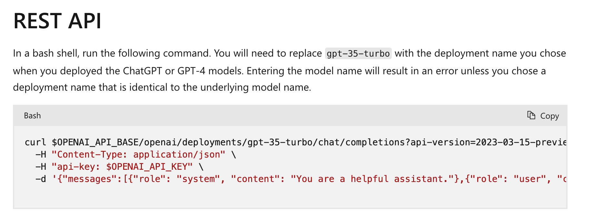](https://img2023.cnblogs.com/blog/668104/202303/668104-20230330112129314-282606999.png)

使用 POSTMAN 进行调用测试。

[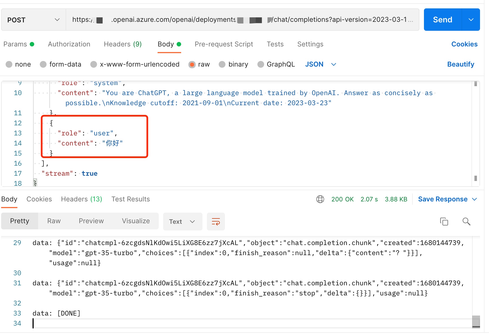](https://img2023.cnblogs.com/blog/668104/202303/668104-20230330112128116-28825994.png)

## 五.打造自己的 ChatGPT

### 1.Azure OpenAI Proxy

打造自己的 ChatGPT 推荐直接使用 https://github.com/Chanzhaoyu/chatgpt-web 这个项目。

[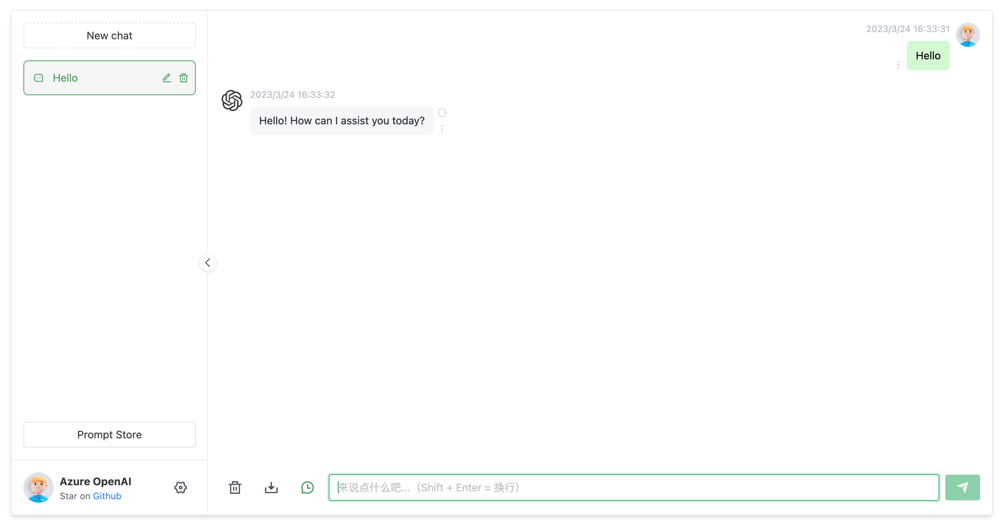](https://img2023.cnblogs.com/blog/668104/202303/668104-20230330112126749-1847613867.png)

前面我们说到 API 调用是有差异的，此项目目前还没用直接支持 Azure OpenAI。我尝试修改过这个项目，可以调用了但是有个问题，无法正常的自动结束对话，跟了代码发现有 Bug：

https://github.com/Chanzhaoyu/chatgpt-web -> https://github.com/transitive-bullshit/chatgpt-api -> https://github.com/rexxars/eventsource-parser

最终在 eventsource-parser 这个 package 里，无法适应 Azure OpenAI 返回的结果，做过对比发现 Azure OpenAI 返回的调用最后少了一个换行 `\n`。

最终我便想了个方法，自己实现一个 Proxy **转换** OpenAI 官方 API 标准到 Azure OpenAI 标准，这样就能让 Azure OpenAI 直接对接到任何支持 OpenAI 的任何项目中，并且可以顺便修复上面所说的差异，让 chatgpt-web 直接使用 Azure OpenAI。

项目地址：https://github.com/stulzq/azure-openai-proxy 希望大家点点 star。

### 2.搭建

最快的方式当然是使用 Docker，以下是 docker compose 脚本：

```yaml
version: '3'

services:
  chatgpt-web:
    image: chenzhaoyu94/chatgpt-web
    ports:
      - 3002:3002
    environment:
      OPENAI_API_KEY: <Auzre OpenAI API Key>
      OPENAI_API_BASE_URL: http://azure-openai:8080
      AUTH_SECRET_KEY: ""
      MAX_REQUEST_PER_HOUR: 1000
      TIMEOUT_MS: 60000
    depends_on:
      - azure-openai
    links:
      - azure-openai
    networks:
      - chatgpt-ns

  azure-openai:
    image: stulzq/azure-openai-proxy
    ports:
      - 8080:8080
    environment:
      AZURE_OPENAI_ENDPOINT: <Auzre OpenAI API Endpoint>
      AZURE_OPENAI_MODEL_MAPPER: <Auzre OpenAI API Deployment Mapper>
      AZURE_OPENAI_API_VER: 2023-03-15-preview
    networks:
      - chatgpt-ns

networks:
  chatgpt-ns:
    driver: bridge
```

启动有 3 个环境变量需要配置：

| 变量名                    | 说明                                         |
| ------------------------- | -------------------------------------------- |
| OPENAI_API_KEY            | Azure **密钥和终结点** 里提供的 Key          |
| AZURE_OPENAI_ENDPOINT     | Azure **密钥和终结点** 里提供的终结点        |
| AZURE_OPENAI_MODEL_MAPPER | Azure 部署模型名称映射到 OpenAI 官方模型名称 |

特别说明一下 `AZURE_OPENAI_MODEL_MAPPER`使用 OpenAI 官方标准发起的请求里包含的模型名称是固定的，在这里可以[查询](https://platform.openai.com/docs/models)，而在 Azure OpenAI 模型部署时是可以自定义名称的，请求 Azure yes需要提供这个部署模型的名称，所以建立了一个映射关系。

比如我在 Azure 部署了一个 `gpt-3.5-turbo`模型，我设置的部署名称为：`xc-gpt-35`，此时我的设置：

```shell
AZURE_OPENAI_MODEL_MAPPER: gpt-3.5-turbo=xc-gpt-35
```

[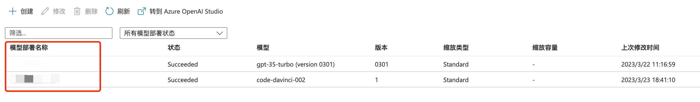](https://img2023.cnblogs.com/blog/668104/202303/668104-20230330112125444-1763954579.png)

## 六.结束

Azure OpenAI 平台为开发人员提供了一个强大的工具，可以轻松地创建和训练 ChatGPT 模型。随着 ChatGPT 技术的不断发展，它将在越来越多的应用场景中发挥重要作用，为人们提供更加智能和个性化的服务和体验。