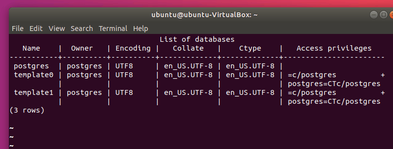
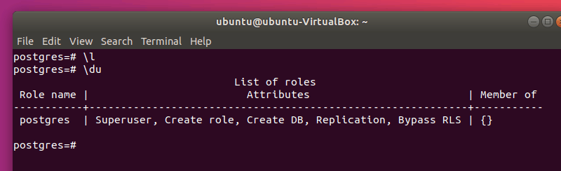

# Ubuntu安装PostgreSQL及常用命令

> Ubuntu安装PostgreSQL及常用命令

[PostgreSQL](https://www.postgresql.org/) (又名 Postgres) 是一个功能强大的自由开源的关系型数据库管理系统 ([RDBMS](https://www.codecademy.com/articles/what-is-rdbms-sql)) ，其在可靠性、稳定性、性能方面获得了业内极高的声誉。它旨在处理各种规模的任务。它是跨平台的，而且是 [macOS Server](https://www.apple.com/in/macos/server/) 的默认数据库。

如果你喜欢简单易用的 SQL 数据库管理器，那么 PostgreSQL 将是一个正确的选择。PostgreSQL 对标准的 SQL 兼容的同时提供了额外的附加特性，同时还可以被用户大量扩展，用户可以添加数据类型、函数并执行更多的操作。

### 方法一：通过 Ubuntu 存储库安装 PostgreSQL

在终端中，使用以下命令安装 PostgreSQL：

```bash
sudo apt updatesudo apt install postgresql postgresql-contrib
```

根据提示输入你的密码，依据于你的网速情况，程序将在几秒到几分钟安装完成。说到这一点，随时检查 [Ubuntu 中的各种网络带宽](https://itsfoss.com/network-speed-monitor-linux/)。

> 什么是 postgresql-contrib?
>
> postgresql-contrib 或者说 contrib 包，包含一些不属于 PostgreSQL 核心包的实用工具和功能。在大多数情况下，最好将 contrib 包与 PostgreSQL 核心一起安装。

### 方法二：在 Ubuntu 中安装最新版本的 PostgreSQL 11

要安装 PostgreSQL 11, 你需要在 `sources.list` 中添加官方 PostgreSQL 存储库和证书，然后从那里安装它。

不用担心，这并不复杂。 只需按照以下步骤。

首先添加 GPG 密钥：

```bash
wget --quiet -O - https://www.postgresql.org/media/keys/ACCC4CF8.asc | sudo apt-key add -
```

现在，使用以下命令添加存储库。如果你使用的是 Linux Mint，则必须手动替换你的 Mint 所基于的 Ubuntu 版本号：

```bash
sudo sh -c 'echo "deb http://apt.postgresql.org/pub/repos/apt/ `lsb_release -cs`-pgdg main" >> /etc/apt/sources.list.d/pgdg.list'
```

现在一切就绪。使用以下命令安装 PostgreSQL：

```bash
sudo apt updatesudo apt install postgresql postgresql-contrib
```

## PostgreSQL 配置

你可以通过执行以下命令来检查 PostgreSQL 是否正在运行：

```
service postgresql status
```

通过 `service` 命令，你可以启动、关闭或重启 `postgresql`。输入 `service postgresql` 并按回车将列出所有选项。现在，登录该用户。

默认情况下，PostgreSQL 会创建一个拥有所权限的特殊用户 `postgres`。要实际使用 PostgreSQL，你必须先登录该账户：

```
sudo su postgres
```

你的提示符会更改为类似于以下的内容：

```
postgres@ubuntu-VirtualBox:/home/ubuntu$ 
```

现在，使用 `psql` 来启动 PostgreSQL Shell：

```
psql
```

你应该会看到如下提示符：

```
postgress=#
```

你可以输入 `\q` 以退出，输入 `\?` 获取帮助。

要查看现有的所有表，输入如下命令：

```
\l
```

输出内容类似于下图所示（单击 `q` 键退出该视图）：



使用 `\du` 命令，你可以查看 PostgreSQL 用户：



你可以使用以下命令更改任何用户（包括 `postgres`）的密码：

```sql
ALTER USER postgres WITH PASSWORD 'my_password';
```

**注意：**将 `postgres` 替换为你要更改的用户名，`my_password` 替换为所需要的密码。另外，不要忘记每条命令后面的 `;`（分号）。

建议你另外创建一个用户（不建议使用默认的 `postgres` 用户）。为此，请使用以下命令：

```sql
CREATE USER my_user WITH PASSWORD 'my_password';
```

运行 `\du`，你将看到该用户，但是，`my_user` 用户没有任何的属性。来让我们给它添加超级用户权限：

```sql
ALTER USER my_user WITH SUPERUSER;
```

你可以使用以下命令删除用户：

```sql
DROP USER my_user;
```

要使用其他用户登录，使用 `\q` 命令退出，然后使用以下命令登录：

```bash
psql -U my_user
```

你可以使用 `-d` 参数直接连接数据库：

```bash
psql -U my_user -d my_db
```

你可以使用其他已存在的用户调用 PostgreSQL。例如，我使用 `ubuntu`。要登录，从终端执行以下命名：

```bash
psql -U ubuntu -d postgres
```

**注意：**你必须指定一个数据库（默认情况下，它将尝试将你连接到与登录的用户名相同的数据库）。

如果遇到如下错误：

```bash
psql: FATAL:  Peer authentication failed for user "my_user"
```

确保以正确的用户身份登录，并使用管理员权限编辑 `/etc/postgresql/11/main/pg_hba.conf`：

```bash
sudo vim /etc/postgresql/11/main/pg_hba.conf
```

**注意：**用你的版本替换 `11`（例如 `10`）。

对如下所示的一行进行替换：

```text
local   all             postgres                                peer
```

替换为：

```text
local   all             postgres                                md5
```

然后重启 PostgreSQL：

```bash
sudo service postgresql restart
```

使用 PostgreSQL 与使用其他 SQL 类型的数据库相同。由于本文旨在帮助你进行初步的设置，因此不涉及具体的命令。不过，这里有个 [非常有用的要点](https://gist.github.com/Kartones/dd3ff5ec5ea238d4c546) 可供参考! 另外, 手册（`man psql`）和 [文档](https://www.postgresql.org/docs/manuals/) 也非常有用。

## 常见命令

### 查看是否运行

```bash
ps -ef | grep postgres
```

### 重启 PostgreSQL

```bash
sudo service postgresql restart
```

