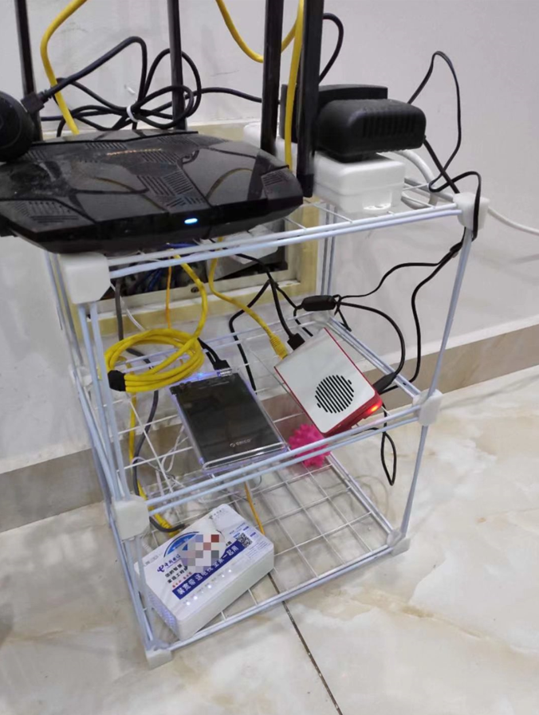
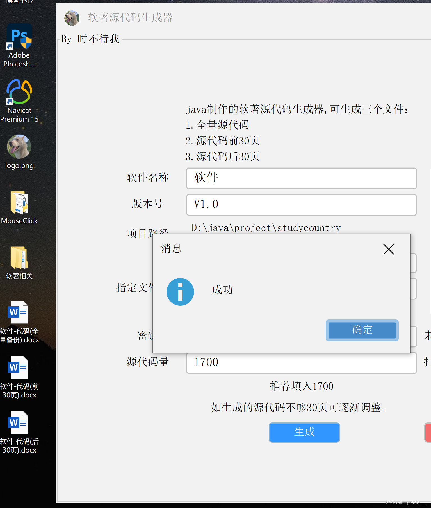
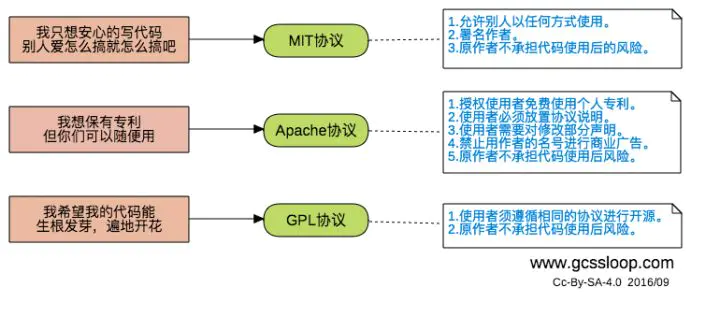

# 介绍

### 关于博主

2015年高二入伍，2017年退役，2019年入学。全栈 Web  软件工程师，软件设计师，魂学爱好者，曾参加**湖南省Web技能竞赛**获二等奖，**中国高校计算机大赛——微信小程序应用开发赛**获全国三等奖，华中赛区一等奖。

获得2020-2021年度**国家奖学金**。

获得三项软件著作权。

拥有最高日活量30000+，注册用户7000+的小程序项目开发经验，可以独立开发小型项目。

 

 

 

 

 

 

**语言和工具：** 

<code></code>
<code></code>
<code></code>
<code></code>
<code></code>
<code></code>
<code></code>
<code></code>

 

📊 **我把时间花在:**

 

📈 **我的github统计:**

### 关于博客

> 博客定位：专注于Web技术、架构设计以及实战案例的技术类原创/转载文章，包括不限于Java和Vue技术

####  博客使用技术

> 服务器:树莓派4B
>
> 前端:VuePress构建
>
> 文档书写:Typora
>
> 前端部署:Nginx代理

我的树莓派服务器：

### 联系博主

> 邮件： 
>

> GitHub：
>

> 微信公众号：
>

### [项目预览](http://www.zhangzhiyu.live:8900/cardscss)

#### 软著源代码材料生成工具

申请软件著作权登记的时候会被要求提交60页的源代码。没有经验的开发者朋友第一次申请的时候难免会遇到因代码文档格式不正确、代码里含有其他版权信息等原因被要求补正的问题，从而导致拿证时间延误。

现实生活中，申请软著需要源代码申请材料，源代码申请材料有格式 等要求，并且源代码分布在一个项目文件夹中各个文件，复制到一个 word 文档中需要一定时间。

为方便申报软件著作权对前后60页代码的整理，作者制作了一款软件，只需要选择源代码文件夹目录即可生成前后30页代码文件，全量备查代码文件，页眉 页码 格式都弄好了，支持C++、java、C#、python、JavaScript、vue等任何常见格式。

  

> 发布三个月有30000次浏览，7000次下载，1500人因此作品关注公众号

[详情查看](./plugInUnit/软著源代码材料生成器.md)

[点击下载](https://pan.baidu.com/s/10YG3pPlLcq0ANfzYEm5LAQ?pwd=cb7h)

### 内容来源

部分来源网络，如有侵权请联系作者

站内所有内容遵循GPL协议

