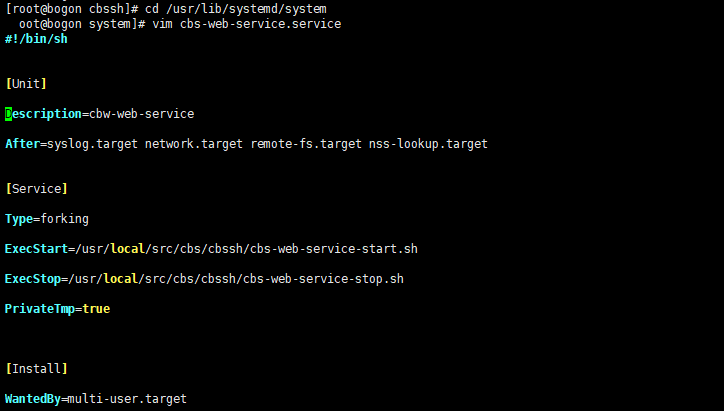

# 软件自启动

> linux设置软件开机自启动


## nginx

> 此方法可应用于绝大数软件

 **第一步：进入到/lib/systemd/system/目录**

```bash
[root@iz2z init.d]# cd /lib/systemd/system/
```

**第二步：创建nginx.service文件，并编辑**

```bash
# vim nginx.service
```

```bash
[Unit]
Description=nginx service
After=network.target 
   
[Service] 
Type=forking 
ExecStart=/usr/local/nginx/sbin/nginx
ExecReload=/usr/local/nginx/sbin/nginx -s reload
ExecStop=/usr/local/nginx/sbin/nginx -s quit
PrivateTmp=true 
   
[Install] 
WantedBy=multi-user.target
```

[Unit]: 服务的说明

Description:描述服务
After:描述服务类别
[Service]服务运行参数的设置
Type=forking是后台运行的形式
ExecStart为服务的具体运行命令
ExecReload为重启命令
ExecStop为停止命令
PrivateTmp=True表示给服务分配独立的临时空间
注意：[Service]的启动、重启、停止命令全部要求使用绝对路径
[Install]运行级别下服务安装的相关设置，可设置为多用户，即系统运行级别为3

保存退出。

**第三步：加入开机自启动**

```bash
# systemctl enable nginx
```

如果不想开机自启动了，可以使用下面的命令取消开机自启动

```bash
# systemctl disable nginx
```

**第四步：服务的启动/停止/刷新配置文件/查看状态**

```bash
# systemctl start nginx.service　         启动nginx服务
# systemctl stop nginx.service　          停止服务
# systemctl restart nginx.service　       重新启动服务
# systemctl list-units --type=service     查看所有已启动的服务
# systemctl status nginx.service          查看服务当前状态
# systemctl enable nginx.service          设置开机自启动
# systemctl disable nginx.service         停止开机自启动
```

###  **一个常见的错误**

Warning: nginx.service changed on disk. Run 'systemctl daemon-reload' to reload units.

 直接按照提示执行命令systemctl daemon-reload 即可。

```bash
# systemctl daemon-reload
```


## redis

1、在/etc目录下新建redis目录

mkdir redis

```bash
[root@iZwz991stxdwj560bfmadtZ etc]# mkdir redis
```

修改redis.conf文件

将

```
daemonize no
```

修改为

```
daemonize yes
```

2、将/usr/local/redis-4.0.6/redis.conf 文件复制一份到/etc/redis目录下，并命名为6379.conf　　

```bash
[root@iZwz991stxdwj560bfmadtZ redis]# cp /usr/local/redis-4.0.6/redis.conf /etc/redis/6379.conf
```

 

3、将redis的启动脚本复制一份放到/etc/init.d目录下

```bash
[root@iZwz991stxdwj560bfmadtZ init.d]# cp /usr/local/redis-4.0.6/utils/redis_init_script /etc/init.d/redisd
```

 

4、设置redis开机自启动

先切换到/etc/init.d目录下

然后执行自启命令

```bash
[root@iZwz991stxdwj560bfmadtZ init.d]# chkconfig redisd on
service redisd does not support chkconfig　
```

 

看结果是redisd不支持chkconfig

解决方法：

使用vim编辑redisd文件，在第一行加入如下两行注释，保存退出

```bash
# chkconfig:   2345 90 10
# description:  Redis is a persistent key-value database
```

 

注释的意思是，redis服务必须在运行级2，3，4，5下被启动或关闭，启动的优先级是90，关闭的优先级是10。


 

再次执行开机自启命令，成功

```bash
[root@iZwz991stxdwj560bfmadtZ init.d]# chkconfig redisd on
```

　

现在可以直接已服务的形式启动和关闭redis了

启动：

service redisd start　

```bash
[root@izwz991stxdwj560bfmadtz ~]# service redisd start
Starting Redis server...
2288:C 13 Dec 13:51:38.087 # oO0OoO0OoO0Oo Redis is starting oO0OoO0OoO0Oo
2288:C 13 Dec 13:51:38.087 # Redis version=4.0.6, bits=64, commit=00000000, modified=0, pid=2288, just started
2288:C 13 Dec 13:51:38.087 # Configuration loaded
```

关闭：

方法1：service redisd stop

```bash
[root@izwz991stxdwj560bfmadtz ~]# service redisd stop
Stopping ...
Redis stopped
```

## springboot

### 第一步：新建服务启动脚本

**1、在/usr/local/src/cbs/cbssh/目录下创建启动脚本cbs-web-service-start.sh**

```ini
#!/bin/sh
  
export JAVA_HOME=/usr/local/java/jdk1.8.0_311
export PATH=$JAVA_HOME/bin:$PATH

nohup java -jar /root/www/wwwroot/Ruoyi/ruoyi-admin.jar > /root/www/wwwroot/Ruoyi/service.log 2>&1 &

echo $! i> /var/run/cbs-web-service.pid

```

请自己修改JAVA_HOME和启动路径


**2、在/usr/local/src/cbs/cbssh/目录下创建停止脚本cbs-web-service-stop.sh**

```ini
#!/bin/sh

PID=$(cat /var/run/cbs-web-service.pid)

kill -9 $PID
```


3、增加权限

```ini
chmod +x cbs-web-service-start.sh

chmod +x cbs-web-service-stop.sh
```

### 第二步：新建开机自启动脚本

**1、在/usr/lib/systemd/system目录下创建服务开机启动脚本cbs-web-service.service**

```ini
#!/bin/sh

[Unit]

Description=cbw-web-service

After=syslog.target network.target remote-fs.target nss-lookup.target


[Service]

Type=forking

ExecStart=/usr/local/src/cbs/cbssh/cbs-web-service-start.sh

ExecStop=/usr/local/src/cbs/cbssh/cbs-web-service-stop.sh

PrivateTmp=true


[Install]

WantedBy=multi-user.target
```



### 第三步：设置开机自启动

```ini
# 启用开机自启动
systemctl daemon-reload
systemctl enable cbs-web-service.service

# 禁用(移除)开机自启动
systemctl disable cbs-web-service.service

# 查看服务状态
systemctl status cbs-web-service.service

# 手动启动服务
systemctl start cbs-web-service.service

# 手动关闭服务
systemctl stop cbs-web-service.service

# 手动重启服务
systemctl restart cbs-web-service.service

# 查看开机启动项
systemctl list-unit-files | grep enable
```

**注意：**脚本开头的`#!/bin/sh`不可少

## 相关命令

### 显示服务列表

```bash
chkconfig --list
```

等级代号列表：

- 等级0表示：表示关机
- 等级1表示：单用户模式
- 等级2表示：无网络连接的多用户命令行模式
- 等级3表示：有网络连接的多用户命令行模式
- 等级4表示：不可用
- 等级5表示：带图形界面的多用户模式
- 等级6表示：重新启动

### 重启服务器

```bash
reboot
```

### 创建redis命令软连接

```bash
ln -s /usr/local/redis/redis-cli /usr/bin/redis
```

