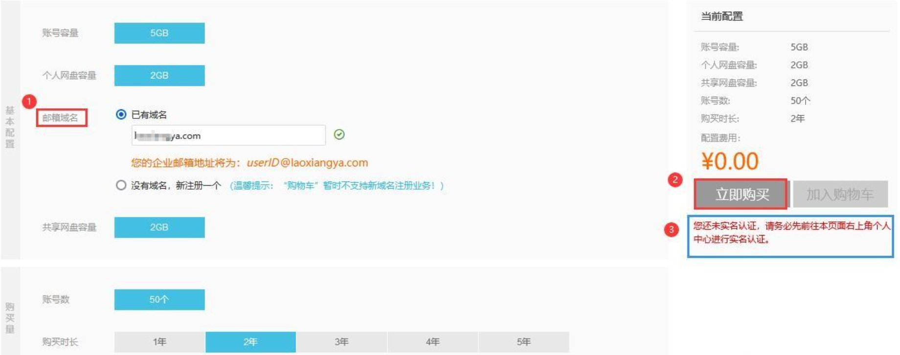
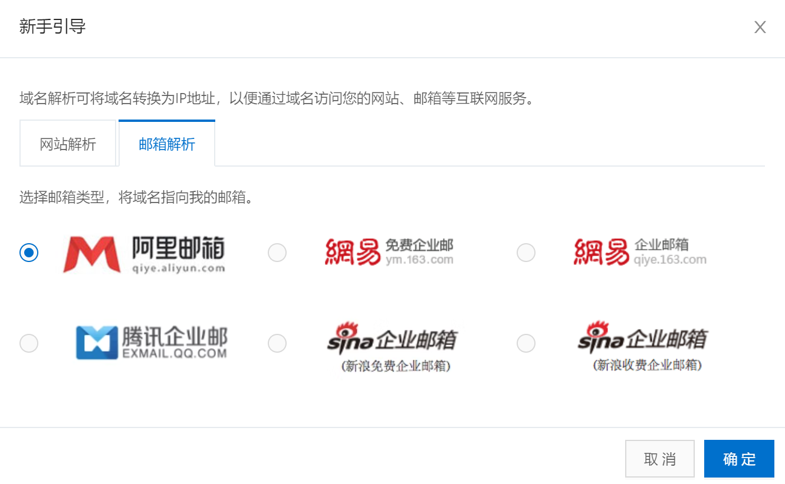
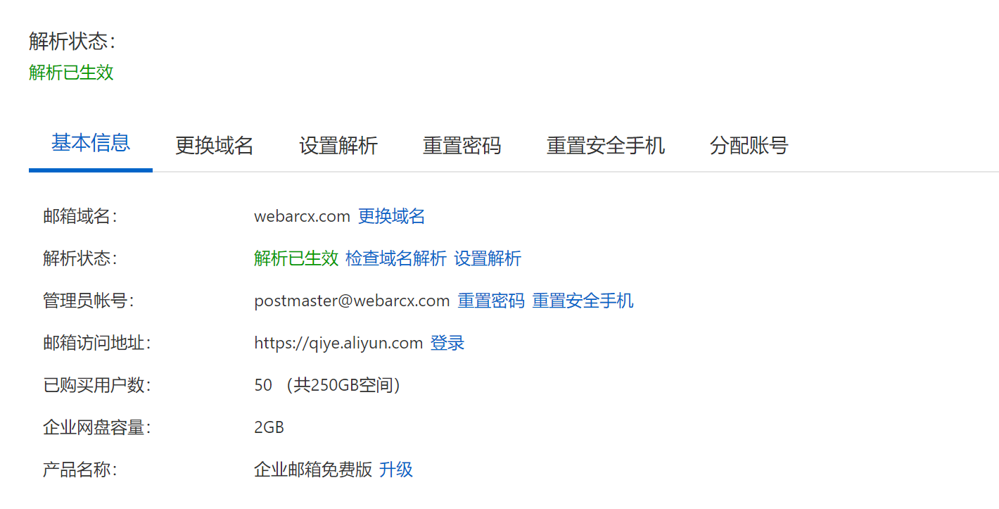
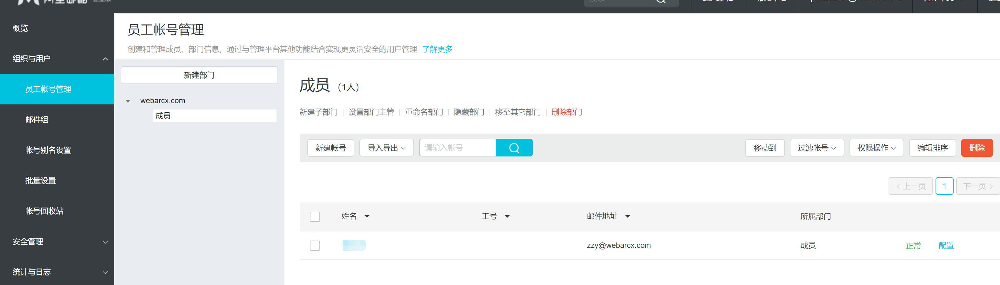

# 使用阿里云企业邮箱搭建免费域名邮箱

使用域名邮箱有以下好处：

1. 专业形象：使用域名邮箱可以展示您的企业或个人品牌，让邮件收件人对您的信任感增加。与免费邮箱相比，域名邮箱更能显示您的专业性和正式性。
2. 定制化：您可以根据自己的需求选择合适的域名，并在此域名下创建多个邮箱账户，方便管理和组织邮件。
3. 安全性：域名邮箱通常具备更高的安全性，提供防垃圾邮件和病毒扫描功能，保护您的电子邮件免受恶意攻击。
4. 留存价值：域名邮箱随着您的域名的保有，可以长期使用，不会因为更换邮箱服务而失去联系人和历史邮件。
5. 个性化推广：您可以在域名邮箱中添加个性化的签名、公司LOGO等信息，以及设置自动回复功能，用于商务推广和客户沟通。

这篇文章将讲述怎么利用阿里云免费企业邮箱搭建属于自己的域名邮箱

> 如果您已是阿里云会员，直接登录即可。如果您还不是阿里云会员，请先注册成为阿里云会员，注册成功后便可使用会员信息登录

## 必要条件

拥有一个域名

## 登录阿里云会员

进入【[企业邮箱免费版](https://ourl.co/alimail)】页面，输入【**邮箱域名**】>点击【**立即购买**】（如下图所示）；

- 账号容量空间：5G
- 输入邮箱绑定域名（如：没有域名就新注册一个）
- 免费版默认50账号
- 选择购买时长，（直接选五年就行）点击立即购买即可（免费的）

## 进入云解析DNS

点击[域名](https://dns.console.aliyun.com/?spm=5176.12818093.ProductAndResource--ali--widget-product-recent.dre0.3be916d01Qu63i#/dns/domainList)对应的**解析设置**

然后依次点击**新手引导**，邮箱解析，选择**阿里邮箱**直接**确定**

## 进入企业邮箱

[进入](https://alimail.console.aliyun.com/?spm=5176.12818093.ProductAndResource--ali--widget-product-recent.dre2.3be916d01Qu63i#eyJ2YWx1ZSI6InByb2R1Y3RMaXN0In0=)后点击表格中邮箱的右边的**管理**查看解析是否已经生效

1. 点击**重置密码**，进行管理员密码重置操作
2. 重置后，点击  **邮箱访问地址**  右侧**登录**
3. 账号为管理员账号，密码为刚重置的密码

## 邮箱用户配置

点击[组织与用户](https://qiye.aliyun.com/admin/#/account-email)，**员工账号管理**，**新建账号**

然后进行密码设置等一系列操作，就完成了域名邮箱的配置

以后我就可以使用zzy@webarcx.com 进行邮件收发了

## 常见问题

### 发送给QQ邮箱，Gmail邮箱显示垃圾邮件无法发送

可能是DNS尚未扩散的原因，建议等上半天一天再试