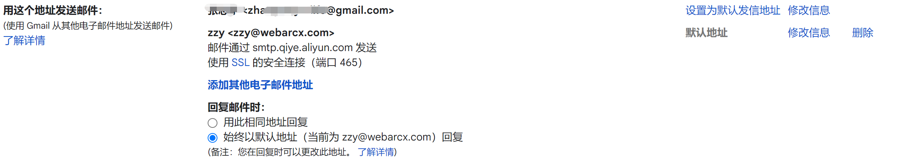

# 配置域名邮箱

由于阿里云域名邮箱太垃圾了，发件老是被当成垃圾邮件失败

所以：

收件用 使用阿里云免费企业邮箱
发件用 Gmail https://support.google.com/domains/answer/9437157

## 发件具体配置：

### 第 1步：添加电子邮件别名

1. 在计算机上，转到 [Gmail](https://mail.google.com/)。
2. 点击右上角的“设置”图标  **设置**。
3. 选择**帐号和导入**或帐号标签页。
4. 在“用这个地址发送邮件”部分中，点击**添加其他电子邮件地址**。
5. 在随即打开的窗口中，输入您希望收件人查看的名称。
6. 输入您为电子邮件转发功能设置的电子邮件地址别名。
7. 确认已勾选“视为别名”，然后点击**下一步**。
8. 在“SMTP 服务器”字段中，输入：`smtp.qiye.aliyun.com`。
9. 从“端口”菜单中选择 **465**。
10. 在“用户名”字段中，输入您阿里云域名企业邮箱使用的用户名。
11. 在“密码”字段中，输入阿里云域名企业邮箱密码。
12. 确认已标记**使用 TLS 的安全连接**框。
13. 点击**添加帐号**。

### 第 2 步：确认地址

1. 在计算机上，转到 [Gmail](https://mail.google.com/)。
2. 打开您通过 Gmail 收到的确认邮件。
3. 点击该链接。

### 第 3 步：更改“发件人”地址

1. 在邮件中，点击“发件人”行。

   - 如果没有找到“发件人”行，请点击收件人电子邮件旁边的空白处。

2. 选择要用于发送邮件的地址。

   

收件可使用域名邮箱正常收件，发件时使用gmail邮箱发件