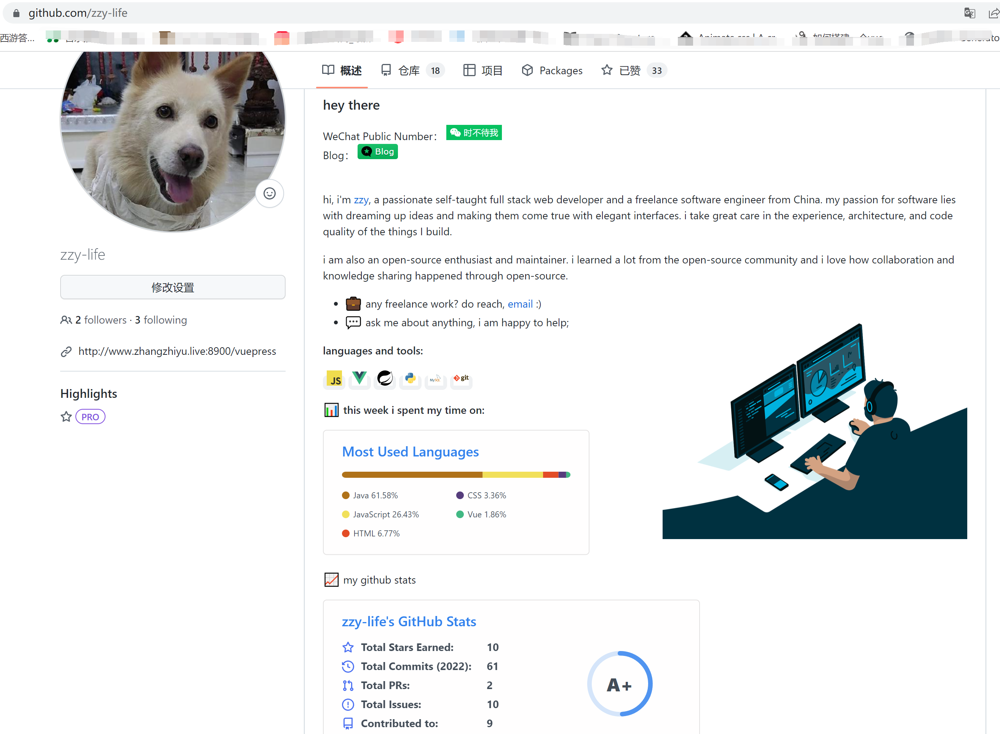
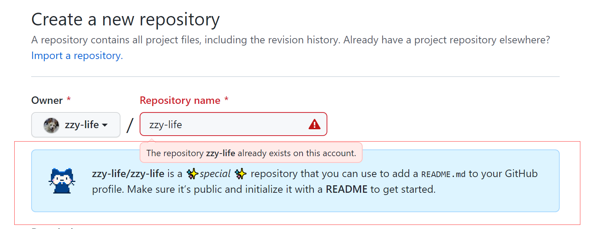
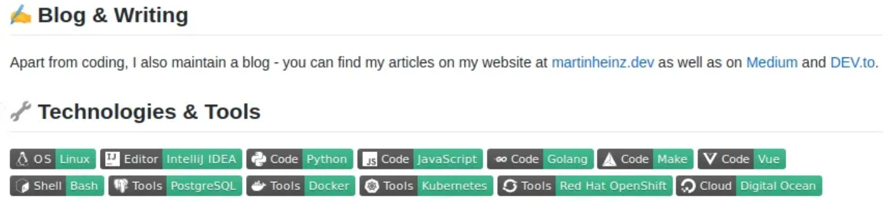
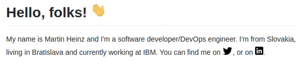
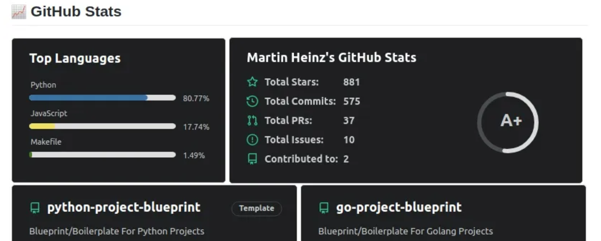
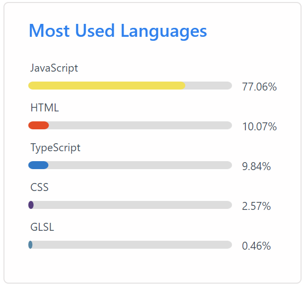

# 为你的GitHub个人资料构建出色的自述文件

**通过其隐藏的新功能-GitHub Profile READMEs，在GitHub上展示你的项目和技能！**

如果你时常访问别人的GitHub简介，你可能会注意到，最近有些人在他们的简介里有一些花哨的图片、描述和统计。这些是新的GitHub Profile README s。它们是一种隐藏的新功能，在这篇文章中，我将向你展示如何创建一个，以及如何使用一些很酷的技巧和工具使它脱颖而出。



## 如何创建自己的

创建GitHub Profile `README` 非常简单，但你可能自己都找不到。要创建它，请访问[https://github.com/new](https://link.zhihu.com/?target=https%3A//github.com/new)，与创建普通仓库时相同。用你的用户名命名仓库——在我的情况下为 `zzy-file/zzy-file`。只要你输入它，你就会收到信息，告诉你这个秘密/特殊仓库。

一定要有出现下方的文字才有效哦

勾选 Add a README file 


## 让它脱颖而出

我们有一个带有 `README` 的版本库，但是内容呢？你可以只扔进一些关于你自己的信息，你的电子邮件联系人，然后就结束了，但我们可以做得更好。 

更多`README`模板请[点击](https://github.com/abhisheknaiidu/awesome-github-profile-readme)


## GIFs 和 Emojis

另一个让你的README更有趣和好玩的方法是添加各种GIF或表情。我个人喜欢在每个标题的开头添加表情符号，例如：



我发现获取相关表情的最简单的方法是在[https://emojipedia.org/emoji/](https://link.zhihu.com/?target=https%3A//emojipedia.org/emoji/) 上搜索表情符号名称，然后在[https://www.fileformat.info/index.htm](https://link.zhihu.com/?target=https%3A//www.fileformat.info/index.htm) 上查找它的HTML实体。这些HTML实体可以包含在markdown中，你的浏览器应该可以很好地渲染它们。

如果表情符号对你来说还不够，你还想在 `README` 中加入一些动作，那么你也可以加入GIF。当添加GIF时，你将需要实际的.gif文件，可以在你的资源库中托管，比如头图，也可以在外部网站上托管，比如[https://imgur.com/](https://link.zhihu.com/?target=https%3A//imgur.com/)。无论托管在何处，都将使用以下方法将其包括在内：

```html
/<OWNER>/master/<GIF_NAME>.gif" width="30px">
```

在GitHub标记中，有一些HTML标签可以使用，`` 就是其中之一。这使得在我的 `README` 中轻松添加像这样的图像和GIF：

```html
# Hello, folks! 

```

   


## 展示你的仓库

每个人的GitHub个人资料实际上只是一个展示你的仓库并突出显示你的活动/贡献的地方。使用GitHub个人资料 `README`，你可以使用*[github-readme-stats](https://link.zhihu.com/?target=https%3A//github.com/anuraghazra/github-readme-stats)*更好地突出这些内容。GitHub Readme Stats是一个工具，可用于为你的贡献和仓库生成GitHub Stats，并将它们附加到 `README` 中。如果决定使用所有可用的统计卡，则可能会出现如下所示的内容：




## 突出你的技能

 另一个经常出现在人们档案中的东西是他们的技能和他们喜欢使用的技术列表。 

使用*[github-readme-stats](https://link.zhihu.com/?target=https%3A//github.com/anuraghazra/github-readme-stats)*

```markdown
[](https://github.com/anuraghazra/github-readme-stats)
```




