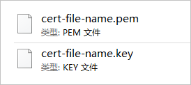

# nginx安装证书

> nginx安装证书

## 前提条件

- 已经通过SSL证书服务完成证书签发。更多信息，请参见[提交证书申请](https://help.aliyun.com/document_detail/98574.htm#concept-wxz-3xn-yfb)。
- 已准备好远程登录工具（例如PuTTY、Xshell），用于登录您的Web服务器。

## 步骤1：下载证书到本地

1. 登录[SSL证书控制台](https://yundunnext.console.aliyun.com/?p=cas)。

2. 在左侧导航栏，单击**SSL证书**。

3. 定位到要下载的证书，单击**操作**列下的**下载**。

4. 在**证书下载**面板，定位到**Nginx**服务器，单击**操作**列下的**下载**。

   该操作会将Nginx服务器证书压缩包下载到本地，并保存在浏览器的默认下载位置。

5. 打开浏览器的默认下载位置，解压已下载的Nginx证书压缩包文件。

   解压后您将会获得以下文件：

> 本文中出现证书文件名称的地方，统一使用cert-file-name为例进行描述。例如，本文中用到的证书文件为cert-file-name.pem，证书私钥文件为cert-file-name.key。在实际操作过程中，您必须使用真实的证书文件名称替换示例代码中的cert-file-name。获取证书文件名称的具体操作，请参见[下载证书到本地](https://help.aliyun.com/document_detail/98728.html?spm=5176.b657008.help.dexternal.78911b485DJuj2#step-g2p-wai-ral)。

- PEM格式的证书文件。

  PEM格式的证书文件是采用Base64编码的文本文件，您可以根据需要将证书文件修改成其他格式。关于证书格式的更多信息，请参见[主流数字证书都有哪些格式](https://help.aliyun.com/document_detail/42214.htm#concept-a4g-mbv-ydb)。

- KEY格式的证书私钥文件。

> 如果您在申请证书时将**CSR生成方式**设置为**手动填写**，则下载的证书文件压缩包中不会包含KEY文件，您需要手动创建证书私钥文件。

## 步骤2：在Nginx服务器上安装证书

在Nginx独立服务器、Nginx虚拟主机上安装证书的具体操作不同，请根据您的实际环境，选择对应的安装步骤。

参考以下步骤，在Nginx独立服务器上安装证书：

1. 登录Nginx服务器。

   例如，您可以使用远程登录工具（例如，PuTTY、Xshell）登录服务器。

2. 使用远程登录工具，将本地证书文件和私钥文件上传到Nginx服务器的证书目录（示例中为/usr/local/nginx/conf）。

3. 编辑Nginx配置文件（nginx.conf），修改与证书相关的配置内容。

   使用示例代码前，请注意替换以下内容：

   - yourdomain.com

     ：替换成证书绑定的域名。

     如果您购买的是单域名证书，需要修改为单域名（例如`www.aliyundoc.com`）；如果您购买的是通配符域名证书，则需要修改为通配符域名（例如`*.aliyundoc.com`）。

   - `cert-file-name.pem`：替换成您在步骤3上传的证书文件的名称。

   - `cert-file-name.key`：替换成您在步骤3上传的证书私钥文件的名称。

   ```bash
   #以下属性中，以ssl开头的属性表示与证书配置有关。
   server {
       listen 443 ssl;
       #配置HTTPS的默认访问端口为443。
       #如果未在此处配置HTTPS的默认访问端口，可能会造成Nginx无法启动。
       #如果您使用Nginx 1.15.0及以上版本，请使用listen 443 ssl代替listen 443和ssl on。
       server_name yourdomain.com; #需要将yourdomain.com替换成证书绑定的域名。
       root html;
       index index.html index.htm;
       ssl_certificate cert/cert-file-name.pem;  #需要将cert-file-name.pem替换成已上传的证书文件的名称。
       ssl_certificate_key cert/cert-file-name.key; #需要将cert-file-name.key替换成已上传的证书私钥文件的名称。
       ssl_session_timeout 5m;
       ssl_ciphers ECDHE-RSA-AES128-GCM-SHA256:ECDHE:ECDH:AES:HIGH:!NULL:!aNULL:!MD5:!ADH:!RC4;
       #表示使用的加密套件的类型。
       ssl_protocols TLSv1.1 TLSv1.2 TLSv1.3; #表示使用的TLS协议的类型。
       ssl_prefer_server_ciphers on;
       location / {
           root html;  #站点目录。
           index index.html index.htm;
       }
   }
   ```

   **可选：**设置HTTP请求自动跳转HTTPS。

   如果您希望所有的HTTP访问自动跳转到HTTPS页面，则可以在需要跳转的HTTP站点下添加以下`rewrite`语句。

   使用示例代码前，请注意将yourdomain.com替换成证书绑定的域名。

   ```bash
   server {
       listen 80;
       server_name yourdomain.com; #需要将yourdomain.com替换成证书绑定的域名。
       rewrite ^(.*)$ https://$host$1; #将所有HTTP请求通过rewrite指令重定向到HTTPS。
       location / {
           index index.html index.htm;
       }
   }
   ```

   > 如果您使用的是阿里云ECS服务器，必须在[ECS管理控制台](https://ecs.console.aliyun.com/)的**安全组**页面，配置放行80端口和443端口，否则网站访问可能出现异常。关于如何配置安全组，请参见[添加安全组规则](https://help.aliyun.com/document_detail/25471.htm#concept-sm5-2wz-xdb)。
   >
   > 服务器也需要放行相应端口

4. 重启nginx服务器

## 步骤3：验证是否安装成功

证书安装完成后，您可通过访问证书的绑定域名验证该证书是否安装成功。

```bash
https://yourdomain.com   #需要将yourdomain.com替换成证书绑定的域名。
```

如果网页地址栏出现小锁标志，表示证书已经安装成功。

如果验证时出现访问异常，请参照下表进行排查。

| 异常现象                                           | 可能原因                                                     | 处理方法                                                     |
| :------------------------------------------------- | :----------------------------------------------------------- | :----------------------------------------------------------- |
| 通过HTTPS无法正常访问您的网站。                    | 安装证书的Nginx服务器的443端口未开放或被其他工具拦截。       | 如果您使用的是阿里云ECS服务器，请前往[ECS管理控制台](https://ecs.console.aliyun.com/)的**安全组**页面，配置开放443端口。关于如何配置安全组，请参见[添加安全组规则](https://help.aliyun.com/document_detail/25471.htm#concept-sm5-2wz-xdb)。如果您使用的不是阿里云ECS服务器，请参照对应的服务器安全设置指南，配置开放服务器的443端口。 |
| 收到网站提示“您与网站之间的连接未完全安全”。       | 您的网站代码中调用的是HTTP协议。                             | 您需要在网站代码中把HTTP协议修改为HTTPS协议。**说明** 不同网站代码的实现逻辑可能存在差异，请您根据具体情况进行修改。如果需要更多支持，请提交[工单](https://selfservice.console.aliyun.com/ticket/category/cas)。 |
| 收到网站提示“该网站未根据工信部相关法律进行备案”。 | 您的网站未完成备案，未在接入商处完成备案接入。您的网站内容与备案信息不符、备案信息不准确、网站存在不适宜传播的内容等。 | 如果您使用的是阿里ICP云备案系统，请前往[阿里云备案系统](https://beian.aliyun.com/order/index)进行网站备案。如果您使用的不是阿里云ICP备案系统，请前往备案服务商的系统进行网站备案。 |

