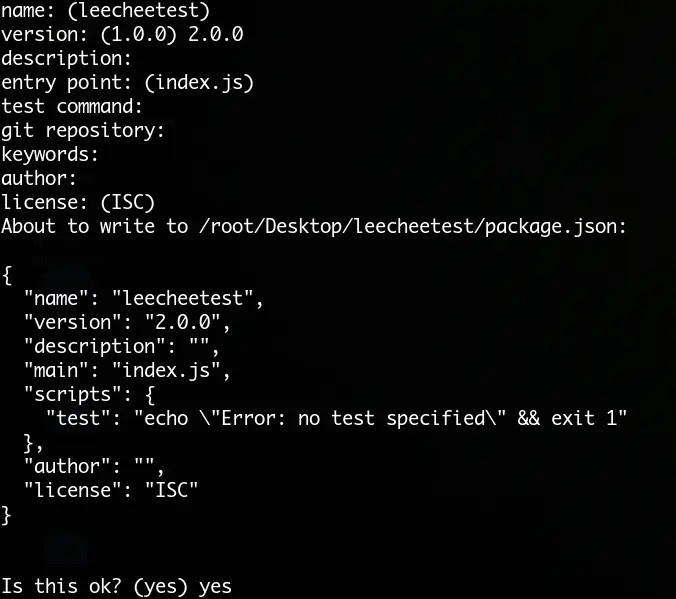
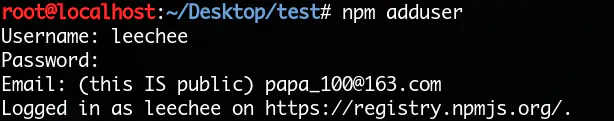
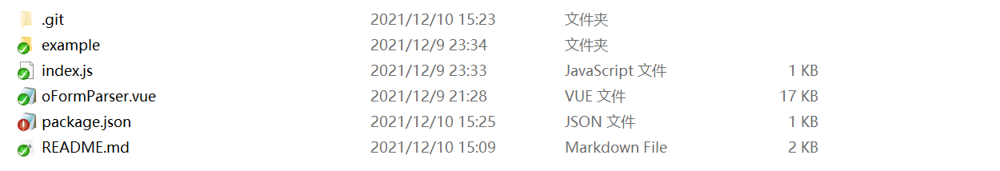

# 通俗易懂地教你发布自己的npm

> 作为一个全栈JavaScript开发者，如果你还不知道npm是什么东西，那么我只能说你真的**OUT**了。
> 让我们来一起学习npm吧！[什么是npm？](https://link.jianshu.com/?t=https://www.npmjs.com/)

## 准备工作

- 首先去[npm官网](https://link.jianshu.com/?t=https://www.npmjs.com/signup)注册一个自己的账号，
- 同时你也需要一个[GitHub](https://link.jianshu.com/?t=https://github.com/)账号，用来托管你的模块代码
- [安装nodejs](https://link.jianshu.com/?t=https://nodejs.org/en/)

## 制作自己的npm模块

执行命令：`npm init`并填写相关的信息

- `name` 模块的名字，默认是你当前文件夹的名字
- `version` 版本号，默认是1.0.0
- `description` 描述
- `entry point` 入口文件，默认是`index.js`
- `test command` 测试命令
- `git repository` git仓库，填写项目的github仓库地址
- `keywords` 关键字
- `author` 作者
- `license` 许可证书，默认`ISC`



如果你什么也不想填写，一直敲回车就好，填写完信息后当前文件夹会生成`package.json`文件。当然，如果你信息填写错误或者想添加一些东西，直接修改`package.json`文件就好

## 发布到npm仓库

首先，执行命令：`npm adduser`，输入你的npm账号、密码、邮箱



> 注意！如出现登录401错误，是因为当前属于淘宝镜像，需要切换到npm源镜像

```text
npm config set registry https://registry.npmjs.org/
```

发布完成后，可自行切回淘宝镜像

```text
npm config set registry  https://registry.npm.taobao.org/
```

然后执行`npm publish`，你的模块就发布到npm仓库了，版本号默认是`package.json`中的`version`。

命令执行成功后就可以在npm上看到你的模块了

> 注意！如果你发布了一个版本，下一次执行`npm publish`的时候版本号一定要高于之前的版本号

## 安装

> npm i 项目名

## npm示例项目



- .git可选，属于git仓库信息

- example可选，我放了一个调用示例

- index.js 入口文件

  ```javascript
  import oFormParser from './oFormParser'
  
  export default oFormParser
  ```

  

- oFormParser.vue 可用文件 存放项目可用组件

  ```javascript
  <template>
  	<view class="formParser-box">
  
  		<!-- 动态表单 -->
  		<u-form :model="form" ref="uForm" label-width="150">
  			<block v-for="(item, index) in normalizedSize" :key="item.keyName">
  
  				<u-form-item ref="uFormItem" :label="item.label" :prop="item.keyName" :required="item.required">
  
  					<!-- input 输入框（单行文本，多行文本，密码框） -->
  					<u-input v-if="item.tag == 'input'" v-bind:value="form[item.keyName]" :disabled="item.disabled"
  						:type="item.type" :placeholder="item.placeholder" border
  						@input="onChangeRate($event, index, item.keyName)" />
  
  			</block>
  		</u-form>
  
  	</view>
  </template>
  
  <script>
  	export default {
  		name: "formParser",
  		props: {
  			// 父组件表单数据
  			formParserData: {
  				type: Array,
  				default: () => []
  			},
  		},
  		computed: {
  		},
  		data() {
  			return {
  			};
  		},
  		mounted() {
  		},
  		methods: {
  			
  	}
  </script>
  
  <style lang="scss">
  	.formParser-box {
  		padding: 25rpx;
  
  		.form-footer {
  			padding: 60rpx 0;
  		}
  	}
  </style>
  
  ```

  

- package.json npm版本信息

- README.md 仓库文档信息

<script>
export default {
    mounted () {
      this.$page.lastUpdated = "2022/1/14 下午6:09:09";
    }
  }
</script>