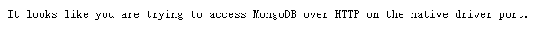

# 使用docker启动mongodb

> 使用docker启动mongodb

## 拉取 MongoDB 镜像并创建容器

由于树莓派是 ARM 架构，使用 latest 标签镜像可能无法使用，所以我们需要使用带有 ARM 标签的镜像，如：

```bash
docker pull mongo:4.2.16-rc0-bionic
```

然后我们使用以下命令创建 MongoDB 容器

```bash
docker run --name some-mongo -p 27017:27017 -d mongo:4.2.16-rc0-bionic
```

然后我们尝试访问 MongoDB

```
IP:27017
```

访问成功



## 创建用户

在终端输入以下命令，进入 MongoDB

```bash
docker exec -it some-mongo mongo admin
```

创建一个名为 admin，密码为 123456 的用户

```bash
db.createUser({ user:'admin',pwd:'123456',roles:[ { role:'userAdminAnyDatabase', db: 'admin'},"readWriteAnyDatabase"]});
```

> 树莓派版本的mongodb只能使用docker volume create方式挂载数据卷

