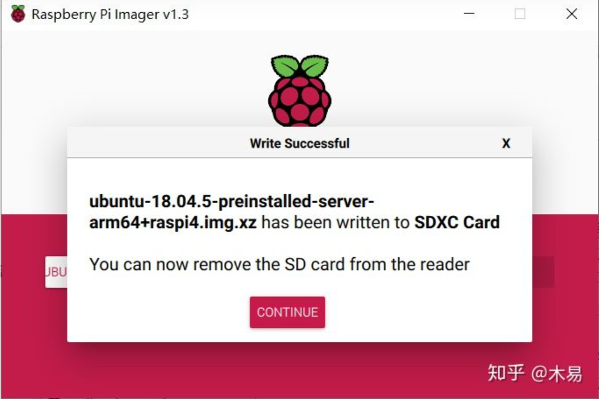
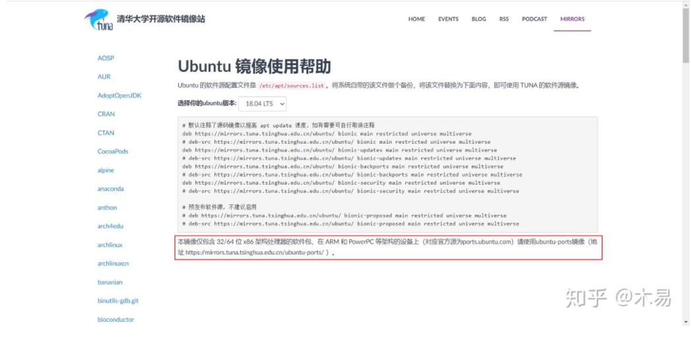
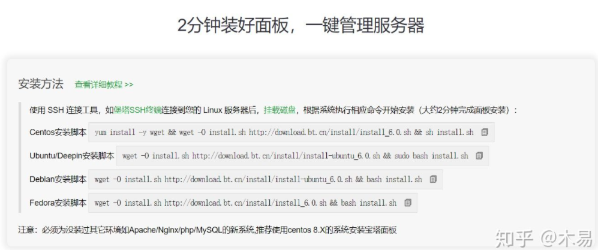
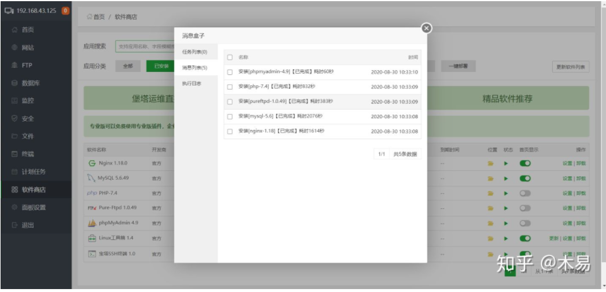

# 树莓派安装Ubuntu系统

> 树莓派安装Ubuntu系统

## 系统的安装

安装过程十分简单，下载[官方镜像](https://cdimage.ubuntu.com/releases/18.04.5/release/ubuntu-18.04.5-preinstalled-server-arm64+raspi4.img.xz)后，使用[Raspberry Pi Imager](https://downloads.raspberrypi.org/imager/imager_1.4.exe)软件将镜像烧录到SD卡。



烧录完成后，重新插拔SD卡，进入boot目录。

为了使树莓派的新系统第一次启动时能自动连接WIFI，需要在boot目录下打开network-config文件，按以下内容取消注释，并修改wifi名称和密码。

```text
# This file contains a netplan-compatible configuration which cloud-init
# will apply on first-boot. Please refer to the cloud-init documentation and
# the netplan reference for full details:
#
# https://cloudinit.readthedocs.io/
# https://netplan.io/reference
#
# Some additional examples are commented out below

version: 2
ethernets:
  eth0:
    dhcp4: true
    optional: true
wifis:
  wlan0:
    dhcp4: true
    optional: true
    access-points:
      homessid（这里填写wifi名称）:
        password: "S3kr1t"（引号内填写wifi密码）
#      myotherlan:
#        password: "correct battery horse staple"
#      workssid:
#        auth:
#          key-management: eap
#          method: peap
#          identity: "me@example.com"
#          password: "passw0rd"
#          ca-certificate: /etc/my_ca.pem
```

其次，ubuntu系统默认开启ssh，因此这里不需要像Raspberry Pi OS 一样新建ssh文件。

完成以上操作后，将SD卡插入到树莓派，即可上电开机

### 首次连接

上电2分钟后，将树莓派断电重启。若操作无误，树莓派第二次启动时会自动连接之前设置的wifi。

为了能够ssh连接树莓派，需要知道树莓派的IP地址。

进入Windows PowerShell，输入`arp -a`，查看树莓派的IP地址。（需在同一网络下）

得到ip地址为后，使用ssh连接，用户名ubuntu，密码ubuntu。首次登录会提示修改密码，按要求操作即可。修改密码后会断开连接，而后重新连接。



```text
# 默认注释了源码镜像以提高 apt update 速度，如有需要可自行取消注释
deb https://mirrors.tuna.tsinghua.edu.cn/ubuntu-ports/  bionic main restricted universe multiverse
# deb-src https://mirrors.tuna.tsinghua.edu.cn/ubuntu-ports/  bionic main restricted universe multiverse
deb https://mirrors.tuna.tsinghua.edu.cn/ubuntu-ports/  bionic-updates main restricted universe multiverse
# deb-src https://mirrors.tuna.tsinghua.edu.cn/ubuntu-ports/  bionic-updates main restricted universe multiverse
deb https://mirrors.tuna.tsinghua.edu.cn/ubuntu-ports/  bionic-backports main restricted universe multiverse
# deb-src https://mirrors.tuna.tsinghua.edu.cn/ubuntu-ports/  bionic-backports main restricted universe multiverse
deb https://mirrors.tuna.tsinghua.edu.cn/ubuntu-ports/  bionic-security main restricted universe multiverse
# deb-src https://mirrors.tuna.tsinghua.edu.cn/ubuntu-ports/  bionic-security main restricted universe multiverse

# 预发布软件源，不建议启用
# deb https://mirrors.tuna.tsinghua.edu.cn/ubuntu-ports/  bionic-proposed main restricted universe multiverse
# deb-src https://mirrors.tuna.tsinghua.edu.cn/ubuntu-ports/  bionic-proposed main restricted universe multiverse
```

编辑镜像站后，使用`sudo apt-get update`命令，更新软件源列表，同时检查编辑是否正确。

随后使用`sudo apt-get upgrade`将系统升级至最新。

### 安装宝塔面板

进入[宝塔Linux面板](https://link.zhihu.com/?target=https%3A//www.bt.cn/download/linux.html)，找到**Ubuntu/Deepin安装脚本**



登录树莓派后，使用`sudo su`命令切换到root用户，执行宝塔面板安装命令。

```text
wget -O install.sh http://download.bt.cn/install/install-ubuntu_6.0.sh && sudo bash install.sh
```

等待一段时间后，安装完成。（安装较慢）

随后根据内网地址访问宝塔面板，输入用户名和密码进行登录。

安装耗费时间参考如图。如果出现安装失败的，在软件商店中搜索失败的项目，重新安装即可。



### 镜像安装

> 作者已制作树莓派4B的Ubuntu18镜像，可直接通过镜像安装
>
> 如需要请联系作者

