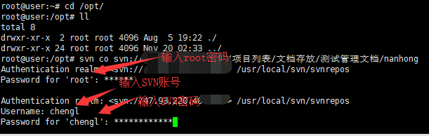
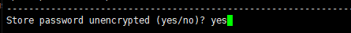

# 树莓派搭建SVN服务器

> 树莓派搭建SVN服务器

系统为Ubuntu18

## 下载创建目录

- 进入终端，输入下面命令安装 svn 。需要管理员权限时请添加 sudo 在最前方，因为本人是管理员登陆的，所以下列命令并没有出现 sudo

> apt install subversion

- 创建 db 下的 svn 文件夹，用于保存 svn 相关的东西

> mkdir /db/svn

- 创建 svn 下的 repository 文件夹，用于存储版本库相关文件(repository 则是仓库名)

> mkdir /db/svn/repository  

- 更改 repository 的权限为 777 ，所有用户可读可写可执行

> chmod -R 777 /db/svn/repository

- 在 repository 文件夹创建 svn 版本库（创建仓库）

> svnadmin create /db/svn/repository

## 修改配置

- 设置 svn 的访问权限，打开 /db/svn/repository/conf/svnserve.conf 文件

> vim /db/svn/repository/conf/svnserve.conf

- 将下面几行的注释 **#** 去掉（注意缩进，删除#后必须顶格写）

```text
#anon-access = none             （设置为 none 才可以用小乌龟看 svn 日志）
#auth-access = write            （权限用户可写）
#password-db = password         （密码文件为 password）
#authz-db = authz               （权限文件为 authz）
```

- 配置用户权限，打开 /db/svn/repository/conf/authz 文件

> vim /db/svn/repository/conf/authz

- 在 [groups] 下添加组的成员的信息

```text
admin = user1,user2            （将 user1,user2 添加到 admin 组）
[/]                            （针对版本库所有实例）
@admin = rw                    （admin 组用户的权限为可读可写）
```

- 配置用户密码，打开 /db/svn/repository/conf/passwd 文件

> vim /db/svn/repository/conf/passwd

- 在 [users] 下配置用户密码

```text
user1 = user1_passwd          （用户名 = 密码）
```

## 启动SVN

- 启动 svn 服务器

> svnserve -d -r /db/svn （-d：后台运行 ，-r：指定svn服务器根目录）

- 检查 svn 是否启动成功

> ps -aux|grep svnserve

- 启动成功后在Windows 下使用小乌龟检出

## 注意项

### 客户端访问路径

> svnserve -d -r /db/svn
>
> -d 表示svnserve 以”守护“进程模式进行
>
> -r 指定文件系统的根目录位置，这样客户端不用输入全路径，就可以访问版本库
>
> 如：svn://192.168.1.109/repository


### 建立新的仓库

- 创建 svn 下的 repository 文件夹，用于存储版本库相关文件(repository 则是仓库名)

> mkdir /db/svn/repository  

- 在 repository 文件夹创建 svn 版本库（创建仓库）

> svnadmin create /db/svn/repository

- 重新编辑配置文件

> 可将其他仓库的conf文件夹直接覆盖


### 注意防火墙端口

> 请放行3690


### 全局忽略node_modules等文件夹提交

1. 在版本库目录上文件夹点右键

2.  在乌龟菜单中找到"属性"点开

3.  在弹出窗中点"新增"(或者是新建)

4. 选择其他

5.  在弹出窗中的"属性"下拉选中中选中"svn:ignore"

   > svn:ignore:只对当前目录有效；

   > global-ignores:是全局有效，就是所有目前都有效

6.  然后取值中填上node_modules

7.  确认后刷新目录

8.  再按照正常步骤使用，发现node_modules文件夹已经默认被忽略掉

### 物理机重启后需重启svn服务

> svnserve -d -r /db/svn

### 服务器拉取代码

命令行输入

```bash
svn co svn://ip/代码路径 /www/wwwroot/dist（拉取到哪的路径）
```

 输入当前服务器密码，输入SVN账号和密码，输入yes，点击回车
需要等待几分钟，具体等待时间根据拉取的文件多少和网速 

  

  


