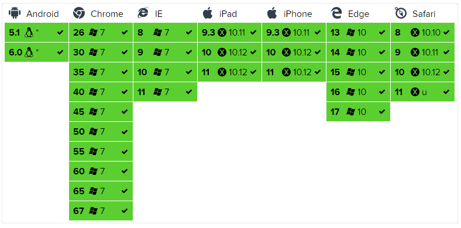

# Excel导出插件

> Excel导出插件

用于前端基于Dom导出Excel表格

## 浏览器支持



## 安装

基础包

```text
npm install xlsx
```

样式增强包

```text
npm install xlsx-style --save
```

## 源码样例

我的版本是

  "xlsx": "^0.17.3",

  "xlsx-style": "^0.8.13"

```vue
<template>
  <div>
    <el-table
      :data="tableData"
      :span-method="arraySpanMethod"
      border
      style="width: 100%"
      id="tb"
    >
      <el-table-column prop="id" label="ID" width="180"> </el-table-column>
      <el-table-column prop="name" label="姓名"> </el-table-column>
      <el-table-column prop="amount1" sortable label="数值 1">
      </el-table-column>
      <el-table-column prop="amount2" sortable label="数值 2">
      </el-table-column>
      <el-table-column prop="amount3" sortable label="数值 3">
      </el-table-column>
    </el-table>

    <button @click="qq()">点我</button>
  </div>
</template>

<script>
import XLSX from "xlsx";
import * as XLSX2 from "xlsx-style";

export default {
  data() {
    return {
      tableData: [
        {
          id: "12987122",
          name: "王小虎",
          amount1: "234",
          amount2: "3.2",
          amount3: 10,
        },
        {
          id: "12987123",
          name: "王小虎",
          amount1: "165",
          amount2: "4.43",
          amount3: 12,
        },
        {
          id: "12987124",
          name: "王小虎",
          amount1: "324",
          amount2: "1.9",
          amount3: 9,
        },
        {
          id: "12987125",
          name: "王小虎",
          amount1: "621",
          amount2: "2.2",
          amount3: 17,
        },
        {
          id: "12987126",
          name: "王小虎",
          amount1: "539",
          amount2: "4.1",
          amount3: 15,
        },
      ],
    };
  },
  methods: {
    arraySpanMethod({ row, column, rowIndex, columnIndex }) {
      if (rowIndex % 2 === 0) {
        if (columnIndex === 0) {
          return [1, 2];
        } else if (columnIndex === 1) {
          return [0, 0];
        }
      }
    },

    objectSpanMethod({ row, column, rowIndex, columnIndex }) {
      if (columnIndex === 0) {
        if (rowIndex % 2 === 0) {
          return {
            rowspan: 2,
            colspan: 1,
          };
        } else {
          return {
            rowspan: 0,
            colspan: 0,
          };
        }
      }
    },
    //导出
    qq() {
      //调用导出Excel的方法
      var fileName = "测试";
      var headLength = 5; //获取表格有几列
      var colsLength = 1; //获取表格表头的行数，就是最多是几级表头
      this.$nextTick(() => {
        this.excelTable(
          "tb", //表格id
          `${fileName}${20141212}`, //导出的文件名+时间
          headLength, //一共有几列
          6, //一共有几行
          colsLength //表头有几行
        );
      });
    },
    //递归获得表头最大层数
    fcHeadLength(header, headerRowLength) {
      headerRowLength++;
      header.forEach((item) => {
        if (item.children && item.children.length > 0) {
          fcHeadLength(item.children, headerRowLength);
        } else {
          if (item.label !== "操作") {
            headLength++;
            if (headerRowLength > colsLength) {
              colsLength = headerRowLength;
            }
          }

          return headLength;
        }
      });
    },
    //导出为Excel方法
    tableToExcel(tableID, fileName, headLength, colsLength, headColsLength) {
      console.log(tableID, fileName, headLength, colsLength, headColsLength);
      var thwidth = []; //计算单元格长度
      for (let index = 0; index < headLength; index++) {
        //计算表头宽度
        var test = $("thead")
          .find("tr:eq(0) th:eq(" + index + ")")
          .width();
        thwidth.push(test);
      }
      // return
      console.time("导出总耗时");
      //先添加表格样式，再下载
      var sheet = XLSX.utils.table_to_sheet(
        document.querySelector(`#${tableID}`)
      ); //将一个table对象转换成一个sheet对象
      // console.log(sheet);
      var arr = []; //获取所有列的名称集合
      for (let i = 0; i < headLength; i++) {
        if (i < 26) {
          arr.push(String.fromCharCode(65 + i).toUpperCase());
        } else {
          // console.log(i, String.fromCharCode((65 + (i - 26))).toUpperCase());
          arr.push("A" + String.fromCharCode(65 + (i - 26)).toUpperCase());
        }
      }
      //第一层循环，循环列
      for (let i = 0; i < arr.length; i++) {
        //判断是否多级表头，多级表头的，计算各列单元格长度
        if (headColsLength > 1) {
          //循环多级表头
          for (let j = 0; j < headColsLength; j++) {
            //只循环存在的表头
            if (j < headColsLength && sheet[arr[i] + j]) {
              //判断是多级表头的单元格，计算单元格长度
              if (
                !sheet[arr[i] + (j + 1)] ||
                !sheet[arr[i] + (j - 1)] ||
                (!sheet[arr[i] + (j - 1)] && !sheet[arr[i] + (j + 1)])
              ) {
                //sheet["!cols"].push({
                // wpx: sheet[arr[i] + j].v.length * 2 + 3,
                //});
              }
            }
          }
        } else {
          //不是多级表头直接计算单元格长度
          sheet["!cols"].push({
            wpx: thwidth[i],
          });
        }
        //第二层循环，循环各列的每行数据，添加文字垂直居中
        for (let k = 0; k < colsLength; k++) {
          if (sheet[arr[i] + k]) {
            sheet[arr[i] + k].s = {
              alignment: {
                horizontal: "center",
                vertical: "center",
                wrap_text: true,
              },
            };
          }
        }
      }
      console.timeEnd("导出总耗时");
      this.downloadExcel(sheet2blob(sheet), `${fileName}.xlsx`); //下载
      // document.getElementById('app').removeChild(document.getElementById(tableID)) //每次下载完，删除下载生成的表格

      function sheet2blob(sheet, sheetName) {
        sheetName = sheetName || "sheet1";
        var workbook = {
          SheetNames: [sheetName],
          Sheets: {},
        };
        workbook.Sheets[sheetName] = sheet; // 生成excel的配置项

        var wopts = {
          bookType: "xlsx", // 要生成的文件类型
          bookSST: false, // 是否生成Shared String Table，官方解释是，如果开启生成速度会下降，但在低版本IOS设备上有更好的兼容性
          type: "binary",
        };
        var wbout = XLSX2.write(workbook, wopts);
        var blob = new Blob([s2ab(wbout)], {
          type: "application/octet-stream",
        }); // 字符串转ArrayBuffer
        function s2ab(s) {
          var buf = new ArrayBuffer(s.length);
          var view = new Uint8Array(buf);
          for (var i = 0; i != s.length; ++i) view[i] = s.charCodeAt(i) & 0xff;
          return buf;
        }
        return blob;
      }
    },
    downloadExcel(url, saveName) {
      if (typeof url == "object" && url instanceof Blob) {
        url = URL.createObjectURL(url); // 创建blob地址
      }
      var aLink = document.createElement("a");
      aLink.href = url;
      aLink.download = saveName || ""; // HTML5新增的属性，指定保存文件名，可以不要后缀，注意，file:///模式下不会生效
      var event;
      if (window.MouseEvent) event = new MouseEvent("click");
      else {
        event = document.createEvent("MouseEvents");
        event.initMouseEvent(
          "click",
          true,
          false,
          window,
          0,
          0,
          0,
          0,
          0,
          false,
          false,
          false,
          false,
          0,
          null
        );
      }
      aLink.dispatchEvent(event);
    },
    excelTable(tableID, fileName, headLength, colsLength, headColsLength) {
      this.tableToExcel(
        tableID,
        fileName,
        headLength,
        colsLength + 1,
        headColsLength
      );
    },
  },
};
</script>
```


