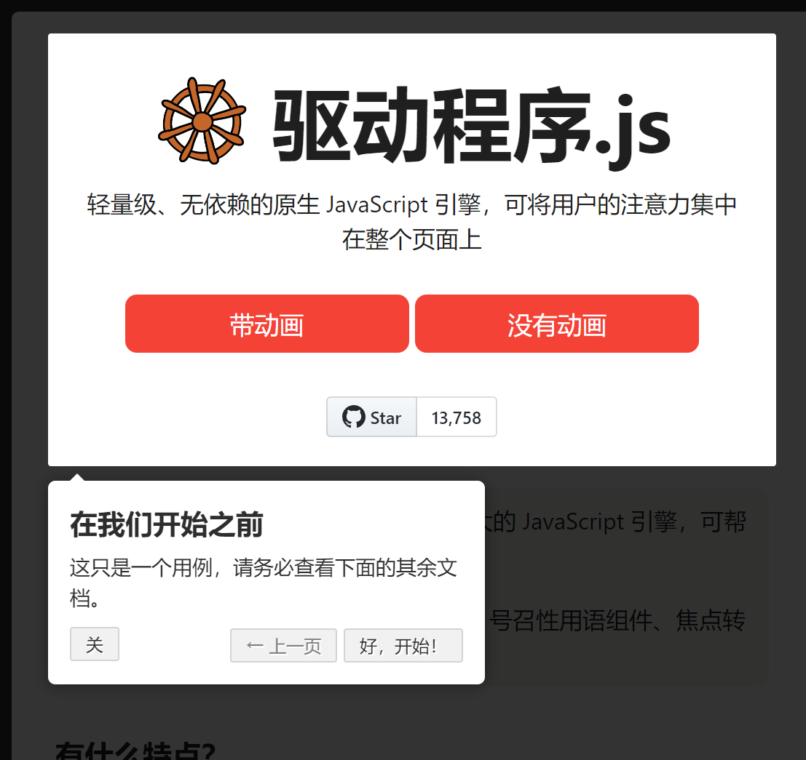

# driverjs插件新手交互引导

> driverjs插件新手交互引导

## 介绍

driver.js是一个功能强大且高度可定制的基于原生JavaScript开发的新用户引导库。它没有依赖项，支持所有主要浏览器。

Driver.js官网地址：https://kamranahmed.info/driver.js/

GitHub地址：https://github.com/kamranahmedse/driver.js



**NPM安装依赖：**

```shell
npm i driver.js --save
```

在项目中引入依赖：

```js
import Driver from 'driver.js';
import 'driver.js/dist/driver.min.css';
```

## 代码实现

在项目中需要先实例化 driver 对象，然后调用 `driver.defineSteps(array)` 方法实现引导步骤。
在需要实现新用户引导的Vue文件中实例化driver对象，例如在项目的 main.vue 文件中，driver.js用法如下所示：

```vue
<template>
  <div class="panel-group">
    <component :is="currentRole" />
  </div>
 <div id="hamburger-container">
   <component :is="currentRole" />
 </div>
</template>

<script>
import adminDashboard from './admin'
import Driver from 'driver.js' // 引入driver.js依赖
import 'driver.js/dist/driver.min.css' // 引入driver.js的样式文件

export default {
  name: 'Main',
  components: { adminDashboard },
  data() {
    return {
      currentRole: 'adminDashboard',
      driver: null
    }
  },
  mounted() {
    // 实例化driver对象
    this.driver = new Driver()
    // 弹框提示
    this.$confirm('是否进入新手导航？', '提示', {
      confirmButtonText: '确定',
      cancelButtonText: '取消'
    }).then(() => {
      // 调用新手引导方法
      this.onNavigation()
    }).catch(() => {})
  },
  methods: {
    onNavigation() {
      // 新手引导方法
      this.driver.defineSteps([
        {
          element: '#hamburger-container',
          popover: {
            title: '折叠按钮',
            description: '点击折叠左侧菜单导航',
            position: 'right',
            nextBtnText: '下一步',
            prevBtnText: '上一步',
            closeBtnText: '关闭'
          }
        },
        {
          element: '.panel-group',
          popover: {
            title: '数据统计',
            description: '统计每日最新数据',
            position: 'bottom',
            nextBtnText: '下一步',
            prevBtnText: '上一步',
            closeBtnText: '关闭'
          }
        }
      ])

      // 必须调用 start() 方法才能生效
      this.driver.start()
    }
  }
}
</script>
```


## 配置说明

`defineSteps()` 方法的参数为数组类型，数组中元素就是要执行的引导步骤。step 选项包括：

```json
{
  element: '#item',  // 需要被高亮的元素选择器
  popover: {                    // 弹框内容，如果为空将不会显示弹窗
    className: 'popover-class', // 额外指定的当前步骤弹窗类名
    title: '弹框标题',             // 弹窗的标题
    description: '该步骤是用于xxx', // 弹窗的主体内容
    showButtons: false,         // 是否在弹窗底部显示控制按钮
    closeBtnText: '关闭',      // 关闭按钮的文本
    nextBtnText: '下一步',        // 当前步骤的下一步按钮文本
    prevBtnText: '上一步',    // 当前步骤的上一步按钮文本
    doneBtnText: '完成'    // 最后一步完成按钮文本
  }
}
```

##  diver对象配置参数说明

```javascript
const driver = new Driver({
  className: 'scoped-class', //包裹driver.js弹窗的类名
  animate: true,  // 高亮元素改变时是否显示动画
  opacity: 0.75,  //背景透明度(0 表示只有弹窗并且没有遮罩)
  padding: 10,   //  元素与边缘的距离
  allowClose: true, // 是否允许点击遮罩时关闭
  overlayClickNext: false, //是否允许点击遮罩时移到到下一步
  doneBtnText: 'Done', // 最终按钮上的文本
  closeBtnText: 'Close', // 当前步骤关闭按钮上的文本
  nextBtnText: 'Next', //当前步骤下一步按钮上的文本
  prevBtnText: 'Previous', // 当前步骤上一步按钮上的文本
  showButtons: false, //是否在底部显示控制按钮
  keyboardControl: true, // 是否允许通告键盘控制(escape关闭，箭头键用于移动)
  scrollIntoViewOptions: {}, //  `scrollIntoView()` 方法的选项
  onHighlightStarted: (Element) {}, // 元素开将要高亮时调用
  onHighlighted: (Element) {}, // 元素开完全高亮时调用
  onDeselected: (Element) {}, // 取消选择时调用
  onReset: (Element) {},        // 遮罩将要关闭时调用
  onNext: (Element) => {},      // 任何步骤中移到到下一步时调用
  onPrevious: (Element) => {},  // 任何步骤中移到到上一步时调用
});
```

 driver对象提供一系列强大的API方法，开发者通过这些API方法对driver.js实现高度定制。driver对象API方法如下： 

```javascript
const isActivated = driver.isActivated; // 检查driver是否激活
driver.moveNext();     // 移动到步骤列表中的下一步
driver.movePrevious(); // 移动到步骤列表中的上一步
driver.start(stepNumber = 0);  // 从指定的步骤开始
driver.highlight(string|stepDefinition); // 高亮通过查询选择器指定的或步骤定义的元素 
driver.reset(); // 重置遮罩并且清屏
driver.hasHighlightedElement(); //检查是否有高亮元素
driver.hasNextStep(); // 检查是否有可移动到的下一步元素
driver.hasPreviousStep(); // 检查是否有可移动到的上一步元素
driver.preventMove();// 阻止当前移动。如果要执行某些异步任务并手动移动到下一步，则在“onNext”或“onPrevious”中很有用

const activeElement = driver.getHighlightedElement();// 获取屏幕上当前高亮元素
const lastActiveElement = driver.getLastHighlightedElement();
activeElement.getCalculatedPosition(); // 获取活动元素的屏幕坐标
activeElement.hidePopover();  // 隐藏弹窗
activeElement.showPopover();  // 显示弹窗
activeElement.getNode();  // 获取此元素后面的DOM元素
```

## [html使用参考](https://zhuanlan.zhihu.com/p/544404499?utm_source=qq&utm_medium=social&utm_oi=623572166525063168)

