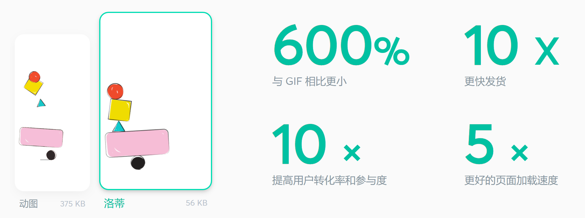

# vue使用svg动画插件

## 优势

Lottie 是一种开源动画文件格式，它体积小、质量高、可编写脚本、可交互，并且可以在运行时进行操作。
App Store 中排名前 500 的应用程序现在使用 Lottie 来吸引用户并提高转化率。



## 演示

[查看](https://chenqingspring.github.io/vue-lottie)

## 依赖

```shell
npm install --save vue-lottie
```

从[网站](https://lottiefiles.com/)下载动画（下载成json文件）

## 案例

### 定义组件

```vue
<!--
 * @Author: 时不待我 790002517@qq.com
 * @Date: 2022-09-15 15:00:25
 * @LastEditors: 时不待我 790002517@qq.com
 * @LastEditTime: 2022-09-15 15:13:50
-->
<template>
    <div :style="style" ref="lavContainer"></div>
</template>

<script>
   import lottie from 'lottie-web';
  export default {
    props: {
      options: {
        type: Object,
        required: true
      },
      height: Number,
      width: Number,
    },
    data () {
      return {
        style: {
          width: this.width ? `${this.width}px` : '100%',
          height: this.height ? `${this.height}px` : '100%',
          overflow: 'hidden',
          margin: '0 auto'
        }
      }
    },
    mounted () {
      this.anim = lottie.loadAnimation({
          container: this.$refs.lavContainer,
          renderer: 'svg',
          loop: this.options.loop !== false,
          autoplay: this.options.autoplay !== false,
          animationData: this.options.animationData,
          rendererSettings: this.options.rendererSettings
        }
      );
      this.$emit('animCreated', this.anim)
    }
  }
</script>
```


### 使用

```vue
<template>
  <div class="docs">
    <lottie
      :options="defaultOptions.animation"
      :height="400"
      :width="400"
      v-on:animCreated="handleAnimation"
    />
  </div>
</template>

<script>
import Lottie from "../components/lottie.vue";
import * as fan404 from "../../public/css-js/119776-table-fan-404-error.json";
import * as page404 from "../../public/css-js/115858-404-page-not-found.json";
import * as ufo404 from "../../public/css-js/119608-404-ufo-error-page.json";
export default {
  components: {
    lottie: Lottie,
  },
  data() {
    return {
      animation: [fan404, page404, ufo404],
      defaultOptions: {
        animation:{
            animationData: null,
        }
        
      },
    };
  },
  methods: {
    handleAnimation(anim) {
      this.anim = anim;
    },
  },
  created() {
    this.defaultOptions.animation.animationData = this.animation[
      Math.floor(Math.random() * this.animation.length)
    ].default;
  }
};
</script>


```


## 单个页面如何使用多个动画组件?

```vue
<template>
  <div class="docs">
   <lottie
      class="lottie"
      :options="defaultOptions.confettiData"
      :height="400"
      :width="400"
      v-on:animCreated="handleAnimation($event, 'confettiData')"
    />
    <lottie
        class="starslottie"
        :options="defaultOptions.starsData"
        v-on:animCreated="handleAnimation($event, 'starsData')"
      />
  </div>
</template>

<script>
import Lottie from "./.vuepress/theme/components/lottie.vue";
import * as confettiData from "./.vuepress/public/css-js/116943-confetti-3colorsjson.json";
import * as starsData from "./.vuepress/public/css-js/114031-rating-stars.json";
export default {
  components: {
    lottie: Lottie,
  },
  data() {
    return {
      anim: {
        confettiData: null,
        starsData: null,
      },
      defaultOptions: {
        confettiData: {
          animationData: confettiData.default,
        },

        starsData: {
          animationData: starsData.default,
        },
      },
    };
  },
  methods: {
    handleAnimation(anim, type) {
      this.anim[type] = anim;
    },
  },
  mounted(){
    this.$nextTick(() => {
    //设置动画速度
        this.anim["confettiData"].setSpeed(2);
        this.anim["starsData"].setSpeed(0.5);
        // DOM 更新了
      });
  }
};
</script>


```

