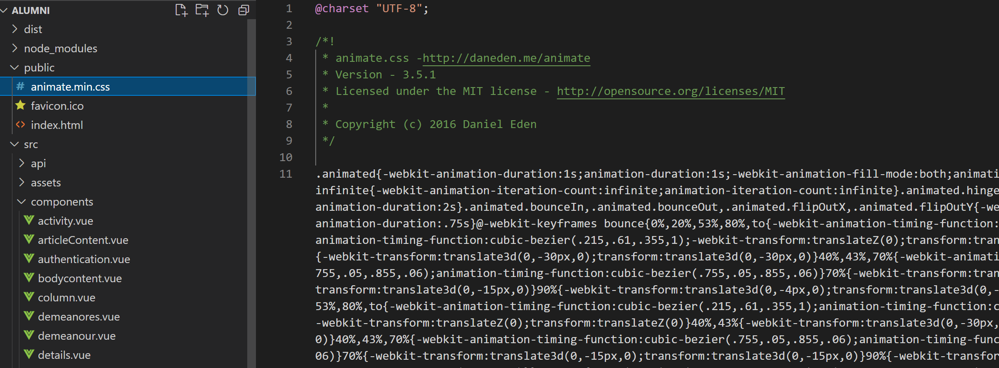

# vue滚动动画插件

> vue滚动动画插件


一个 Vue.js 指令，当元素滚动到视图中时对元素应用显示效果。

CSS3 驱动的滚动触发动画需要[Animate.css](https://daneden.github.io/animate.css/)。

## 下载依赖

```bash
npm install vue-animate-onscroll
# or
yarn add vue-animate-onscroll
```

从 [animate.css](https://cdn.jsdelivr.net/npm/animate.css@3.5.2/animate.min.css)复制到public文件夹内



并在index.html引入

```html
 <link rel="stylesheet" href="./animate.min.css">
```


## 导入并注册指令。

```vue
import Vue from 'vue'
import VueAnimateOnScroll from 'vue-animate-onscroll'

Vue.use(VueAnimateOnScroll)
```

## 将动画类插入所需的元素。

```vue
<div v-animate-onscroll="'animated flip'">滚动时动画一次</div>
```

## 指定向上滚动和向下滚动事件的动画。

 通过传入一个对象作为值，也可以仅在特定的滚动方向上设置动画。在下面的示例中，动画只会在您第一次向下滚动元素时触发。 

```vue
<div v-animate-onscroll="{down: 'animated flip'}">向下滚动时动画一次</div>
```

 向上滚动： 

```vue
<div v-animate-onscroll="{up: 'animated rotateOut'}">向上滚动时动画一次</div>
```

## 如果你想重复滚动动画：

```vue
<div v-animate-onscroll.repeat="{down: '动画翻转', up: '动画反弹' }">
  动画元素
</div>
```

## 多个动画

或者为每个滚动方向使用两个不同的动画：

```vue
< div  v-animate-onscroll ="{down: 'animated flip', up: 'animated rotateOut' }" >永远滚动时动画我</ div >
```

请注意，通过同时提供`up`和`down`方向，`repeat`修饰符隐式生效。

## 使用更多animate动画

从animate官网复制名字

然后使用


