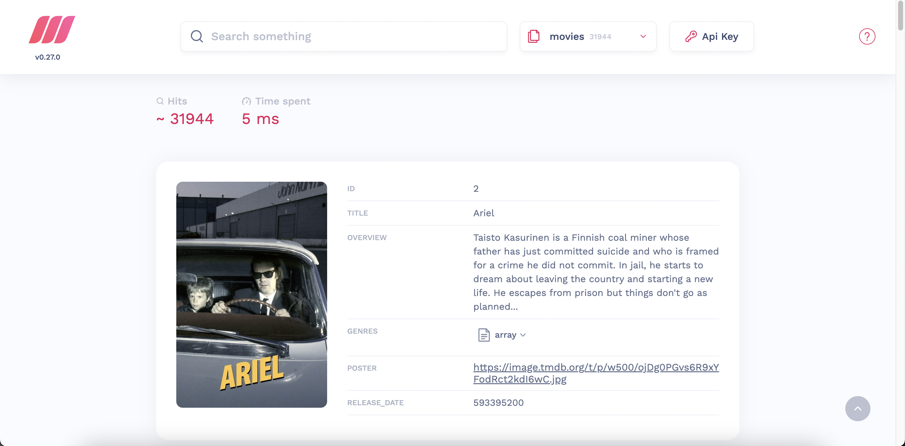

# 支持RESTfulAPI的开源快速搜索引擎

> 支持RESTfulAPI的开源快速搜索引擎

**Meilisearch**是一个强大、快速、开源、易于使用和部署的搜索引擎。支持几乎所有开发语言集成，甚至直接支持js直接调用，在搜索和索引都是高度可定制的。开箱即用地提供了诸如错字容错、过滤器和同义词等功能。有关功能的更多信息，请访问[我们的文档](https://docs.meilisearch.com/)。

  

## ✨特征

- 输入即搜索体验（回答 < 50 毫秒）
- 全文搜索
- 错字容忍（理解错别字和拼写错误）
- 分面搜索和过滤器
- 支持汉字（汉字）
- 支持同义词
- 易于安装、部署和维护
- 全部文件被退回
- 高度可定制
- RESTful API
- 高亮突出显示
- 加权降权
- 在查询时对搜索结果进行排序

## 支持

| SDK                                                          | Meilisearch | Algolia | Typesense | Elasticsearch |
| ------------------------------------------------------------ | :---------: | :-----: | :-------: | :-----------: |
| REST API                                                     |      ✅      |    ✅    |     ✅     |       ✅       |
| [JavaScript 客户端](https://github.com/meilisearch/meilisearch-js) |      ✅      |    ✅    |     ✅     |       ✅       |
| [PHP客户端](https://github.com/meilisearch/meilisearch-php)  |      ✅      |    ✅    |     ✅     |       ✅       |
| [Python 客户端 ](https://github.com/meilisearch/meilisearch-python) |      ✅      |    ✅    |     ✅     |       ✅       |
| [Ruby客户端 ](https://github.com/meilisearch/meilisearch-ruby) |      ✅      |    ✅    |     ✅     |       ✅       |
| [java客户端 ](https://github.com/meilisearch/meilisearch-java) |      ✅      |    ✅    |     ✅     |       ✅       |
| [Swift 客户端 ](https://github.com/meilisearch/meilisearch-swift) |      ✅      |    ✅    |   🔶 WIP   |       ❌       |
| [.NET 客户端 ](https://github.com/meilisearch/meilisearch-dotnet) |      ✅      |    ✅    |     ❌     |       ✅       |
| [Rust客户端 ](https://github.com/meilisearch/meilisearch-rust) |      ✅      |    ❌    |   🔶 WIP   |       ✅       |
| [GO客户端 ](https://github.com/meilisearch/meilisearch-go)   |      ✅      |    ✅    |     ✅     |       ✅       |
| [Dart客户端 ](https://github.com/meilisearch/meilisearch-dart) |      ✅      |    ✅    |     ✅     |       ❌       |
| [Symfony](https://github.com/meilisearch/meilisearch-symfony) |      ✅      |    ✅    |     ❌     |       ❌       |
| [Django ](https://roadmap.meilisearch.com/c/60-django)       |      ❌      |    ✅    |     ❌     |       ❌       |
| [Rails ](https://github.com/meilisearch/meilisearch-rails)   |      ✅      |    ✅    |   🔶 WIP   |       ✅       |
| [Official Laravel Scout Support ](https://github.com/laravel/scout) |      ✅      |    ✅    |     ❌     |       ❌       |
| [UI Search Kit ](https://github.com/meilisearch/instant-meilisearch) |      ✅      |    ✅    |     ✅     |       ✅       |
| [Docsearch ](https://github.com/meilisearch/docs-scraper)    |      ✅      |    ✅    |     ✅     |       ❌       |
| [Strapi ](https://github.com/meilisearch/strapi-plugin-meilisearch) |      ✅      |    ✅    |     ❌     |       ❌       |
| [Gatsby](https://github.com/meilisearch/gatsby-plugin-meilisearch) |      ✅      |    ✅    |     ✅     |       ❌       |
| [Firebase ](https://github.com/meilisearch/firestore-meilisearch) |      ✅      |    ✅    |     ✅     |       ❌       |


## 其他同类产品比较

|            |                         Meilisearch                          |  Algolia   |                          Typesense                           | Elasticsearch                                       |
| :--------: | :----------------------------------------------------------: | :--------: | :----------------------------------------------------------: | --------------------------------------------------- |
| 源代码许可 | [MIT](https://choosealicense.com/licenses/mit/)（完全开源）  |    闭源    | [GPL-3](https://choosealicense.com/licenses/gpl-3.0/) （完全开源） | SSPL （[非开源 ](https://opensource.org/node/1099)) |
|    内置    | Rust [看看我们为什么相信 Rust  ](https://www.abetterinternet.org/docs/memory-safety/). |    C++     |                             C++                              | java                                                |
|  数据存储  |               带内存映射的磁盘——不受 RAM 限制                | 受内存限制 |                          受内存限制                          | 带有 RAM 缓存的磁盘                                 |

## 入门

### 部署服务器（几种安装方法）

#### Docker（推荐方法）

```bash
docker run -p 7700:7700 -v "$(pwd)/meili_data:/meili_data" getmeili/meilisearch
```

#### APT（Debian 和 Ubuntu）

```bash
echo "deb [trusted=yes] https://apt.fury.io/meilisearch/ /" > /etc/apt/sources.list.d/fury.list
apt update && apt install meilisearch-http
meilisearch
```

#### 下载二进制文件一键安装（Linux 和 Mac OS）

```bash
curl -L https://install.meilisearch.com | sh
./meilisearch
```

#### 从源代码编译并运行它

如果您在本地系统上安装了最新的稳定 Rust 环境，请克隆存储库并将其更改为您的工作目录。

```bash
git clone https://github.com/meilisearch/meilisearch.git
cd meilisearch
cargo run --release
```

### 创建索引并上传一些文档

让我们创建一个索引！如果您需要样本数据集，请使用[此电影数据库](https://www.notion.so/meilisearch/A-movies-dataset-to-test-Meili-1cbf7c9cfa4247249c40edfa22d7ca87#b5ae399b81834705ba5420ac70358a65)。您也可以在`datasets/`目录中找到它。

```bash
curl -L https://docs.meilisearch.com/movies.json -o movies.json
```

现在，您已准备好索引一些数据。

```bash
curl -i -X POST 'http://127.0.0.1:7700/indexes/movies/documents' \
  --header 'content-type: application/json' \
  --data-binary @movies.json
```

### 搜索文件

#### 在命令行中

搜索引擎现在知道您的文档，并且可以通过 HTTP 服务器提供这些文档。

命令行[`jq`工具](https://stedolan.github.io/jq/)可以极大地帮助您阅读服务器响应

```bash
curl 'http://127.0.0.1:7700/indexes/movies/search?q=botman+robin&limit=2' | jq
```

或者直接使用

```bash
curl \
  -X POST 'http://localhost:7700/indexes/movies/search' \
  -H 'Content-Type: application/json' \
  --data-binary '{ "q": "botman" }'
```

#### 在代码中

js

```javascript
client.index('movies').search('botman').then((res) => console.log(res))
```

python

```python
client.index('movies').search('botman')
```

PHP

```php
$client->index('movies')->search('botman');
```

java

```java
client.index("movies").search("botman");
```


结果：

```json
{
  "hits": [
    {
      "id": "415",
      "title": "Batman & Robin",
      "poster": "https://image.tmdb.org/t/p/w1280/79AYCcxw3kSKbhGpx1LiqaCAbwo.jpg",
      "overview": "Along with crime-fighting partner Robin and new recruit Batgirl, Batman battles the dual threat of frosty genius Mr. Freeze and homicidal horticulturalist Poison Ivy. Freeze plans to put Gotham City on ice, while Ivy tries to drive a wedge between the dynamic duo.",
      "release_date": 866768400
    },
    {
      "id": "411736",
      "title": "Batman: Return of the Caped Crusaders",
      "poster": "https://image.tmdb.org/t/p/w1280/GW3IyMW5Xgl0cgCN8wu96IlNpD.jpg",
      "overview": "Adam West and Burt Ward returns to their iconic roles of Batman and Robin. Featuring the voices of Adam West, Burt Ward, and Julie Newmar, the film sees the superheroes going up against classic villains like The Joker, The Riddler, The Penguin and Catwoman, both in Gotham City… and in space.",
      "release_date": 1475888400
    }
  ],
  "nbHits": 8,
  "exhaustiveNbHits": false,
  "query": "botman robin",
  "limit": 2,
  "offset": 0,
  "processingTimeMs": 2
}
```

#### 使用网络界面

我们还提供了一个**开箱即用的[Web 界面](https://github.com/meilisearch/mini-dashboard)**，您可以在其中交互式地测试 Meilisearch。

您可以在服务器根目录的 Web 浏览器中访问 Web 界面。默认 URL 是[http://127.0.0.1:7700](http://127.0.0.1:7700/)。您需要做的就是打开您的网络浏览器并输入 Meilisearch 的地址来访问它。这将引导您进入带有搜索栏的网页，允许您在所选索引中进行搜索。

  

### 前端集成

现在唯一缺少的步骤是在您的项目中添加一个搜索栏。实现这一点的最简单方法是使用

[Instant-meilisearch ](https://github.com/meilisearch/instant-meilisearch)：一个开发者工具，生成开始搜索所需的所有组件。

以下代码示例使用纯[JavaScript](https://developer.mozilla.org/en-US/docs/Web/JavaScript) ：

```html
<!DOCTYPE html>
<html lang="en">
  <head>
    <meta charset="utf-8" />
    <link rel="stylesheet" href="https://cdn.jsdelivr.net/npm/@meilisearch/instant-meilisearch/templates/basic_search.css" />
  </head>
  <body>
    <div class="wrapper">
      <div id="searchbox" focus></div>
      <div id="hits"></div>
    </div>
  </body>
  <script src="https://cdn.jsdelivr.net/npm/@meilisearch/instant-meilisearch@0.3.2/dist/instant-meilisearch.umd.min.js"></script>
  <script src="https://cdn.jsdelivr.net/npm/instantsearch.js@4"></script>
  <script>
    const search = instantsearch({
      indexName: "movies",
      searchClient: instantMeiliSearch(
        "http://localhost:7700"
      )
      });
      search.addWidgets([
        instantsearch.widgets.searchBox({
          container: "#searchbox"
        }),
        instantsearch.widgets.configure({ hitsPerPage: 8 }),
        instantsearch.widgets.hits({
          container: "#hits",
          templates: {
          item: `
            <div>
            <div class="hit-name">
                  {{#helpers.highlight}}{ "attribute": "title" }{{/helpers.highlight}}
            </div>
            </div>
          `
          }
        })
      ]);
      search.start();
  </script>
</html>
```

 这是正在发生的事情：

- 前四行`<body>`添加了两个容器元素：`#searchbox`和`#hits`。instant-meilisearch在里面创建搜索栏`#searchbox`并列出搜索结果`#hits`
- 前两个 `<script src="…">` 标签导入库需要运行instant-meilisearch
- 第三个也是最后一个`<script>`标签是您自定义的地方`instant-meilisearch`


 下示例使用[Vue 2 ](https://vuejs.org/)，用于构建 Web 用户界面的 JavaScript 框架的第二个主要版本。 

```vue
<!DOCTYPE html>
<html lang="en">

<head>
  <meta charset="utf-8" />
  <link rel="stylesheet"
    href="https://cdn.jsdelivr.net/npm/@meilisearch/instant-meilisearch/templates/basic_search.css" />
</head>

<body>
  <div id="app" class="wrapper">
    <ais-instant-search :search-client="searchClient" index-name="movies">
      <ais-configure :hits-per-page.camel="10" />
      <ais-search-box placeholder="Search here…" class="searchbox"></ais-search-box>
      <ais-hits>
        <div slot="item" slot-scope="{ item }">
          <ais-highlight :hit="item" attribute="title" />
        </div>
      </ais-hits>
    </ais-instant-search>
  </div>
</body>
<script src="https://cdn.jsdelivr.net/npm/vue@2.6.14"></script>
<script src="https://cdn.jsdelivr.net/npm/vue-instantsearch/vue2/umd/index.js"></script>
<script
  src="https://cdn.jsdelivr.net/npm/@meilisearch/instant-meilisearch/dist/instant-meilisearch.umd.min.js"></script>
<script>
  Vue.use(VueInstantSearch)
  var app = new Vue({
    el: '#app',
    data: {
      searchClient: instantMeiliSearch('http://127.0.0.1:7700')
    }
  })
</script>

</html>

```

这是正在发生的事情：

- 要instant-meilisearch与 Vue 一起使用，您必须在应用程序的 HTML 中添加`<ais-instant-search>`、`<ais-search-box>`和。`<ais-hits>`这些组件在生成instant-meilisearch接口时是必需的
- 其他 Vue 组件，例如`<ais-configure>`和`<ais-highlight>`是可选的。他们 提供 对instant-meilisearch行为 和 外表 的更大 控制
- 使用 Vue`<script src="..">`运行所需的前两个标签导入库instant-meilisearch
- 第三个也是最后一个`<script>`创建一个新的 Vue 实例并指示它使用instant-meilisearch


> 上面的例子使用了 Vue 2。参考[这个 GitHub issue ](https://github.com/meilisearch/meilisearch-vue/issues/102)了解有关 Vue 3 的更多信息。


 以下代码示例使用[React （打开新窗口）](https://reactjs.org/)，一个用于构建 Web 用户界面的 JavaScript 库。 

```react
<!DOCTYPE html>
<html lang="en">
  <head>
    <meta charset="utf-8" />
    <link rel="stylesheet" href="https://cdn.jsdelivr.net/npm/@meilisearch/instant-meilisearch/templates/basic_search.css" />
  </head>
  <body>
      <div id="app" class="wrapper"></div>
  </body>
  <script src="https://unpkg.com/react@16/umd/react.development.js" crossorigin></script>
  <script src="https://unpkg.com/react-dom@16/umd/react-dom.development.js" crossorigin></script>
  <script src="https://cdn.jsdelivr.net/npm/react-instantsearch-dom@6.7.0/dist/umd/ReactInstantSearchDOM.js"></script>
  <script src="https://cdn.jsdelivr.net/npm/@meilisearch/instant-meilisearch/dist/instant-meilisearch.umd.min.js"></script>
  <script>
    const { InstantSearch, SearchBox, Hits, Highlight, Configure } = ReactInstantSearchDOM;
    const searchClient = instantMeiliSearch(
      "http://localhost:7700"
    );
    const App = () => (
      React.createElement(InstantSearch, {
        indexName: "movies",
        searchClient: searchClient
      }, [
        React.createElement(SearchBox, { key: 1 }),
        React.createElement(Hits, { hitComponent: Hit, key: 2 }),
        React.createElement(Configure, { hitsPerPage: 10 })]
      )
    );

    const Hit = (props) => (
      React.createElement(Highlight, {
        attribute: "title",
        hit: props.hit
      })
    );
    
    const domContainer = document.querySelector('#app');
    ReactDOM.render(React.createElement(App), domContainer);
  </script>
</html>

```

这是正在发生的事情：

- 内部是 React`< div id="app">`的`<body>`入口点。instant-meilisearch通过操作 DOM 在此 HTML 元素内创建搜索栏和搜索结果容器
- 前四个标签导入在[React](https://reactjs.org/)`<script src="…">`中运行所需的所有库instant-meilisearch
- 最后一个`<script>`标签初始化 React，自定义instant-meilisearch，并在里面创建所有需要的 UI 元素`<div id="app">`


## 文档

[现在您的 Meilisearch 服务器已启动并运行，您可以在文档](https://docs.meilisearch.com/)中了解有关如何调整搜索引擎的更多信息。

