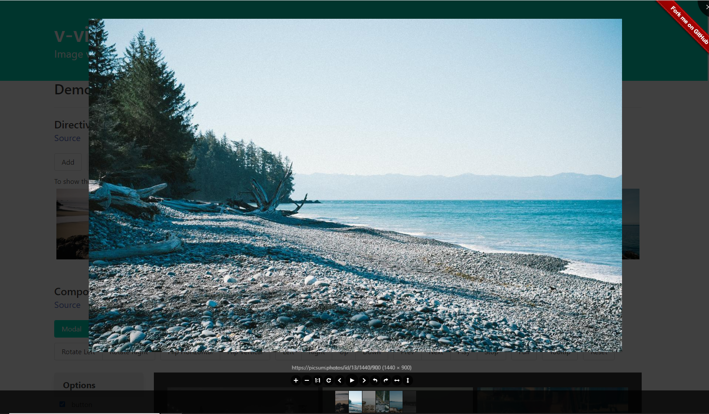
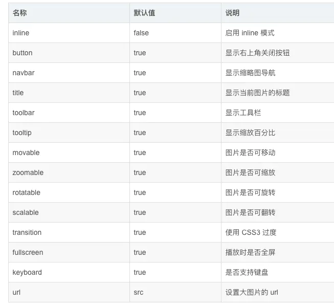

::: v-pre
# 大图预览插件

用于图片浏览的Vue组件，支持旋转、缩放、翻转等操作，基于[viewer.js](https://github.com/fengyuanchen/viewerjs)。

## 效果



## [在线演示](https://mirari.github.io/v-viewer/)

## [v-viewer for vue3](https://github.com/mirari/v-viewer/tree/v3)

## 第一步安装：

```shell
npm install v-viewer --save
```


## 第二步注册调用：

```javascript
import Viewer from 'v-viewer'
import 'viewerjs/dist/viewer.css'
```


## 第三步注册：

```javascript
Vue.use(Viewer);
Viewer.setDefaults({
  Options: { "inline": true, "button": true, "navbar": true, "title": true, "toolbar": true, "tooltip": true, "movable": true, "zoomable": true, "rotatable": true, "scalable": true, "transition": true, "fullscreen": true, "keyboard": true, "url": "data-source" }
});


或者
Vue.use(Viewer, {
  defaultOptions: {
    'zIndex': 9999,
    'inline': false, // 启用 inline 模式
    'button': true, // 显示右上角关闭按钮
    'navbar': true, // 显示缩略图导航
    'title': false // 显示当前图片的标题

  }
})
```



## 第四步使用：

### 以指令形式使用

只需要将`v-viewer`指令添加到任意元素即可，该元素下的所有`img`元素都会被`viewer`自动处理。

你可以像这样传入配置项： `v-viewer="{inline: true}"`

如果有必要，可以先用选择器查找到目标元素，然后可以用`el.$viewer`来获取`viewer`实例。

```javascript
<template>
  <div>
    <div class="images" v-viewer="{movable: false}">
      
    </div>
    <button type="button" @click="show">Show</button>
  </div>
</template>
<script>
  import 'viewerjs/dist/viewer.css'
  import { directive as viewer } from "v-viewer"
  export default {
    directives: {
      viewer: viewer({
          debug: true,
      }),
    },
    data() {
      return {
        images: [
          "https://picsum.photos/200/200",
          "https://picsum.photos/300/200",
          "https://picsum.photos/250/200"
        ]
      };
    },
    methods: {
      show () {
        const viewer = this.$el.querySelector('.images').$viewer
        viewer.show()
      }
    }
  }
</script>
```

#### 指令修饰器

##### static

添加修饰器后，`viewer`的创建只会在元素绑定指令时执行一次。
如果你确定元素内的图片不会再发生变化，使用它可以避免不必要的重建动作。

```vue
<div class="images" v-viewer.static="{inline: true}">
  
</div>
```

##### rebuild

默认情况下当图片发生变更时(添加、删除或排序)，`viewer`实例会使用`update`方法更新内容。

如果你遇到任何显示问题，尝试使用重建来代替更新。

```vue
<div class="images" v-viewer.rebuild="{inline: true}">
  
</div>
```

### 以组件形式使用

你也可以单独引入全屏组件并局部注册它。

使用[作用域插槽](https://cn.vuejs.org/v2/guide/components.html#作用域插槽)来定制你的图片展示方式。

```vue
<template>
  <div>
    <viewer :options="options" :images="images"
            @inited="inited"
            class="viewer" ref="viewer"
    >
      <template #default="scope">
        
        {{scope.options}}
      </template>
    </viewer>
    <button type="button" @click="show">Show</button>
  </div>
</template>
<script>
  import 'viewerjs/dist/viewer.css'
  import { component as Viewer } from "v-viewer"
  export default {
    components: {
      Viewer
    },
    data() {
      return {
        images: [
          "https://picsum.photos/200/200",
          "https://picsum.photos/300/200",
          "https://picsum.photos/250/200"
        ]
      };
    },
    methods: {
      inited (viewer) {
        this.$viewer = viewer
      },
      show () {
        this.$viewer.show()
      }
    }
  }
</script>
```

#### 组件属性

##### images

- 类型: `Array`

##### trigger

- 类型: `Array`

你可以使用`trigger`来代替`images`, 从而传入任何类型的数据。

当`trigger`绑定的数据发生变更，组件就会自动更新。

```vue
<viewer :trigger="externallyGeneratedHtmlWithImages">
  <div v-html="externallyGeneratedHtmlWithImages"/>
</viewer>
```

##### rebuild

- 类型: `Boolean`
- 默认值: `false`

默认情况下当图片发生变更时(添加、删除或排序)，`viewer`实例会使用`update`方法更新内容。

如果你遇到任何显示问题，尝试使用重建来代替更新。

```vue
<viewer
  ref="viewer"
  :options="options"
  :images="images"
  rebuild
  class="viewer"
  @inited="inited"
>
  <template #default="scope">
    
    {{scope.options}}
  </template>
</viewer>
```

#### 组件事件

##### inited

- viewer: `Viewer`

监听`inited`事件来获取`viewer`实例，或者也可以用`this.refs.xxx.$viewer`这种方法。

### 以api形式使用

> api形式只能使用modal模式。

你可以直接执行函数: `this.$viewerApi({options: {}, images: []})` 来展现画廊， 而不需要自己来渲染这些`img`元素.

函数会返回对应的viewer实例.

```vue
<template>
  <div>
    <button type="button" class="button" @click="previewURL">URL Array</button>
    <button type="button" class="button" @click="previewImgObject">Img-Object Array</button>
  </div>
</template>
<script>
  import 'viewerjs/dist/viewer.css'
  import { api as viewerApi } from "v-viewer"
  export default {
    data() {
      sourceImageURLs: [
        'https://picsum.photos/200/200?random=1',
        'https://picsum.photos/200/200?random=2',
      ],
      sourceImageObjects: [
        {
          'src':'https://picsum.photos/200/200?random=3',
          'data-source':'https://picsum.photos/800/800?random=3'
        },
        {
          'src':'https://picsum.photos/200/200?random=4',
          'data-source':'https://picsum.photos/800/800?random=4'
        }
      ]
    },
    methods: {
      previewURL () {
          // 如果使用`app.use`进行全局安装, 你就可以像这样直接调用`this.$viewerApi`
        const $viewer = this.$viewerApi({
          images: this.sourceImageURLs
        })
      },
      previewImgObject () {
          // 或者你可以单独引入api然后执行它
        const $viewer = viewerApi({
          options: {
            toolbar: true,
            url: 'data-source',
            initialViewIndex: 1
          },
          images: this.sourceImageObjects
        })
      }
    }
  }
</script>
```

## Viewer的配置项 & 方法

请参考[viewer.js](https://github.com/fengyuanchen/viewerjs).

## 插件配置项

### name

- 类型: `String`
- 默认值: `viewer`

如果你需要避免重名冲突，可以像这样引入:

```vue
<template>
  <div>
    <div class="images" v-vuer="{movable: false}">
      
    </div>
    <button type="button" @click="show">Show</button>
  </div>
</template>
<script>
  import 'viewerjs/dist/viewer.css'
  import Vuer from 'v-viewer'
  import Vue from 'vue'
  Vue.use(Vuer, {name: 'vuer'})
  export default {
    data() {
      return {
        images: [
          "https://picsum.photos/200/200",
          "https://picsum.photos/300/200",
          "https://picsum.photos/250/200"
        ]
      };
    },
    methods: {
      show () {
        // viewerjs实例名称
        const vuer = this.$el.querySelector('.images').$vuer
        vuer.show()
        // api名称
        this.$vuerApi({
          images: this.images
        })
      }
    }
  }
</script>
```

### defaultOptions

- 类型: `Object`
- 默认值: `undefined`

如果你需要修改viewer.js的全局默认配置项，可以像这样引入：

```javascript
import VueViewer from 'v-viewer'
import Vue from 'vue'
Vue.use(VueViewer, {
  defaultOptions: {
    zIndex: 9999
  }
})
```

你还可以在任何时候像这样修改全局默认配置项：

```javascript
import VueViewer from 'v-viewer'
import Vue from 'vue'
Vue.use(VueViewer)
Viewer.setDefaults({
  zIndexInline: 2017
})
```

:::

