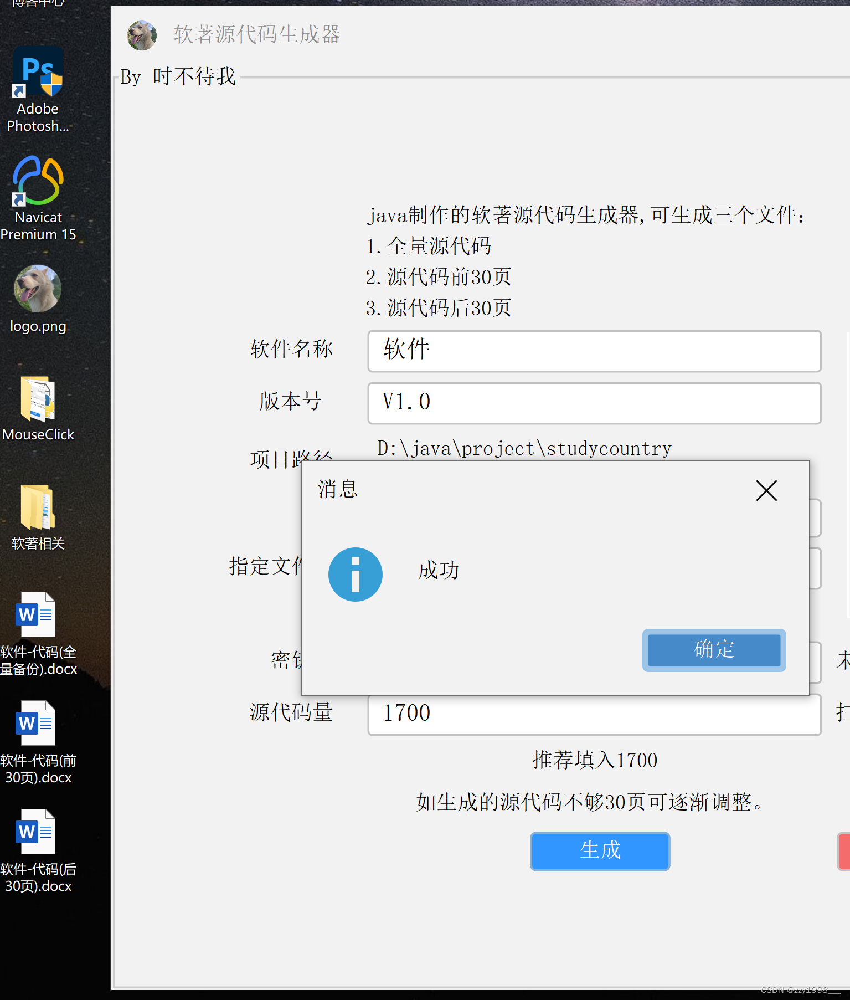
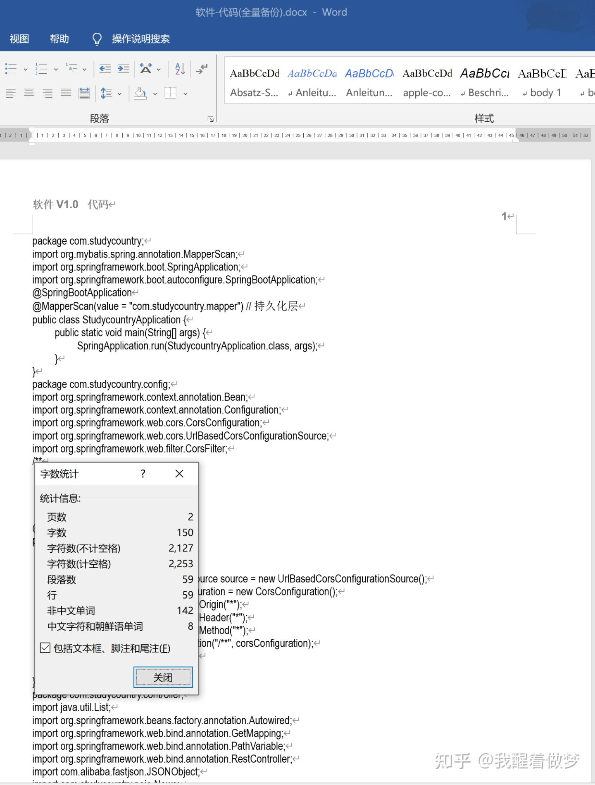

# 软著源代码生成工具

软著源代码生成工具，软著程序鉴别文档生成，软著鉴别材料生成，软著源代码辅助生成

超级实用永久免费的软著源代码材料格式文档生成辅助工具（完全私密，没有代码泄露风险）

现实生活中，申请软著需要源代码申请材料，源代码申请材料有格式 等要求，并且源代码分布在一个项目文件夹中各个文件，复制到一个 word 文档中需要一定时间。

超级实用永久免费的软著源代码材料格式文档生成辅助工具（完全私密，没有代码泄露风险）——软著源代码生成工具，软著程序鉴别文档生成，软著鉴别材料生成,软著源代码辅助生成

没有代码的可以试试这个：[超级实用的软著材料一键生成——软件著作权模板材料一站式生成方案_软著一键生成-CSDN博客](https://blog.csdn.net/zzy1998___/article/details/136434859)

申请软件著作权登记的时候会被要求提交60页的源代码。没有经验的开发者朋友第一次申请的时候难免会遇到因代码文档格式不正确、代码里含有其他版权信息等原因被要求补正的问题，从而导致拿证时间延误。为了帮助开发者朋友一次性顺利通过软件著作权登记的审查。

为方便申报软件著作权对前后60页代码的整理，只需要选择源代码文件夹目录即可生成前后30页代码文件，全量备查代码文件，页眉 页码 格式都弄好了，支持C++、java、C#、python、JavaScript、vue等任何格式。

下面为大家分享下自己制作的一个申请软著源代码申请材料的**自动化生成软件**， 能让用户使用软件一件生成所需申请软著的源代码材料。

**官网和下载地址** ：

https://www.webarcx.com/software

##  第一步

填入软件名称，版本号，选择所需生成项目的路径，填写所需申请的文件后缀，根据需要填入密钥，填写源代码量 

  

## 第二步

 点击生成即可在桌面看到word文档 

  

