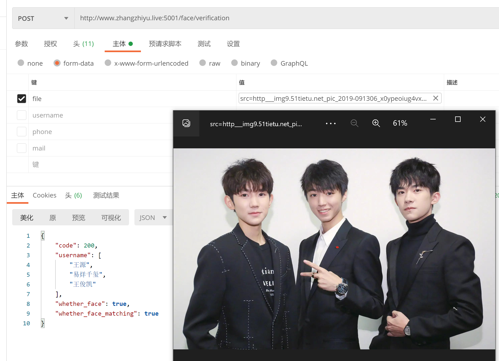

# PostgreSQL版人脸检索

> PostgreSQL版人脸识别检索

[PostgreSQL](https://www.postgresql.org/) (又名 Postgres) 是一个功能强大的自由开源的关系型数据库管理系统 ([RDBMS](https://www.codecademy.com/articles/what-is-rdbms-sql)) ，其在可靠性、稳定性、性能方面获得了业内极高的声誉。它旨在处理各种规模的任务。它是跨平台的，而且是 [macOS Server](https://www.apple.com/in/macos/server/) 的默认数据库，可以存储人脸识别数据并进行向量搜索，比Mysql快2457900倍。

## PostgreSQL cube 插件 - 多维空间对象

CUBE是一个多维数据类型，支持两种多维类型：多维POINT、区间（左下+右上）。以及这些几何对象的几何特性搜索和计算（方位搜索、距离计算），这些搜索都支持GiST索引。

我们甚至可以将多个字段合并成多维POINT，实现对大量数据的高效空间聚集、空间计算。

### 方案对比

| 对比项           | 方案一（MySQL） | 方案二（PostgreSQL） | 方案二相比方案一的提升 |
| :--------------- | :-------------- | :------------------- | :--------------------- |
| 单次查询响应速度 | 61.45秒         | 0.0025秒             | 2457900%               |
| 并发查询QPS      | 0.055330        | 1056                 | 1908449%               |

[参见阿里云base插件](https://help.aliyun.com/document_detail/154873.html)

[参见](https://developer.aliyun.com/article/202810)

## docker下载PostgreSQL

### 拉取镜像

amd64架构：

```bash
docker pull registry.cn-hangzhou.aliyuncs.com/zzy_pi/postgresql-large-cube:11.2-alpine
```

arm64架构：

```bash
docker pull registry.cn-hangzhou.aliyuncs.com/zzy_pi/postgresql-large-cube-arm64:
```


### 新建文件

docker-compose.yml

```yaml
version: '2'

services:
    db:
        privileged: true
        image: postgresql-large-cube:9.6
        environment:
            POSTGRES_PASSWORD: 密码
            POSTGRES_USER: 账号
            POSTGRES_DB: 初始化库
            PGDATA: /tmp

        volumes:
            - /db/PostgreSQL/data:/var/lib/postgresql/data
        ports:
            - "5432:5432"
```

### 运行compose

```bash
docker-compose up -d
```

### 查看compose

```bash
docker-compose ps 
```

### 删除

```bash
docker-compose rm
```

## python3连接postgresql依赖

```bash
sudo apt-get install python3-psycopg2
sudo apt-get install libpq-dev
```

## 运行数据库依赖自动化脚本

```python

import psycopg2


def setup_db():
    conn = psycopg2.connect(database="库", user="账号", password="密码", host="127.0.0.1", port="5432")
    db = conn.cursor()
    db.execute("create extension if not exists cube;")
    db.execute("drop table if exists vectors")
    db.execute("create table vectorssss (id serial PRIMARY KEY, username varchar,phone varchar ,mail varchar ,vec_data cube);")
    db.execute("create index vectors_vec_idx on vectors (vec_data);")
    conn.commit()
    conn.close()

setup_db()
```

## HTTP服务

```python
# 这是一个_非常简单_的网络服务示例，可以识别上传图像中的人脸。
# 上传一个图片文件，它会检查图片中是否包含奥巴马的照片。
# 结果以json形式返回。例如：
#
# $ curl -XPOST -F "file=@obama2.jpg" http://127.0.0.1:5001
#
# 返回：
#
# {
# “face_found_in_image”：是的，
# "is_picture_of_obama": 真
# }
#
# 本示例基于 Flask 文件上传示例：http://flask.pocoo.org/docs/0.12/patterns/fileuploads/

# 注意：此示例需要安装烧瓶！您可以使用 pip 安装它：
# $ pip3 安装烧瓶
import io

from flask_cors import *
import ast
import json
from io import BytesIO
import base64
import numpy as np
import face_recognition
import psycopg2
from flask import Flask, jsonify, request, redirect
import logging
# 您可以将其更改为系统上的任何文件夹
ALLOWED_EXTENSIONS = {'png', 'jpg', 'jpeg', 'gif', 'jfif'}

app = Flask(__name__)
CORS(app, resources={r"/*": {"origins": "*", "methods": "POST, GET", "expose_headers": "Content-Type"}})  # 允许所有域名跨域

dbdatabase = "face"
dbuser = ""
dbpassword = ""
dbhost = ""
dbport = "5432"

def allowed_file(filename):
    return '.' in filename and \
           filename.rsplit('.', 1)[1].lower() in ALLOWED_EXTENSIONS


# 人脸注册
@app.route('/face/registration', methods=['GET', 'POST'])
def upload_image_registration():
    # 文件
    img = ""
    formData = ""
    try:
        trysss = request.files['file']
        print("try")
    except Exception:
        logging.warning('抛出')
        # 将结果作为json返回
        result = {
            "code": 500,
            "face_found_in_image": False,
            "is_picture_of_obama": False
        }
        return jsonify(result)
    else:
        # 检查是否上传了有效的图片文件
        if request.method == 'POST':
            if 'file' not in request.files:
                return redirect(request.url)

            file = request.files['file']
            if file.filename == '':
                return redirect(request.url)

            if file and allowed_file(file.filename):
                # 获取上传图像中任何人脸的人脸编码
                # 加载上载的图像文件
                img = face_recognition.load_image_file(file)
                formData = request.form.to_dict()

    encodings = face_recognition.face_encodings(img)
    conn = psycopg2.connect(database=dbdatabase, user=dbuser, password=dbpassword, host=dbhost,
                            port=dbport)
    db = conn.cursor()

    if len(encodings) > 0:
        isnot = detect_faces_in_image(encodings)
        if isnot[1]:
            result = {
                "code": "500",
                "face_encodings": "该人脸已经注册"
            }
            # 已经注册。
            return jsonify(result)

        query = "INSERT INTO vectors (username,phone,mail, vec_data) VALUES ('{}','{}','{}', CUBE(array[{}]))".format(
            formData.get("username"), formData.get("phone"), formData.get("mail"),
            ','.join(str(s) for s in encodings[0][0:128]),

        )
        db.execute(query)
        conn.commit()

    # 将结果作为json返回
    conn.close()
    result = {
        "code": "200",
        "face_encodings": "成功"
    }
    # 图像文件似乎有效！返回人脸编码。
    return jsonify(result)


# 人脸验证
@app.route('/face/verification', methods=['POST'])
def upload_image():
    try:
        trysss = request.files['file']
        logging.warning('try')
    except Exception:
        logging.warning('抛出')
        # 将结果作为json返回
        result = {
            "code": 500,
            "face_found_in_image": False,
            "is_picture_of_obama": False
        }
        return jsonify(result)
    else:
        logging.warning('未抛出')
        if request.method == 'POST':
            if 'file' not in request.files:
                return redirect(request.url)

            file = request.files['file']
            if file.filename == '':
                return redirect(request.url)

            if file and allowed_file(file.filename):
                print(file)

                encodingsimg = face_recognition.load_image_file(file)
                if request.form.get('type') == None:
                    # 抛出则是没有发type，PC端
                    encodings = face_recognition.face_encodings(encodingsimg)
                else:
                    face_locations = face_recognition.face_locations(encodingsimg, model='cnn')
                    encodings = face_recognition.face_encodings(encodingsimg, face_locations)

                # 加载上载的图像文件
                isnot = detect_faces_in_image(encodings)
                # 将结果作为json返回
                result = {
                    "code": 200,
                    "face_found_in_image": isnot[0],
                    "is_picture_of_obama": isnot[1],
                    "username": isnot[1] if isnot[1] == False else isnot[2]
                }
                return jsonify(result)

            # 将结果作为json返回
        result = {
            "code": 500,
            "face_found_in_image": False,
            "is_picture_of_obama": False
        }
        return jsonify(result)


# 判断人脸是否存在
def detect_faces_in_image(encodings):

    conn = psycopg2.connect(database=dbdatabase, user=dbuser, password=dbpassword, host=dbhost,
                            port=dbport)
    db = conn.cursor()
    username = ""
    # 是否匹配
    is_obama = False
    if len(encodings) > 0:
        query = "SELECT * FROM vectors  " + \
                "ORDER BY vec_data <-> '{}' ::cube ASC LIMIT 3".format(
                    ','.join(str(s) for s in encodings[0][0:128]),
                )
        db.execute(query)
        # 获取结果集的每一行
        while True:
            rows = db.fetchmany(2000)
            if not rows:
                break
            for row in rows:
                id, name, phone, mail, vecdata = row
                username = name
                known_face_encoding = ast.literal_eval(vecdata)
                # 查看上传图像中的第一张面孔是否与数据库的已知面孔匹配
                match_results = face_recognition.compare_faces([known_face_encoding], encodings[0], tolerance=0.50)
                print(match_results)
                if match_results[0]:
                    is_obama = True
                    break

    else:
        logging.warning('No encodings')
    # 使用 face_recognition.face_encodings(img) 生成的预先计算的人脸编码
    # 查出来为空则数据库没有注册此人人脸数据
    conn.close()
    face_found = False

    if len(encodings) > 0:
        face_found = True

    return face_found, is_obama, username


if __name__ == "__main__":
    app.run(host='0.0.0.0', port=5001, debug=True)

```

## 启用卷积神经网络（cnn）识别脚本

> ubuntu安装脚本

```sh
#!/usr/bin/env bash

set -e
set -o xtrace
DEBIAN_FRONTEND=noninteractive

sudo rm /etc/apt/apt.conf.d/*.*
sudo apt update
sudo apt install unzip -y
sudo apt -y upgrade --force-yes -o Dpkg::Options::="--force-confdef" -o Dpkg::Options::="--force-confold"
sudo apt -y autoremove
sudo ufw allow 8888:8898/tcp
sudo apt -y install --force-yes -o Dpkg::Options::="--force-confdef" -o Dpkg::Options::="--force-confold" qtdeclarative5-dev qml-module-qtquick-controls
sudo add-apt-repository ppa:graphics-drivers/ppa -y
sudo apt update
mkdir downloads
cd ~/downloads/
wget http://developer.download.nvidia.com/compute/cuda/repos/ubuntu1604/x86_64/cuda-repo-ubuntu1604_9.0.176-1_amd64.deb
sudo dpkg -i cuda-repo-ubuntu1604_9.0.176-1_amd64.deb
sudo apt-key adv --fetch-keys http://developer.download.nvidia.com/compute/cuda/repos/ubuntu1604/x86_64/7fa2af80.pub
sudo apt update
sudo apt install cuda -y
wget http://files.fast.ai/files/cudnn-9.1-linux-x64-v7.tgz
tar xf cudnn-9.1-linux-x64-v7.tgz
sudo cp cuda/include/*.* /usr/local/cuda/include/
sudo cp cuda/lib64/*.* /usr/local/cuda/lib64/
wget https://repo.continuum.io/archive/Anaconda3-5.0.1-Linux-x86_64.sh
bash Anaconda3-5.0.1-Linux-x86_64.sh -b
cd
git clone https://github.com/fastai/fastai.git
cd fastai/
echo 'export PATH=~/anaconda3/bin:$PATH' >> ~/.bashrc
export PATH=~/anaconda3/bin:$PATH
source ~/.bashrc
conda env update
echo 'source activate fastai' >> ~/.bashrc
source activate fastai
source ~/.bashrc
cd ..
mkdir data
cd data
wget http://files.fast.ai/data/dogscats.zip
unzip -q dogscats.zip
cd ../fastai/courses/dl1/
ln -s ~/data ./
jupyter notebook --generate-config
echo "c.NotebookApp.ip = '*'" >> ~/.jupyter/jupyter_notebook_config.py
echo "c.NotebookApp.open_browser = False" >> ~/.jupyter/jupyter_notebook_config.py
pip install ipywidgets
jupyter nbextension enable --py widgetsnbextension --sys-prefix
echo
echo ---
echo - YOU NEED TO REBOOT YOUR PAPERSPACE COMPUTER NOW
echo ---

```

## 使用docker直接运行

> 基于face-recognition,postgresql数据库制作的人脸识别镜像 
>
> 下载docker可以直接拉取使用 不需要下载依赖配置环境等 



### 依赖

依赖postgresql数据库

官方的cube类型受限，要使用docker安装扩容版的postgresql数据库

 amd64架构： 

```bash
docker pull registry.cn-hangzhou.aliyuncs.com/zzy_pi/postgresql-large-cube:11.2-alpine
```

arm64架构：

```bash
docker pull registry.cn-hangzhou.aliyuncs.com/zzy_pi/postgresql-large-cube-arm64
```

如何运行请[查看](./PostgreSQL%E7%89%88%E4%BA%BA%E8%84%B8%E6%A3%80%E7%B4%A2.html#docker%E4%B8%8B%E8%BD%BDpostgresql)

可使用脚本文件初始化库，或自行设置

```python
import psycopg2


def setup_db():
    conn = psycopg2.connect(database="face", user="数据库账号", password="数据库密码", host="数据库域名或IP", port="5432")
    db = conn.cursor()
    db.execute("create extension if not exists cube;")
    db.execute("drop table if exists vectors")
    db.execute("create table vectors (id serial, username varchar,phone varchar ,mail varchar ,vec_data cube);")
    db.execute("create index vectors_vec_idx on vectors (vec_data);")
    db.execute("ALTER TABLE 'public'.'vectors' ADD PRIMARY KEY ('id');")
    conn.commit()
    conn.close()

setup_db()
```


拉取镜像

amd64架构：
```bash
docker pull registry.cn-hangzhou.aliyuncs.com/zzy_pi/face_postgresql:v1
```

arm64架构：
```bash
docker pull registry.cn-hangzhou.aliyuncs.com/zzy_pi/face_postgresql_arm64::v1
```

运行命令

```bash
docker run  --env dbhost="数据库ip或域名" --env dbuser="数据库账号" --env dbpassword="数据库密码" -p 5001:5001 face-recognition
```

### 接口说明

#### 人脸注册

域名:端口/face/registration  (Post请求)仅支持Formdata格式

参数:

| 键       | 含义                                  | 备注                                          |
| -------- | ------------------------------------- | --------------------------------------------- |
| file     | 需注册的人脸图片（仅支持jpg,jpeg,png) | 尽量上传高清图像（0.5M-4M）否则将影响识别质量 |
| username | 人脸名                                | 调用识别接口时会返回这个                      |
| phone    | 手机号                                | 可不填                                        |
| mail     | 邮箱                                  | 可不填                                        |

回调

| 键             | 含义             | 备注               |
| -------------- | ---------------- | ------------------ |
| code           | 接口是否成功调用 | 200成功 500失败    |
| msg            | 失败原因         | 仅code=500才会出现 |
| face_encodings | 是否成功         | 成功回调“成功”     |


#### 人脸验证

参数
域名:端口/face/verification (Post请求)仅支持Formdata格式

| 键   | 含义                                  | 备注 |
| ---- | ------------------------------------- | ---- |
| file | 需识别的人脸图片（仅支持jpg,jpeg,png) |      |

回调

| 键                    | 含义               | 备注                                                         |
| --------------------- | ------------------ | ------------------------------------------------------------ |
| code                  | 接口是否成功调用   | 200成功 500失败                                              |
| msg                   | 失败原因           | 仅code=500才会出现                                           |
| whether_face          | 是否识别到人脸     | 仅code=200才会出现，ture或false                              |
| whether_face_matching | 人脸是否和库匹配到 | 仅code=200才会出现，ture或flase                              |
| username              | 该人脸在库中的姓名 | 仅code=200才会出现，whether_face和whether_face_matching都为ture时回调名字，否则回调flase |


#### 查询样本库人员

域名:端口/face/all   (Get请求)

回调

| 键       | 含义             | 备注     |
| -------- | ---------------- | -------- |
| code     | 接口是否成功调用 | 200成功  |
| all_face | 库中所有人员姓名 | 数组形式 |


## 自行构建

### dockerfile

```dockerfile
FROM python:3.6-slim-stretch

WORKDIR ./py
 
ADD . .


RUN sed -i 's/deb.debian.org/mirrors.tencent.com/' /etc/apt/sources.list &&  sed -i 's/security.debian.org/mirrors.ustc.edu.cn/' /etc/apt/sources.list 
RUN apt-get clean  && apt-get update 
RUN apt-get install -y --fix-missing  \
    build-essential \
    cmake \	
    gfortran \
    git \
    wget \
    curl \
    graphicsmagick \
    libgraphicsmagick1-dev \
    libatlas-base-dev \
    libavcodec-dev \
    libavformat-dev \
    libgtk2.0-dev \
    libjpeg-dev \
    liblapack-dev \
    libswscale-dev \
    libpq-dev \
    pkg-config \
    python3-dev \
    python3-numpy \
    software-properties-common \
    zip \
    python-psycopg2 \
    && apt-get clean && rm -rf /tmp/* /var/tmp/*	


RUN cd ~ && \
    mkdir -p dlib && \
    git clone -b 'v19.9' --single-branch https://github.com.cnpmjs.org/davisking/dlib.git dlib/ && \
    cd  dlib/ && \
    python3 setup.py install --yes USE_AVX_INSTRUCTIONS

RUN pip3 install -i https://pypi.tuna.tsinghua.edu.cn/simple --trusted-host pypi.tuna.tsinghua.edu.cn -r requirements.txt


CMD ["sh","-x", "./GPU.sh"]
CMD ["python3", "./src/facehttp.py"]

```

## vue配套

```vue
<template>
  <div class="testTracking">
    <video
      id="video"
      width="318"
      height="270"
      preload
      autoplay
      loop
      muted
      v-show="canvasis"
    ></video>
    <canvas id="canvas" width="318" height="270" v-show="canvasis"></canvas>
    <canvas
      id="screenshotCanvas"
      width="318"
      height="270"
      style="display: none"
    ></canvas>
    <div class="buttonDiv">
      <el-card class="box-card"> 请先打开摄像头注册，才可识别出姓名
         <el-divider></el-divider>
         移动端使用GPU计算需要5秒识别
         </el-card>

      <el-button
        type="success"
        icon="el-icon-check"
        @click="openCamera()"
        v-show="!canvasis && video == undefined"
        >打开摄像头</el-button
      >
      <el-button
        type="primary"
        icon="el-icon-edit"
        @click="offvideo()"
        v-show="canvasis"
        >关闭摄像头</el-button
      >
      <el-button
        type="primary"
        icon="el-icon-edit"
        @click="
          popup.open = true;
          popup.key = false;
        "
        v-show="canvasis && video != undefined"
        >拍照注册</el-button
      >
    </div>

    <el-dialog title="请输入您的信息" :visible.sync="popup.open" width="80%">
      <el-form ref="form" label-width="80px" :model="popup" :rules="rules">
        <el-form-item label="用户名" prop="username">
          <el-input v-model="popup.username"></el-input>
        </el-form-item>
        <el-form-item label="手机号" prop="phone">
          <el-input v-model="popup.phone"></el-input>
        </el-form-item>
        <el-form-item label="邮箱" prop="mail">
          <el-input v-model="popup.mail"></el-input>
        </el-form-item>
      </el-form>

      <span slot="footer" class="dialog-footer">
        <el-button @click="popup.open = false">取 消</el-button>
        <el-button
          v-show="popup.imgData != undefined"
          type="primary"
          @click="zhuce('form')"
          >确 定</el-button
        >
      </span>
    </el-dialog>
    
    <form
      id="form1"
      method="post"
      enctype="multipart/form-data"
      action=""
      style="display: none"
    >
      <input id="file" type="file" name="file" />
    </form>
  </div>
</template>

<script>
require("tracking/build/tracking-min.js");
require("tracking/build/data/face-min.js");
require("tracking/examples/assets/stats.min.js");

export default {
  name: "PostSQL",
  data() {
    return {
      src: undefined,
      recty: 0,
      rectx: 0,
      trackerTask: undefined,
      screenshotCanvas: null,
      video: undefined,
      canvasis: false,
      popup: {
        open: false, //弹窗
        username: undefined, //表单姓名
        phone: undefined, //表单手机
        mail: undefined, //表单邮件
        imgData: undefined, //表单人脸
        key: true, //表单注册人脸锁
      },
      rules: {
        username: [
          {
            required: true, //是否必填
            message: "用户名不能为空", //规则
            trigger: "blur", //何事件触发
          },
        ],
        phone: [
          {
            required: true, //是否必填
            message: "手机号不能为空", //规则
            trigger: "blur", //何事件触发
          },
        ],
        mail: [
          {
            required: true, //是否必填
            message: "邮箱不能为空", //规则
            trigger: "blur", //何事件触发
          },
        ],
      },
    };
  },
  mounted() {
    this.axios({
      method: "get",
      url: "https://postgre-face-890657-1305567820.ap-shanghai.run.tcloudbase.com",
      // url: "http://192.168.0.106:5001/face/verification",
    }).then((response) => {});
  },
  methods: {
    openCamera() {
      var video = document.getElementById("video");
      this.screenshotCanvas = document.getElementById("screenshotCanvas");
      this.video = video;
      navigator.mediaDevices
        .getUserMedia({ video: { facingMode: "user" } })
        .then(function (stream) {
          document.getElementById("video").srcObject = stream;
        })
        .catch(function (error) {
          alert(error);
        });
      var canvas = document.getElementById("canvas");
      var context = canvas.getContext("2d");
      var tracker = new tracking.ObjectTracker("face");
      tracker.setInitialScale(4);
      tracker.setStepSize(2);
      tracker.setEdgesDensity(0.1);

      this.trackerTask = tracking.track("#video", tracker, { camera: true });
      this.canvasis = true;
      let flag = true; //人脸锁
      let axiosflag = true; //接口锁
      let name = "识别中..";
      tracker.on("track", (event) => {
        if (event.data.length === 0) {
          //人脸变动，解锁
          flag = true;
          name = "识别中..";
        }

        context.clearRect(0, 0, canvas.width, canvas.height);
        event.data.forEach((rect) => {
          context.font = "20px Helvetica";
          context.fillText(name, rect.x + 20, rect.y - 40);

          context.strokeStyle = "#a64ceb";
          context.strokeRect(
            rect.x - 20,
            rect.y - 20,
            rect.width + 20,
            rect.height + 20
          );
        });
        if (event.data.length) {
          // 会不停的去检测人脸，所以这里需要做个锁
          if (flag && axiosflag) {
            flag = false;
            axiosflag = false;
            // 裁剪出人脸并绘制下来
            let canvasUpload = this.screenshotCanvas;
            let contextUpload = canvasUpload.getContext("2d");
            contextUpload.drawImage(
              video,
              0,
              0,
              canvasUpload.width,
              canvasUpload.height
            );
            // 人脸的basa64
            var image = this.saveAsPNG(canvasUpload);
            // this.src =  image;
            if (this.popup.key) {
              this.popup.imgData = image;
            }

            var formElement = document.getElementById("form1");
            var formData = new FormData(formElement);
            formData.set("file", this.dataURLtoFile(image, "aa.jpg"));
            if (
              /android|webos|iphone|ipod|balckberry/i.test(navigator.userAgent)
            ) {
              formData.set("type", "1");
            }
            this.axios({
              method: "post",
              url: "https://postgre-face-890657-1305567820.ap-shanghai.run.tcloudbase.com/face/verification",
              // url: "http://192.168.0.117:5001/face/verification",
              data: formData,
              headers: {
                "Content-Type": "multipart/form-data",
              },
            }).then((response) => {
              console.log(response);
              axiosflag = true;
              if (response.data.username) {
                name = response.data.username;
              }
            });
          }
        }
      });
    },
    zhuce(formName) {
      let imgData = this.popup.imgData;
      var formElement = document.getElementById("form1");
      var formData = new FormData(formElement);
      this.$refs[formName].validate((valid) => {
        if (valid) {
          formData.set("file", this.dataURLtoFile(imgData, "aa.jpg"));
          formData.append("mail", this.popup.mail);
          formData.append("username", this.popup.username);
          formData.append("phone", this.popup.phone);
          this.axios({
            method: "post",
            url: "https://postgre-face-890657-1305567820.ap-shanghai.run.tcloudbase.com/face/registration",
            // url: "http://192.168.0.117:5001/face/registration",
            data: formData,
            headers: {
              "Content-Type": "multipart/form-data",
            },
          }).then((response) => {
            console.log(response);
            if (response.data.code == "200") {
              this.$message({
                type: "success",
                message: "注册成功",
              });
            } else {
              this.$message({
                type: "error",
                message: response.data.face_encodings,
              });
            }
            this.popup.open = false;
            this.popup.key = true;
          });
        } else {
          return false;
        }
      });
    },

    dataURLtoFile(dataurl, filename) {
      var arr = dataurl.split(","),
        mime = arr[0].match(/:(.*?);/)[1],
        bstr = atob(arr[1]),
        n = bstr.length,
        u8arr = new Uint8Array(n);
      while (n--) {
        u8arr[n] = bstr.charCodeAt(n);
      }
      var file = new File([u8arr], filename, { type: mime });
      return file;
    },

    // 保存为png,base64格式图片
    saveAsPNG(c) {
      return c.toDataURL("image/jpeg");
    },
    offvideo() {
      // 停止侦测
      this.trackerTask.stop();
      // 关闭摄像头
      this.video.pause();
      this.video.srcObject.getVideoTracks()[0].stop();
      this.canvasis = false;
    },
  },
};
</script>
<style lang="less" scoped>
.testTracking {
  height: 100vh;
  width: 100%;
  position: relative;
  > * {
    position: absolute;
    left: 0;
    right: 0;
    margin: auto;
  }
  video,
  canvas {
    top: 0;
  }
  .box-card {
    margin-bottom: 31px;
  }
  .buttonDiv {
    bottom: 65px;
  }
}
</style>

```


