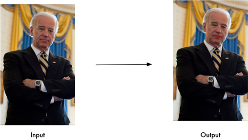
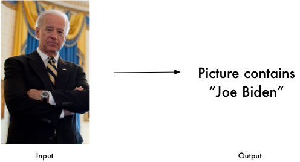
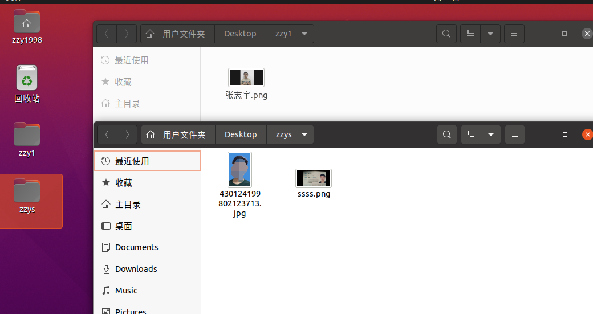
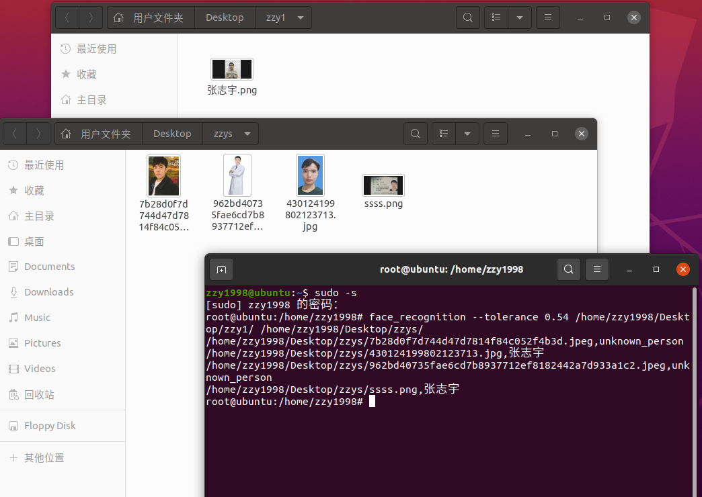
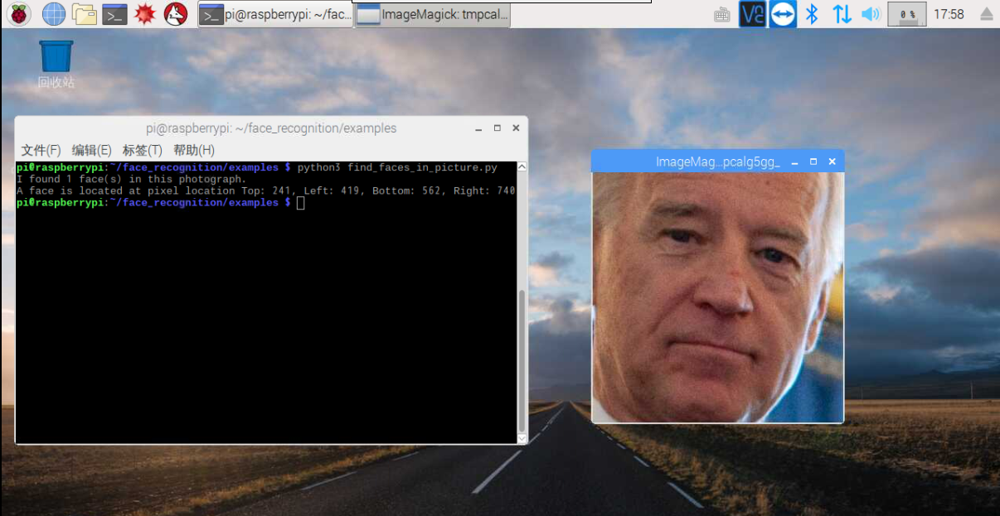
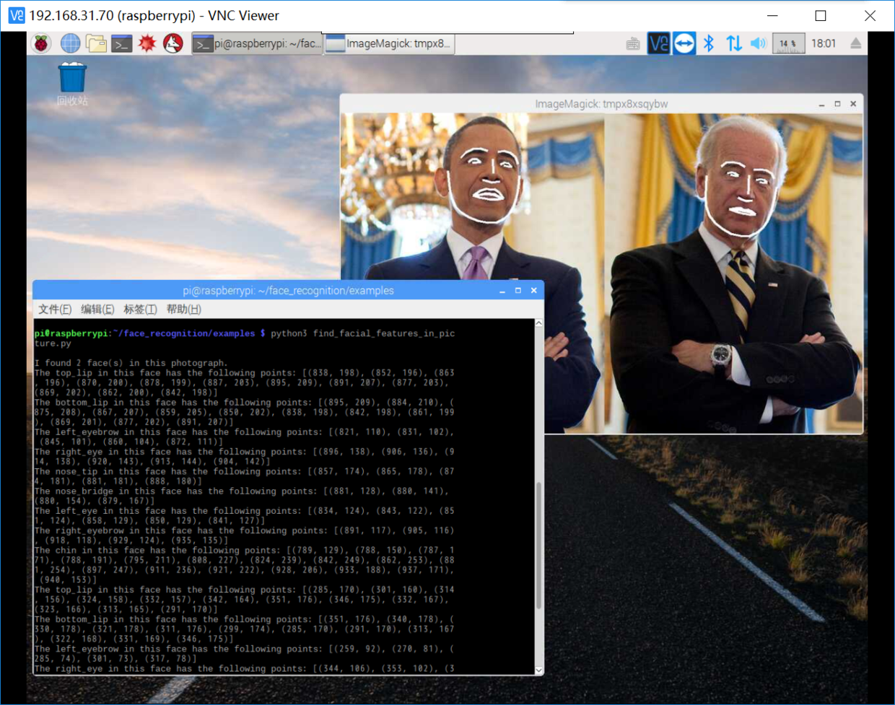

# 人脸识别

> Face Recognition人脸识别开源库

本项目[face_recognition](https://github.com/ageitgey/face_recognition)是一个强大、简单、易上手的人脸识别开源项目，并且配备了完整的开发文档和应用案例，特别是兼容树莓派系统。

本项目是世界上最简洁的人脸识别库，你可以使用Python和命令行工具提取、识别、操作人脸。

本项目的人脸识别是基于业内领先的C++开源库 [dlib](http://dlib.net/)中的深度学习模型，用[Labeled Faces in the Wild](http://vis-www.cs.umass.edu/lfw/)人脸数据集进行测试，有高达99.38%的准确率。但对小孩和亚洲人脸的识别准确率尚待提升。

本项目提供了简易的`face_recognition`命令行工具，你可以用它处理整个文件夹里的图片。


## 特性

#### 从图片里找到人脸

定位图片中的所有人脸：


```python
import face_recognition
image = face_recognition.load_image_file("your_file.jpg")
face_locations = face_recognition.face_locations(image)
```

#### 识别人脸关键点

识别人脸关键点，包括眼睛、鼻子、嘴和下巴。


```python
import face_recognition
image = face_recognition.load_image_file("your_file.jpg")
face_landmarks_list = face_recognition.face_landmarks(image)
```

识别人脸关键点在很多领域都有用处，但同样你也可以把这个功能玩坏，比如本项目的 [digital make-up](https://github.com/ageitgey/face_recognition/blob/master/examples/digital_makeup.py)自动化妆案例（就像美图秀秀一样）。



#### 识别图片中的人是谁



```python
import face_recognition
known_image = face_recognition.load_image_file("biden.jpg")
unknown_image = face_recognition.load_image_file("unknown.jpg")

biden_encoding = face_recognition.face_encodings(known_image)[0]
unknown_encoding = face_recognition.face_encodings(unknown_image)[0]

results = face_recognition.compare_faces([biden_encoding], unknown_encoding)
```

你也可以配合其它的Python库（比如opencv）实现实时人脸检测：


看这个案例 [实时人脸检测](https://github.com/ageitgey/face_recognition/blob/master/examples/facerec_from_webcam_faster.py) 。

## 安装

### 环境配置

Python 3.8.10 

Ubuntu [ubuntu-20.04.3-desktop-amd64](https://mirror.bjtu.edu.cn/ubuntu-releases/20.04.3/ubuntu-20.04.3-desktop-amd64.iso)

### 下载

```bash
pip3 install -i https://pypi.tuna.tsinghua.edu.cn/simple cmake
```

```bash
pip3 install -i https://pypi.tuna.tsinghua.edu.cn/simple boost
```

```bash
pip3 install -i https://pypi.tuna.tsinghua.edu.cn/simple dlib
```

速度很慢

```bash
pip3 install -i https://pypi.tuna.tsinghua.edu.cn/simple face_recognition
```

```bash
pip3 install -i https://pypi.tuna.tsinghua.edu.cn/simple numpy
```


## 使用

桌面新建两个文件夹



zzy1是图片源数据集

zzys是待检测的图片

终端输入

```bash
face_recognition --tolerance 0.54 /home/zzy1998/Desktop/zzy1/ /home/zzy1998/Desktop/zzys/
```



unknown_person则是不符合


#### face_detection 命令行工具

`face_detection`命令行工具可以在单张图片或一个图片文件夹中定位人脸位置（输出像素点坐标）。

在命令行中使用`face_detection`，传入一个图片文件夹或单张图片文件来进行人脸位置检测：

```bash
$ face_detection  ./folder_with_pictures/

examples/image1.jpg,65,215,169,112
examples/image2.jpg,62,394,211,244
examples/image2.jpg,95,941,244,792
```

输出结果的每一行都对应图片中的一张脸，输出坐标代表着这张脸的上、右、下、左像素点坐标。

##### 调整人脸识别的容错率和敏感度

如果一张脸识别出不止一个结果，那么这意味着他和其他人长的太像了（本项目对于小孩和亚洲人的人脸识别准确率有待提升）。你可以把容错率调低一些，使识别结果更加严格。

通过传入参数 `--tolerance` 来实现这个功能，默认的容错率是0.6，容错率越低，识别越严格准确。

```bash
$ face_recognition --tolerance 0.54 ./pictures_of_people_i_know/ ./unknown_pictures/

/unknown_pictures/unknown.jpg,Barack Obama
/face_recognition_test/unknown_pictures/unknown.jpg,unknown_person
```

如果你想看人脸匹配的具体数值，可以传入参数 `--show-distance true`：

```bash
$ face_recognition --show-distance true ./pictures_of_people_i_know/ ./unknown_pictures/

/unknown_pictures/unknown.jpg,Barack Obama,0.378542298956785
/face_recognition_test/unknown_pictures/unknown.jpg,unknown_person,None
```

##### 更多的例子

如果你并不在乎图片的文件名，只想知道文件夹中的图片里有谁，可以用这个管道命令：

```bash
$ face_recognition ./pictures_of_people_i_know/ ./unknown_pictures/ | cut -d ',' -f2

Barack Obama
unknown_person
```

##### 加速人脸识别运算

如果你的CPU是多核的，你可以通过并行运算加速人脸识别。例如，如果你的CPU有四个核心，那么你可以通过并行运算提升大概四倍的运算速度。

如果你使用Python3.4或更新的版本，可以传入 `--cpus <number_of_cpu_cores_to_use>` 参数：

```bash
$ face_recognition --cpus 4 ./pictures_of_people_i_know/ ./unknown_pictures/
```

你可以传入 `--cpus -1`参数来调用cpu的所有核心。

> 子豪兄批注：树莓派3B有4个CPU核心，传入多核参数可以显著提升图片识别的速度（亲测）。

#### Python 

在Python中，你可以导入`face_recognition`模块，调用我们提供的丰富的API接口，用几行代码就可以轻松玩转各种人脸识别功能！

API 接口文档: [https://face-recognition.readthedocs.io](https://face-recognition.readthedocs.io/en/latest/face_recognition.html)

##### 在图片中定位人脸的位置

```python
import face_recognition

image = face_recognition.load_image_file("my_picture.jpg")
face_locations = face_recognition.face_locations(image)

# face_locations is now an array listing the co-ordinates of each face!
```

看 [案例：定位拜登的脸](https://github.com/ageitgey/face_recognition/blob/master/examples/find_faces_in_picture.py)



你也可以使用深度学习模型达到更加精准的人脸定位。

注意：这种方法需要GPU加速（通过英伟达显卡的CUDA库驱动），你在编译安装`dlib`的时候也需要开启CUDA支持。

```python
import face_recognition

image = face_recognition.load_image_file("my_picture.jpg")
face_locations = face_recognition.face_locations(image, model="cnn")

# face_locations is now an array listing the co-ordinates of each face!
```

看 [案例：使用卷积神经网络深度学习模型定位拜登的脸](https://github.com/ageitgey/face_recognition/blob/master/examples/find_faces_in_picture_cnn.py)

如果你有很多图片需要识别，同时又有GPU，那么你可以参考这个例子：[案例：使用卷积神经网络深度学习模型批量识别图片中的人脸](https://github.com/ageitgey/face_recognition/blob/master/examples/find_faces_in_batches.py).

##### 识别单张图片中人脸的关键点

```python
import face_recognition

image = face_recognition.load_image_file("my_picture.jpg")
face_landmarks_list = face_recognition.face_landmarks(image)

# face_landmarks_list is now an array with the locations of each facial feature in each face.
# face_landmarks_list[0]['left_eye'] would be the location and outline of the first person's left eye.
```

看这个案例 [案例：提取奥巴马和拜登的面部关键点](https://github.com/ageitgey/face_recognition/blob/master/examples/find_facial_features_in_picture.py) 

##### 识别图片中的人是谁

```python
import face_recognition

picture_of_me = face_recognition.load_image_file("me.jpg")
my_face_encoding = face_recognition.face_encodings(picture_of_me)[0]

# my_face_encoding now contains a universal 'encoding' of my facial features that can be compared to any other picture of a face!

unknown_picture = face_recognition.load_image_file("unknown.jpg")
unknown_face_encoding = face_recognition.face_encodings(unknown_picture)[0]

# Now we can see the two face encodings are of the same person with `compare_faces`!

results = face_recognition.compare_faces([my_face_encoding], unknown_face_encoding)

if results[0] == True:
    print("It's a picture of me!")
else:
    print("It's not a picture of me!")
```

看这个案例 [案例：是奥巴马还是拜登？](https://github.com/ageitgey/face_recognition/blob/master/examples/recognize_faces_in_pictures.py)

## Python 案例

所有案例都在这个链接中 [也就是examples文件夹](https://github.com/ageitgey/face_recognition/tree/master/examples).

#### 人脸定位

- [案例：定位拜登的脸](https://github.com/ageitgey/face_recognition/blob/master/examples/find_faces_in_picture.py)
- [案例：使用卷积神经网络深度学习模型定位拜登的脸](https://github.com/ageitgey/face_recognition/blob/master/examples/find_faces_in_picture_cnn.py)
- [案例：使用卷积神经网络深度学习模型批量识别图片中的人脸](https://github.com/ageitgey/face_recognition/blob/master/examples/find_faces_in_batches.py)
- [案例：把来自网络摄像头视频里的人脸高斯模糊（需要安装OpenCV）](https://github.com/ageitgey/face_recognition/blob/master/examples/blur_faces_on_webcam.py)

#### 人脸关键点识别

- [案例：提取奥巴马和拜登的面部关键点](https://github.com/ageitgey/face_recognition/blob/master/examples/find_facial_features_in_picture.py)
- [案例：给美国副总统拜登涂美妆](https://github.com/ageitgey/face_recognition/blob/master/examples/digital_makeup.py)

#### 人脸识别

- [案例：是奥巴马还是拜登？](https://github.com/ageitgey/face_recognition/blob/master/examples/recognize_faces_in_pictures.py)
- [案例：人脸识别之后在原图上画框框并标注姓名](https://github.com/ageitgey/face_recognition/blob/master/examples/identify_and_draw_boxes_on_faces.py)
- [案例：在不同精度上比较两个人脸是否属于一个人](https://github.com/ageitgey/face_recognition/blob/master/examples/face_distance.py)
- [案例：从摄像头获取视频进行人脸识别-较慢版（需要安装OpenCV）](https://github.com/ageitgey/face_recognition/blob/master/examples/facerec_from_webcam.py)
- [案例：从摄像头获取视频进行人脸识别-较快版（需要安装OpenCV）](https://github.com/ageitgey/face_recognition/blob/master/examples/facerec_from_webcam_faster.py)
- [案例：从视频文件中识别人脸并把识别结果输出为新的视频文件（需要安装OpenCV）](https://github.com/ageitgey/face_recognition/blob/master/examples/facerec_from_video_file.py)
- [案例：通过树莓派摄像头进行人脸个数统计及人脸身份识别](https://github.com/ageitgey/face_recognition/blob/master/examples/facerec_on_raspberry_pi.py)
- [案例：通过浏览器HTTP访问网络服务器进行人脸识别（需要安装Flask后端开发框架）)](https://github.com/ageitgey/face_recognition/blob/master/examples/web_service_example.py)
- [案例：基于K最近邻KNN分类算法进行人脸识别](https://github.com/ageitgey/face_recognition/blob/master/examples/face_recognition_knn.py)

## 关于 face_recognition的文章和教程

- 本项目作者写的一篇文章

  Modern Face Recognition with Deep Learning

  - 主要内容：基本算法和原理

- Face recognition with OpenCV, Python, and deep learning

  by Adrian Rosebrock

  - 主要内容：如何实际使用本项目

- Raspberry Pi Face Recognition

  by Adrian Rosebrock

  - 主要内容：如何在树莓派上使用本项目

- Face clustering with Python

  by Adrian Rosebrock

  - 主要内容：使用非监督学习算法实现把图片中的人脸高斯模糊

## 人脸识别的原理

如果你想更深入了解人脸识别这个黑箱的原理 [读这篇文章](https://medium.com/@ageitgey/machine-learning-is-fun-part-4-modern-face-recognition-with-deep-learning-c3cffc121d78)。

> 子豪兄批注：一定要看这篇文章，讲的既有趣又有料。


## 警告说明

- 本项目的人脸识别模型是基于成年人的，在孩子身上效果可能一般。如果图片中有孩子的话，建议把临界值设为0.6.
- 不同人种的识别结果可能不同， [看wiki百科页面](https://github.com/ageitgey/face_recognition/wiki/Face-Recognition-Accuracy-Problems#question-face-recognition-works-well-with-european-individuals-but-overall-accuracy-is-lower-with-asian-individuals) 查看更多细节。

## 把本项目部署在云服务器上 (Heroku, AWS等)

本项目是基于C++库`dlib`的，所以把本项目部署在Heroku或者AWS的云端服务器上是很明智的。

为了简化这个过程，有一个Dockerfile案例，教你怎么把`face_recognition`开发的app封装成[Docker](https://www.docker.com/) 容器文件，你可以把它部署在所以支持Docker镜像文件的云服务上。

## 出了幺蛾子？

如果出了问题，请在Github提交Issue之前查看 [常见错误](https://github.com/ageitgey/face_recognition/wiki/Common-Errors) 。

## 提供HTTP服务

[参见](/guide/python/人脸识别配套HTTP服务.md) 

## 配套Vue界面

[参见](/guide/python/人脸识别配套vue界面.md) 

## 文档

[参见](https://face-recognition.readthedocs.io/en/latest/readme.html#adjusting-tolerance-sensitivity)

## 常见问题

### 如何在数据库中有效地查询它们？

[参见](https://github.com/ageitgey/face_recognition/issues/403)

### 如果我有超过 100 万张已知图像，如何更快地进行人脸识别

[参见](https://github.com/ageitgey/face_recognition/issues/238)

### 如何使用 Elasticsearch 和 Python 构建面部识别系统

[参见](https://www.elastic.co/blog/how-to-build-a-facial-recognition-system-using-elasticsearch-and-python)

### 如何将此与另外 5000 个结果进行比较，以验证此人是否出现在我的数据库中

[参见](https://github.com/ageitgey/face_recognition/issues/260)


