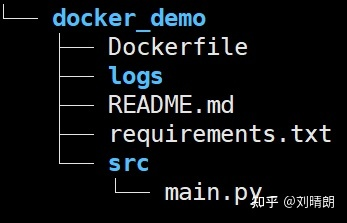

 
# 配套HTTP服务

## 代码示例

```python
# 这是一个_非常简单_的网络服务示例，可以识别上传图像中的人脸。
# 上传一个图片文件，它会检查图片中是否包含奥巴马的照片。
# 结果以json形式返回。例如：
#
# $ curl -XPOST -F "file=@obama2.jpg" http://127.0.0.1:5001
#
# 返回：
#
# {
# “face_found_in_image”：是的，
# "is_picture_of_obama": 真
# }
#
# 本示例基于 Flask 文件上传示例：http://flask.pocoo.org/docs/0.12/patterns/fileuploads/

# 注意：此示例需要安装Flask！您可以使用 pip 安装它：
# $ pip3 安装Flask
from flask_cors import *
import ast
import json
import pymysql
from io import BytesIO
import base64
import numpy as np
import face_recognition
from flask import Flask, jsonify, request, redirect

dbhost = ''
dbport = 3306
dbuser = ''
dbpass = ''
dbname = 'face'

# 数据库信息
# 您可以将其更改为系统上的任何文件夹
ALLOWED_EXTENSIONS = {'png', 'jpg', 'jpeg', 'gif'}

app = Flask(__name__)
CORS(app, resources={r"/*": {"origins": "*", "methods": "POST, GET", "expose_headers": "Content-Type"}})  # 允许所有域名跨域


def allowed_file(filename):
    return '.' in filename and \
           filename.rsplit('.', 1)[1].lower() in ALLOWED_EXTENSIONS


# 人脸注册
@app.route('/face/registration', methods=['GET', 'POST'])
def upload_image_registration():
    # 文件
    img = ""
    formData = ""
    try:
        trysss = request.files['file']
    except Exception:
        formData = request.form.to_dict()
        # 检查是否上传了有效的图片文件
        if request.method == 'POST':
            file = formData.get("file")
            img = face_recognition.load_image_file(BytesIO(base64.urlsafe_b64decode(file)))

    else:
        # 检查是否上传了有效的图片文件
        if request.method == 'POST':
            if 'file' not in request.files:
                return redirect(request.url)

            file = request.files['file']
            if file.filename == '':
                return redirect(request.url)

            if file and allowed_file(file.filename):
                # 获取上传图像中任何人脸的人脸编码
                # 加载上载的图像文件
                img = face_recognition.load_image_file(file)
                formData = request.form.to_dict()

    unknown_face_encodings = face_recognition.face_encodings(img)
    face_encoding = np.array(unknown_face_encodings).tolist()
    # 查询邮箱是否注册过
    selectdata  =  py_mysql_select(formData.get("mail"))
    if selectdata[0] != "":
        # 将结果作为json返回
        result = {
            "code": 500,
            "is_picture_of_obama": False,
            "msg":"该邮箱已经注册"
        }
        return jsonify(result)

    py_mysql_insert(formData.get("username"), formData.get("phone"), formData.get("mail"),
                    face_encoding)
    # 将结果作为json返回
    result = {
        "code": "200",
        "face_encodings": np.array(unknown_face_encodings).tolist()
    }
    # 图像文件似乎有效！返回人脸编码。
    return jsonify(result)

# 人脸验证
@app.route('/face/verification', methods=['POST'])
def upload_image():
    try:
        trysss = request.files['file']
    except Exception:
        formData = request.form.to_dict()
        # 检查是否上传了有效的图片文件
        if request.method == 'POST':
            file = formData.get("file")
            mail = formData.get("mail")
            # 图像文件似乎有效！检测人脸并返回结果。
            # 加载上载的图像文件
            return detect_faces_in_image(BytesIO(base64.urlsafe_b64decode(file)), mail)

        # 如果没有上传有效的图片文件，显示文件上传表单：
        # 将结果作为json返回
        result = {
            "code": 500,
            "face_found_in_image": False,
            "is_picture_of_obama": False
        }
        return jsonify(result), 200
    else:

        if request.method == 'POST':
            if 'file' not in request.files:
                return redirect(request.url)

            file = request.files['file']

            if file.filename == '':
                return redirect(request.url)

            if file and allowed_file(file.filename):
                # 图像文件似乎有效！检测人脸并返回结果。
                # 加载上载的图像文件
                formData = request.form.to_dict()

                return detect_faces_in_image(file, formData.get("mail"))

            # 如果没有上传有效的图片文件，显示文件上传表单：
            # 将结果作为json返回
        result = {
            "code": 500,
            "face_found_in_image": False,
            "is_picture_of_obama": False
        }
        return jsonify(result)


# 判断人脸是否存在
def detect_faces_in_image(file_stream, mail):
    # 使用 face_recognition.face_encodings(img) 生成的预先计算的人脸编码
    mysqldata = py_mysql_select(mail)
    facial_information = mysqldata[0]
    # 查出来为空则数据库没有注册此人人脸数据
    if facial_information == "":
        # 将结果作为json返回
        result = {
            "code": 200,
            "face_found_in_image": False,
            "is_picture_of_obama": False
        }
        return jsonify(result)
    known_face_encoding = ast.literal_eval(facial_information)

    # 加载上载的图像文件
    img = face_recognition.load_image_file(file_stream)
    # 获取上传图像中任何人脸的人脸编码
    unknown_face_encodings = face_recognition.face_encodings(img)

    face_found = False
    is_obama = False

    if len(unknown_face_encodings) > 0:
        face_found = True
        # 查看上传图像中的第一张面孔是否与奥巴马的已知面孔匹配
        match_results = face_recognition.compare_faces([known_face_encoding], unknown_face_encodings[0], tolerance=0.55)
        if match_results[0]:
            is_obama = True

    # 将结果作为json返回
    result = {
        "code": 200,
        "face_found_in_image": face_found,
        "is_picture_of_obama": is_obama,
        "username": is_obama if is_obama == False else mysqldata[1]
    }
    return jsonify(result), 200


# 识别信息插入数据库
def py_mysql_insert(username, phone, mail, facial_information):
    try:
        db = pymysql.connect(host=dbhost, port=dbport, user=dbuser, password=dbpass, database=dbname, charset='utf8')
        print('数据库连接成功!')

        cur = db.cursor()
        sql = 'insert into face_data(username,phone,mail,facial_information) Value (%s,%s,%s,%s)'
        value = (username, phone, mail, json.dumps(facial_information[0]))
        cur.execute(sql, value)
        db.commit()
        print('数据插入成功')
    except pymysql.Error as e:
        print("数据插入失败" + str(e))
        db.rollback()
    db.close()


# 根据邮箱信息查询数据库得到人脸信息
def py_mysql_select(mail):
    print(mail)
    try:
        db = pymysql.connect(host=dbhost, port=dbport, user=dbuser, password=dbpass, database=dbname, charset='utf8')
        print('数据库连接成功!')
        cur = db.cursor()
        sql = 'SELECT * FROM face_data WHERE mail = %s'
        cur.execute(sql, mail)
        results = cur.fetchall()
        facial_information = "";
        username = "";
        for row in results:
            username = row[2]
            facial_information = row[5]

    except pymysql.Error as e:
        print("数据查询失败" + str(e))
        db.rollback()
    db.close()
    # 等于空则没有注册过
    return facial_information, username


if __name__ == "__main__":
    app.run(host='0.0.0.0', port=5001, debug=True)

```

## 打包成docker镜像

### 准备docker

**安装docker**，最后我们不要忘了设置**docker加速**。


### 准备python项目

python项目结构

这里简单介绍下各个目录、文件作用

- docker_demo 项目顶级目录
- Dockerfile 后面根据Dockerfile创建docker镜像，后续将详细讲解该文件
- logs（可选） 日志目录，主要用来演示如何将容器中的数据同步到宿主机中去
- README（可选） 介绍整个项目的背景和使用方法
- requirements.txt 该文件描述了python项目的依赖环境
- src 该目录下放置函数入口文件
- main.py 该文件简单地验证docker是否成功安装好环境依赖、容器是否能和宿主机进行数据同步

### 编写Dockerfile

将Dcokerfile文件置于项目根目录下，文件内容如下

```dockerfile
FROM python:3.6-slim-stretch

WORKDIR ./docker_demo
 
ADD . .

RUN sed -i 's/deb.debian.org/mirrors.tencent.com/' /etc/apt/sources.list
RUN sed -i 's/security.debian.org/mirrors.ustc.edu.cn/' /etc/apt/sources.list 
RUN apt-get clean  
RUN apt-get update 
RUN apt-get install -y --fix-missing  \
    build-essential \
    cmake \
    gfortran \
    git \
    wget \
    curl \
    graphicsmagick \
    libgraphicsmagick1-dev \
    libatlas-base-dev \
    libavcodec-dev \
    libavformat-dev \
    libgtk2.0-dev \
    libjpeg-dev \
    liblapack-dev \
    libswscale-dev \
    pkg-config \
    python3-dev \
    python3-numpy \
    software-properties-common \
    zip \
    && apt-get clean && rm -rf /tmp/* /var/tmp/*	


RUN cd ~ && \
    mkdir -p dlib && \
    git clone -b 'v19.9' --single-branch https://github.com.cnpmjs.org/davisking/dlib.git dlib/ && \
    cd  dlib/ && \
    python3 setup.py install --yes USE_AVX_INSTRUCTIONS

RUN pip3 install -i https://pypi.tuna.tsinghua.edu.cn/simple --trusted-host pypi.tuna.tsinghua.edu.cn -r requirements.txt


CMD ["python3", "./src/face.py"]
```

- FROM python:3.7

FROM <基础镜像>。所谓定制镜像，那一定是以一个镜像为基础。FROM 指令用来指定以哪个镜像作为基础镜像生成新的镜像。这里我们将官方Python的3.7版本镜像作为基础镜像。

- WORKDIR ./docker_demo

WORKDIR <工作目录路径> 。 使用 WORKDIR 指令可以来指定**镜像**中的**工作目录**（或者称为当前目录），以后各层的当前目录就被改为指定的目录。

- ADD . .

ADD <源路径> <目标路径>。使用ADD指令可以将**构建上下文目录**中的源路径目录**复制**到**镜像内**的 <目标路径> 位置。**第一个参数“.”**代表Dockerfile所在的目录，即python项目docker*demo下所有的目录（*不包括docker_demo自身）。**第二个参数“.”**代表镜像的工作目录docker_demo。所以该行命令会将python项目docker_demo目录下的所有文件复制到镜像的docker_demo目录下。这样docker镜像中就拥有了一份docker_demo python项目。

- RUN pip install -r requirements.txt

RUN 指令是用来执行命令行命令的。这里直接安装requirements.txt 中指定的任何所需软件包。

- CMD["python","./src/main.py"]

CMD 指令是容器启动命令，这里是在容器启动时通过python运行 main.py。值得**注意**的是**./**目录指的是当前工作目录**即docker_demo**。

### 构建python依赖

> requirements.txt

需要着重关注的是requirements.txt的生成方法，这个文件里面包含了项目所有的依赖库，当然你可以一行一行的打进去，幸运的是，Python里面提供了一个包可以自动生成项目的依赖库pipreqs，首先你需要安装这个库：

```bash
pip install pipreqs
```

然后cd到项目目录:

```undefined
pipreqs ./
```

这时，你会发现docker_file文件夹下面出现了一个requirements.txt，打开里面的内容如下：

```txt
tensorflow==1.4.1
easydict==1.9
numpy
```

> 下载失败请删除版本号

### 生成Docker镜像

在dockerfile所在的目录下运行。

```bash
sudo docker build -t demo:v1 .
```

我们利用build指令生成镜像，-t 参数指定了最终镜像的名字为demo:v1。如果注意，会看到 docker build 命令最后有一个 . 。 . 表示当前目录，这里是指将Dockerfile所在的当前目录作为构建上下文目录。**注意**：不清楚构建上下文目录含义的同学可以返回**编写Dockerfile**小节，查看ADD . .指令中对构建上下文目录的描述。

### 运行Docker容器

```bash
docker run  -p 5001:5001 demo
-p 是做端口映射，此时将服务器中的5001端口映射到容器中的5001(项目中端口配置的是5001)端口
demo 镜像名
```

我们用docker run运行容器 ，终端显示 hello docker 表示容器运行成功

## http文档

| 方法   | 注册人脸信息                                  | 根据邮箱和人脸登录                                           |
| ------ | --------------------------------------------- | ------------------------------------------------------------ |
| url    | /face/registration                            | /face/verification                                           |
| 返回值 | code:200正常500失败 face_encodings:人脸识别码 | face_found_in_image：上传图片有没有人脸 is_picture_of_obama：是否匹配  username：数据库用户名 |
| 参数   | file:文件 username:姓名 phone:手机 mail:邮箱  | mail:邮箱 file:文件                                          |


