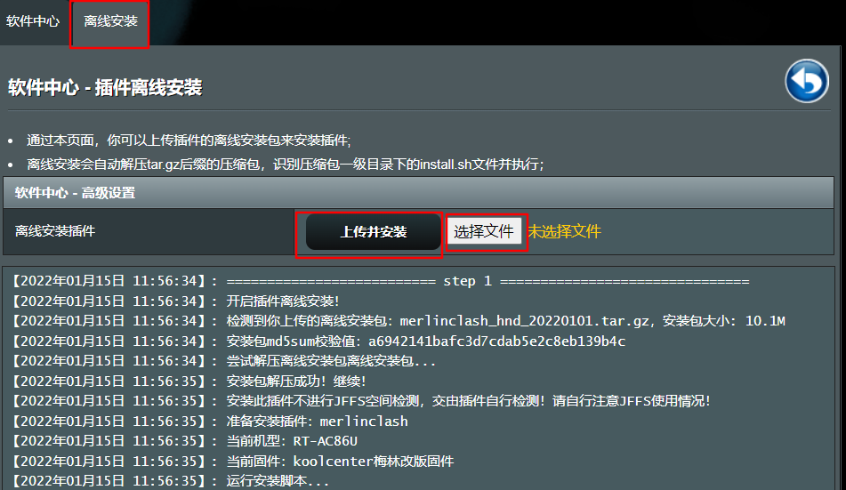
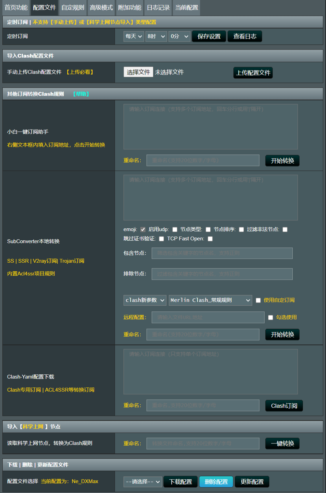
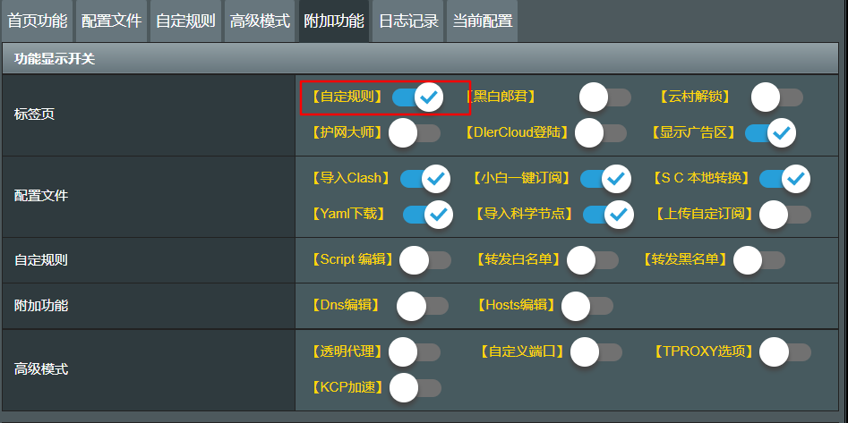
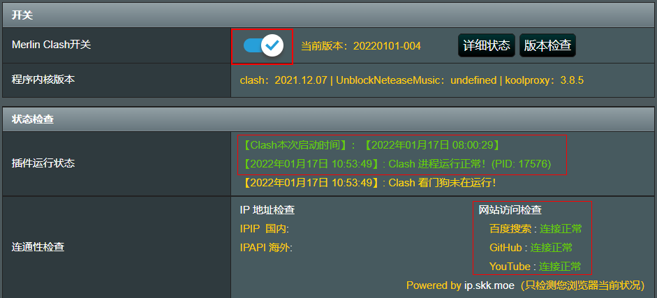
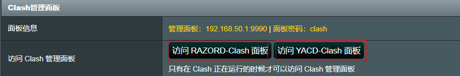

# 华硕路由器搭建科学上网

简介Merlin Clash是一款运行在KoolCenter软件中心(Arm版)上的Clash GUI插件。

如何在华硕AX82U路由器上安装和配置Clash插件。Clash是一款强大的代理工具，能够帮助您更好地管理网络流量，提高上网速度，并绕过各种网络限制。为了完成这项操作，您的AX82U路由器需要运行带有软件中心的固件，例如梅林固件或官方改良固件

## 简介

Merlin Clash是一款运行在软件中心(Arm版)上的Clash GUI插件。AX82U插件：

链接：https://pan.quark.cn/s/040cd768c757

其他型号插件需加入Telegram群组-[merlinclashcat](https://t.me/merlinclashcat)

## 环境

路由器需要能支持刷固件，固件需要带软件中心，比如梅林固件。一般华硕、网件的路由器固件种类多，比较好刷。

## 本设备及固件版本

设备：华硕AX82U

固件：官改3.0.0.4.386_41700_koolshare

## 步骤

### 安装

打开[软件中心]-[离线安装]，上传下载好的merlinclash的tar包并安装。

要是提示含非法关键词，安装失败的，[可查看解决华硕路由器软件中心禁止安装含非法关键词](https://zsyyblog.com/55034afc.html)

### 使用

小白一键订阅助手：推荐使用，填入代理商提供的订阅链接，设置好配置名称即可。

填好订阅链接，设置好配置名称后，点击开始转换，即可完成订阅。

### 附加功能

附加功能中建议打开[自定规则]，其他按你需要自行开启：

### 启动

完成配置后，打开开关，保存并启动后即可开启：

图中，红框处显示绿色，则正常。

### 管理面板

插件提供两种网页端的管理面板：

可在网页端输入ip地址访问，默认密码clash，也可直接点击按钮进入，此时免密。
