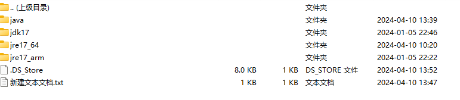

# java语言将jar打包苹果可执行文件

在这篇文章中使用`jpackage`工具将Java应用程序打包成苹果(macOS)的可执行文件。使用`jpackage`创建适用于macOS的`.app`和`.dmg`文件。此外，本文还包括针对不同Java版本的特定指南，确保无论您的项目使用何种版本的Java，都能顺利打包。通过这篇详细的教程，您将能够理解`jpackage`的核心功能，掌握打包Java应用为苹果操作系统可执行文件的技巧，提高软件的可接入性和用户体验。

> java语言将jar打包苹果可执行文件


打包命令：

```bash
./jdk17/bin/jpackage --type dmg --input ./java --name "软著生成工具" --main-jar SourceDocx-1.0.jar --main-class org.springframework.boot.loader.JarLauncher --runtime-image ./jre17_64/zulu-17.jre/Contents/Home --icon ./java/logo.icns
```

## 命令解释

./jdk17/bin/jpackage: 指定使用JDK 17目录下的jpackage工具。
--type dmg: 设置打包的类型为dmg，这是macOS常用的安装包格式。
--input ./java: 指定输入文件夹，这里是包含应用程序jar和其他资源的java目录。
--name "软著生成工具": 设置打包后应用的名称。
--main-jar SourceDocx-1.0.jar: 指定应用程序的主jar文件。
--main-class org.springframework.boot.loader.JarLauncher: 设置主类，这是Spring Boot打包后的jar使用的启动器。
--runtime-image ./jre17_64/zulu-17.jre/Contents/Home: 指定包含在应用程序中的JRE镜像路径。
--icon ./java/logo.icns: 设置应用图标。


## 步骤

### 下载最新版的jdk

首先，您需要下载最新版本的JDK。可以从Azul官网获取：

下载地址：https://www.azul.com/


### 下载jre文件

对于macOS应用，您可能需要支持不同架构（如x64位和arm），因此应下载相应架构的JRE文件。


下载地址：https://www.azul.com/


### 准备文件和目录

在执行打包命令之前，确保您的项目结构正确，所有必需的文件都已就位。这包括应用的jar文件、图标文件以及任何依赖文件。




### 执行命令打包

最后，打开命令行工具，导航到包含JDK的目录，并执行上述打包命令。如果一切设置正确，您的Java应用程序将被打包成macOS可执行的dmg文件。