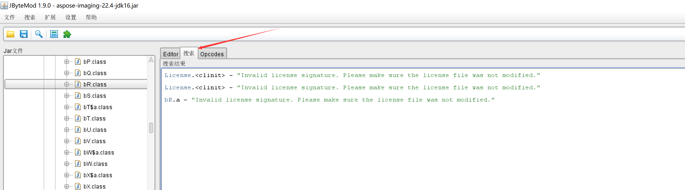
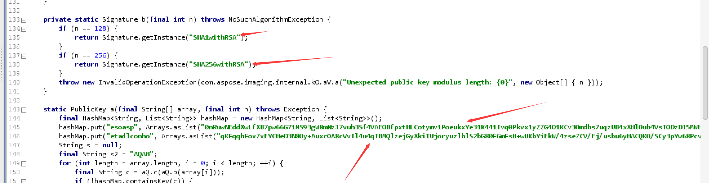

# 个人总结破解aspose系列产品方法

Aspose于2002年3月在澳大利亚悉尼创建，旗下产品覆盖文档、图表、PDF、条码、OCR、CAD、HTML、电子邮件等各个文档管理领域，为全球.NET 、Java、C ++等10余种平台开发人员提供丰富的开发选择。

产品是收费的  下面记录一下破解产品验证薅资本主义羊毛

## 步骤

1. 下载 JByteMod

2. 通过JByteMod点击左上角搜索->搜索字符串->输入Invalid license signature. Please make sure the license file was not modified

3. 点击搜索结果

   

4. 挨个查看

   如果类里有类似于这样方法

   

5. 则找到static方法形参大概类似于final Node node, final Node node2

6. 使用[aspose.pdf-17.8暴力破解，附破解过程和使用代码](https://blog.csdn.net/qq_42834405/article/details/98618002) 方法  如果返回值是void 删除掉验证逻辑即可

   如果返回值是boolean类型则删除验证逻辑  只返回 true

   

