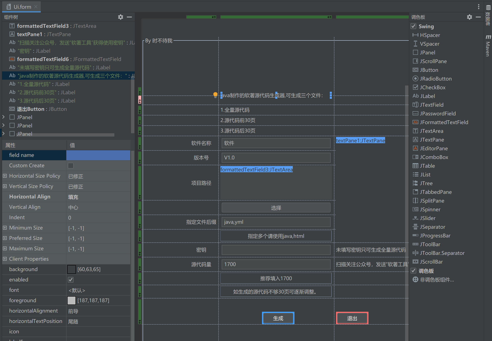
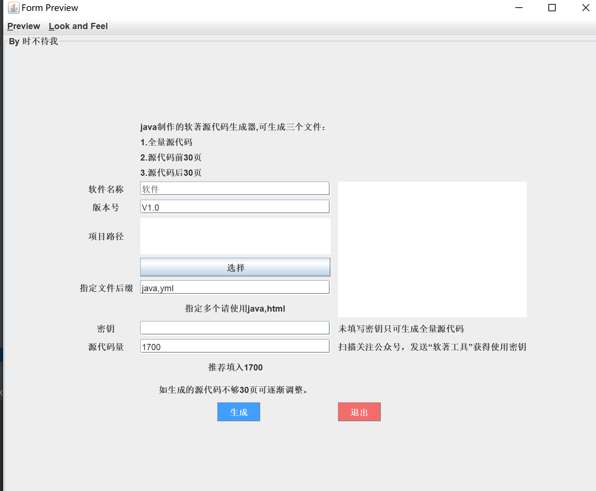

# 使用Swing开发Java GUI程序

## 使用IDEA拖拽开发界面

1. 在项目包中点击Swing UI设计器 输入窗体名称就可以创建成功
   


2. 慢慢拖拽即可创建窗体
   



3. 具体可参考 [IDEA快速GUI界面](https://blog.csdn.net/weixin_48844604/article/details/110110744)  [如何利用Intellij idea的GUI Designer设计GUI](https://www.jianshu.com/p/d37489d41ef1) 
   
4. 打包所需依赖


```xml
 		<dependency>
                <groupId>com.intellij</groupId>
                <artifactId>forms_rt</artifactId>
                <version>7.0.3</version>
        </dependency>
```

## 如何美化开发的页面

美化前：




美化后：


### 要点

1. 要使用最新版的jdk  新版jdk对UI进行了美化
   
2. 使用主题依赖
   
```xml
<dependency>
    <groupId>com.formdev</groupId>
    <artifactId>flatlaf</artifactId>
    <version>2.3</version>
</dependency>

<dependency>
    <groupId>com.formdev</groupId>
    <artifactId>flatlaf-intellij-themes</artifactId>
    <version>2.3</version>
</dependency>
```

​	在主窗口实例化之前调用
```java
// 主题设置
FlatIntelliJLaf.install();
UIManager.put("TextComponent.arc", 5);
UIManager.put("Component.focusWidth", 1);
UIManager.put("Component.innerFocusWidth", 1);
UIManager.put("Button.innerFocusWidth", 1);
UIManager.put("TitlePane.unifiedBackground", true);
UIManager.put("TitlePane.menuBarEmbedded", false);
```

3. 设置字体，设置字体抗锯齿
   
```java
// 字体设置
// 抗锯齿 
System.setProperty("awt.useSystemAAFontSettings", "on");
System.setProperty("swing.aatext", "true");
Font fontUIResource = new Font("宋体", Font.PLAIN, 22);
for (Enumeration keys = UIManager.getDefaults().keys(); keys.hasMoreElements(); ) {
    Object key = keys.nextElement();
    Object value = UIManager.get(key);
    if (value instanceof FontUIResource) {
        UIManager.put(key, fontUIResource);
    }
}
UIManager.put("defaultFont", fontUIResource);
```

   


## 如何解决打包后静态资源无法访问

使用springboot构建Swing程序，然后将静态资源放入resources

然后使用

```java
  ClassLoader loader = Thread.currentThread().getContextClassLoader();   
  InputStream msyh = loader.getResourceAsStream(name);
```

怎么使用springboot构建Swing程序呢？

   ```java
   @SpringBootApplication
   public class SourceDocxApplication implements CommandLineRunner {
   
       public static void main(String[] args) {
           new SpringApplicationBuilder(SourceDocxApplication.class)
                   .headless(false).run(args);
       }
   
       @Override
       public void run(String... args) throws Exception {
           Ui.getInstance().initUI();
   
   
       }
   }
   ```

   Ui.java要继承JFrame

   ```java
       public static Ui getInstance() {
           if (null == instance) {
               synchronized (Ui.class) {
                   if (null == instance) {
                       instance = new Ui();
                   }
               }
           }
           return instance;
       }
       
       public void initUI() throws Exception {
          ...窗体设置代码
          // 主窗口设置
           JFrame frame = new JFrame("软著源代码生成器");
           frame.setContentPane(new Ui().jPanel);
           frame.setDefaultCloseOperation(JFrame.EXIT_ON_CLOSE);
           frame.pack();
           frame.setResizable(false);
           frame.setVisible(true);
   
       }
   ```

   打包配置

   ```xml
   <build>
   		<plugins>
   			<plugin>
   				<groupId>org.springframework.boot</groupId>
   				<artifactId>spring-boot-maven-plugin</artifactId>
   				<configuration>
   					<includeSystemScope>true</includeSystemScope>
   				</configuration>
   			</plugin>
   		</plugins>
   			<!-- 打包配置 -->
   		<resources> 
               <resource>  
   	              <directory>src/main/resources</directory>  
   	                <includes>
   	                    <include>**/*</include>  
   	                </includes>  
               </resource>
   		</resources>
   	</build>
   ```

   

