# 使用 exe4j 将Java程序打包为可执行文件

> 本文介绍了如何将Java应用程序转换为EXE可执行文件的步骤和技巧，使您的Java项目能够在没有安装Java环境的Windows系统上运行。通过详细的教程，通过这些工具优化您的应用打包流程，确保软件的高效发布和部署。无论您是Java新手还是经验丰富的开发者，本文都能为您提供宝贵的指导和技巧，帮助您顺利完成Java项目到EXE文件的转换。
>


jdk版本过高没有jre可以使用命令：

```bash
jlink.exe --module-path jmods --add-modules java.sql,java.desktop --output jre
```

## 步骤

### 将自己的程序打包成jar包

将自己的程序打包成jar包，java -jar jar包 没有问题之后，将cmd窗口关闭进行后续操作

### 下载安装exe4j

 **exe4j**：将jar转换成exe的工具

链接: https://pan.baidu.com/s/1AXaXeawYC0mcDUlSSMGvXw

提取码: smb7

注意：exe4j要用注册码激活，不然会有弹窗

注册码：

```
A-XVK258563F-1p4lv7mg7sav

A-XVK209982F-1y0i3h4ywx2h1

A-XVK267351F-dpurrhnyarva
```


### exe4j

> 重要！这个软件里指定jre路径  指定软件图标ico都要用相对路径  比如使用./jre
>
> 如果这样写了运行不了  就把jre文件夹复制到exe4j根目录  图标同理

选择“jar in exe” mode 选项，

 **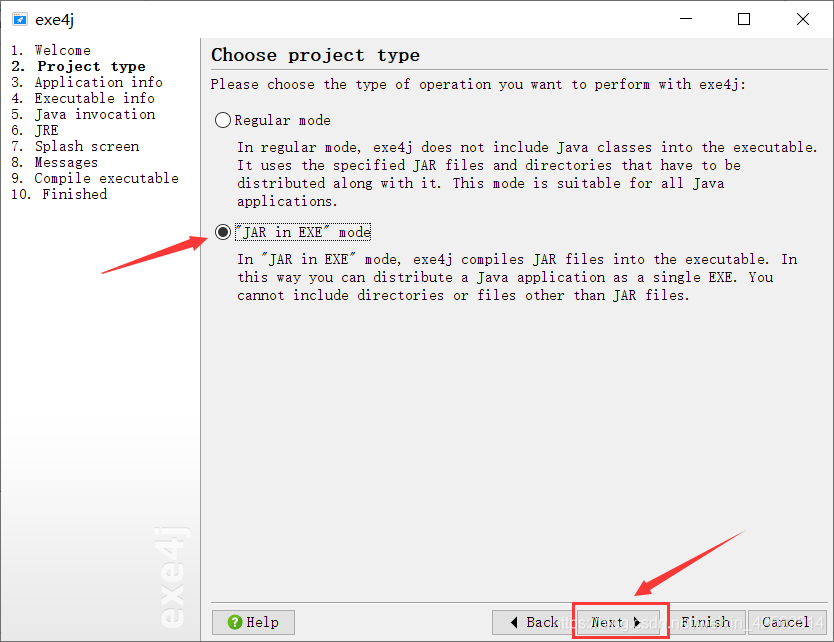**

 **5. 输入名称和输出路径，下一步。**

**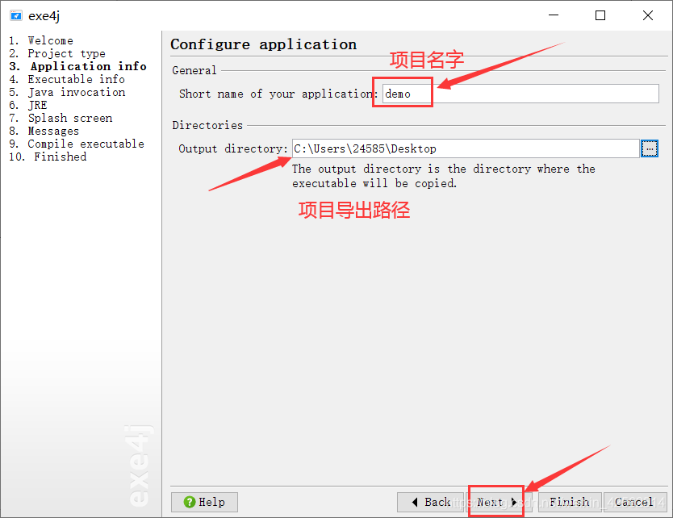**

 **6. 选择GUI，输入应用名称，设置应用图标，下一步。**

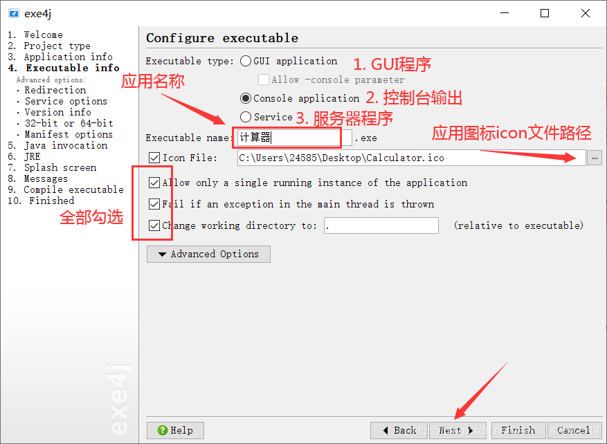

 注意：这里选择**GUI程序**，并且勾选下面的Allow -console

**7. 选中“32-bit or 64-bit”，勾选“generate 64-bit executable”，下一步**

**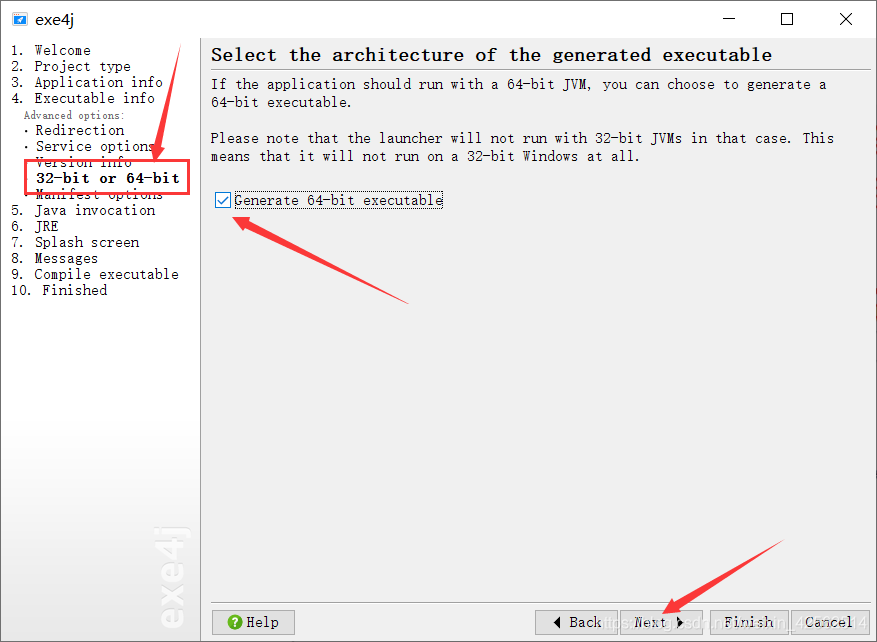**

 注意：因为医院的系统有XP 32位，win7 win8 64位的，所以我是分两次打的exe  一个EMRBrower.exe和EMRBrower32.exe 若是打64位的就勾选，若是打32位的就不用勾选

**8. 再VM Parameters输入“ -Dappdir=${EXE4J_EXEDIR} ”，点击绿色+号**

  在VM参数配置的地方加上：-Dfile.encoding=utf-8 

**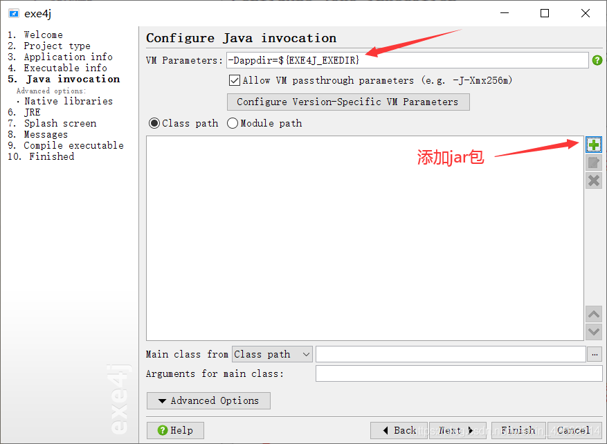**

 **9. 选择jar包路径，自己的jar包，OK。**

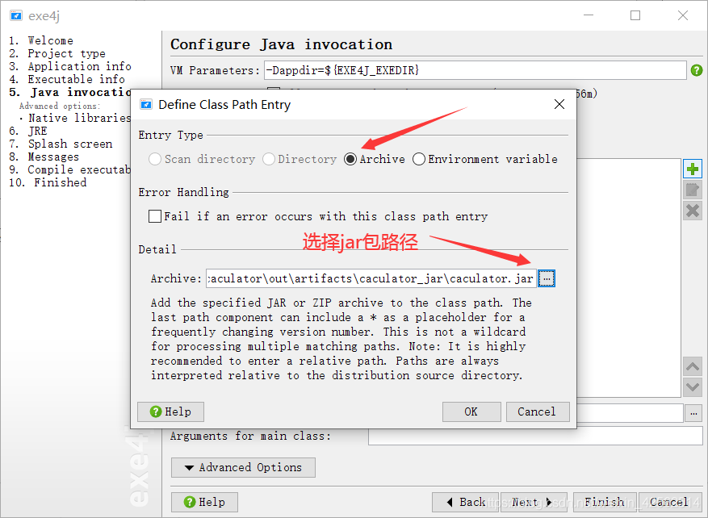

 **10. 选择应用程序的主类（含main方法），下一步。**

 注意：这里一定选择**第三个JarLauncher**，我第一次的时候选择的是最后一个，运行不了报错提示找不类

**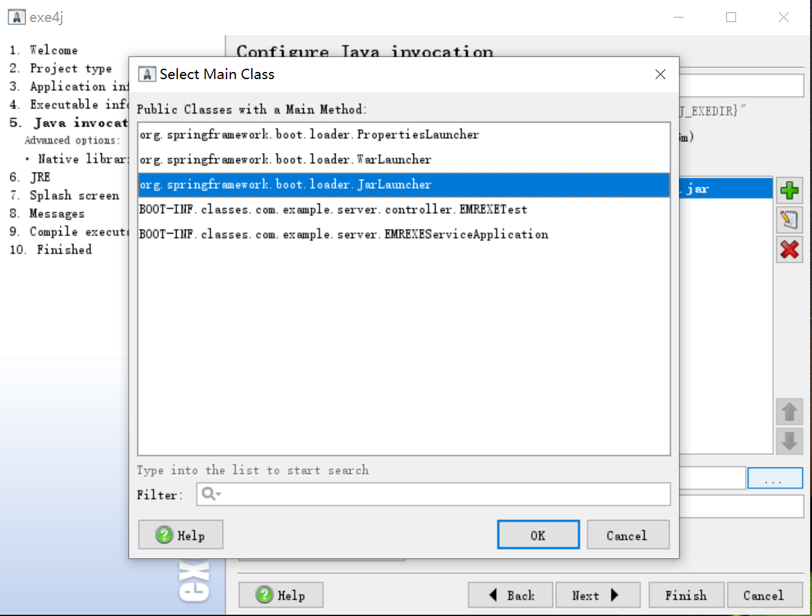**

**11. 选择jdk版本。**

 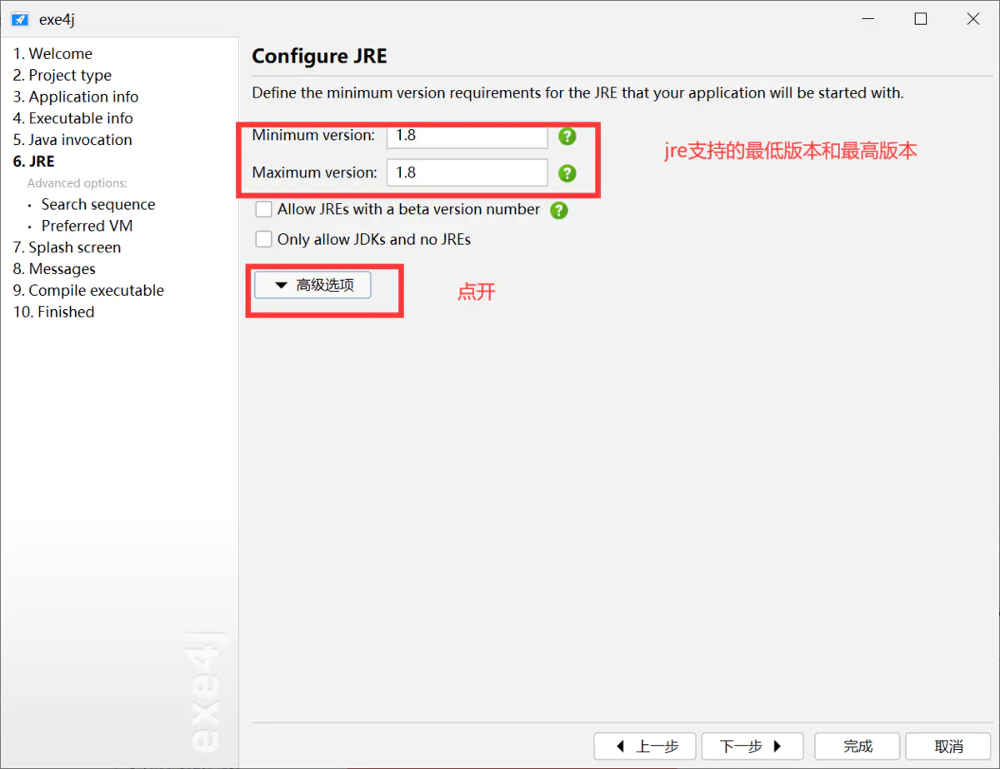 


**12. 选中“ Search sequence ”，选中绿色+号添加jre目录。**

**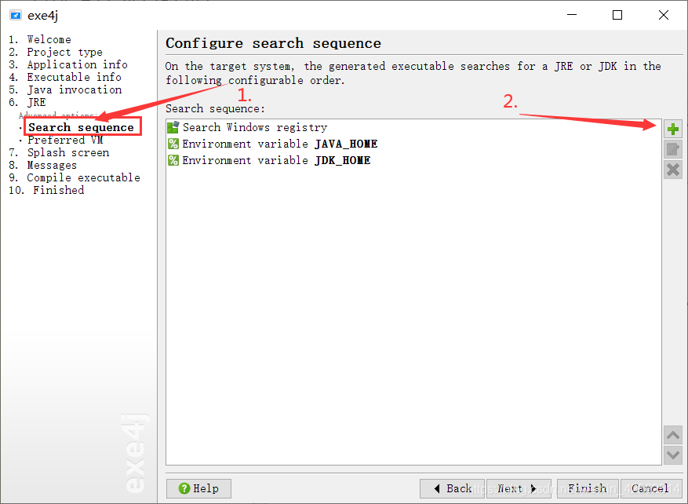**

**13. 选择“ Directory ”，目录输入“ .\jre ”，下一步。**

**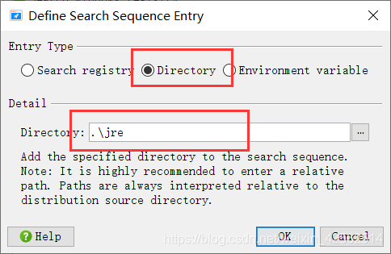**

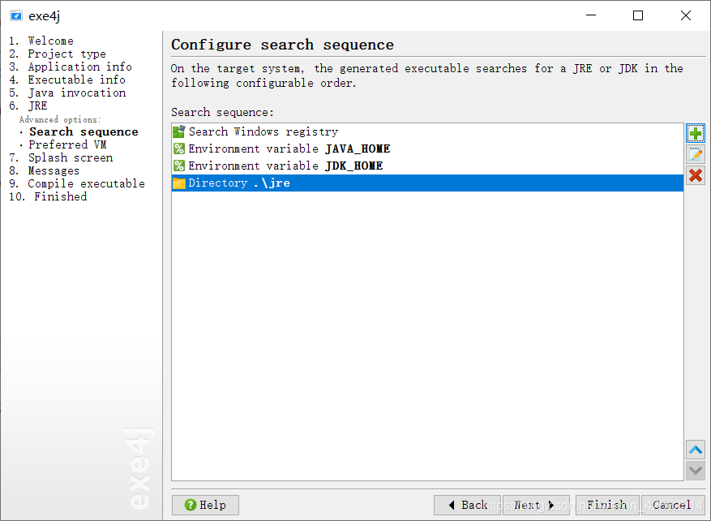

此项设置并不会把jre打包进exe中，只是一个相对jre路径设置。

本次设置需要在exe同级目录下有jre文件夹，并且文件夹名需要相同。

每次运行exe都需要同级目录下有jre文件夹

ps：此路径可有手动输入

**14. 选择“ Client hotspot VM ”，下一步。**

**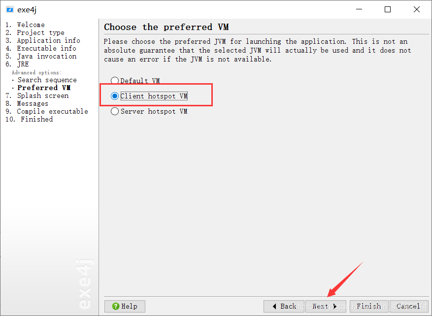**

 **15. 一直下一步，等待绿色进度条完成，在输出目录里面多了一个可运行程序**

**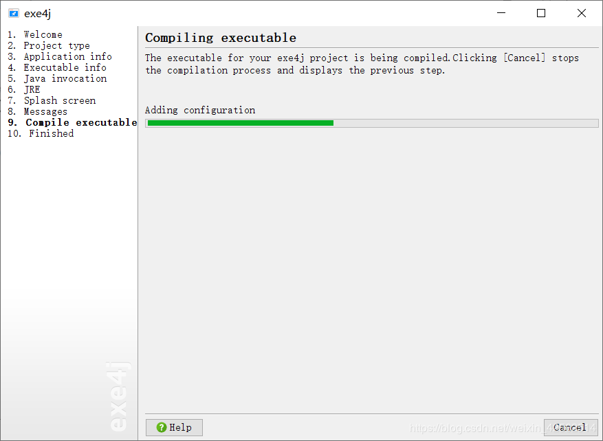**

 **16. 点击“ Click Here to Start the Application ”即可运行程序**

注意：这里最好不要点，因为这个是运行程序，之后全部弄完之后再运行的时候可能端口冲突，导致最后的exe运行不起来

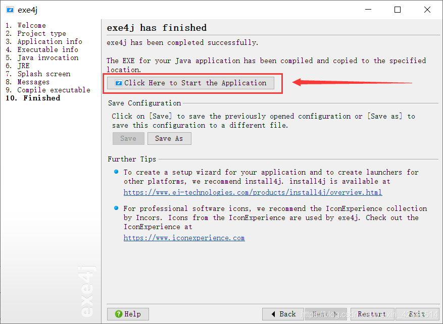
