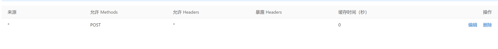
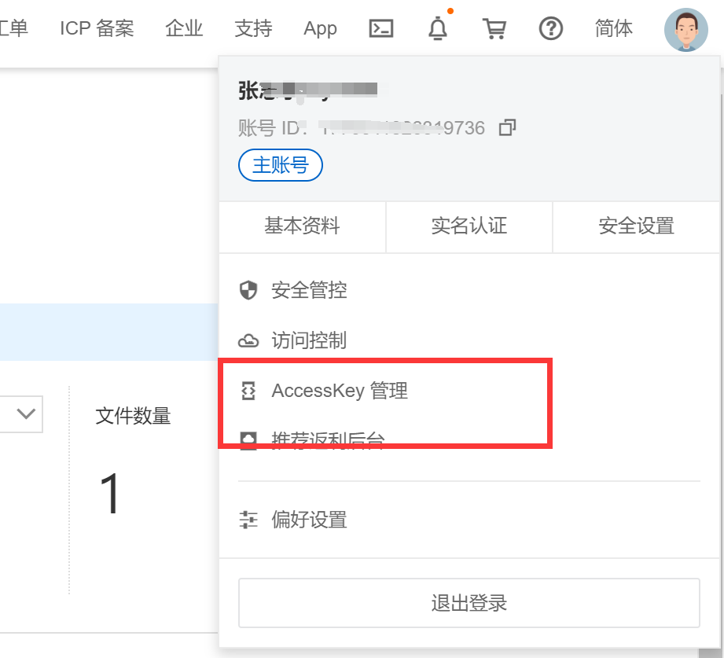
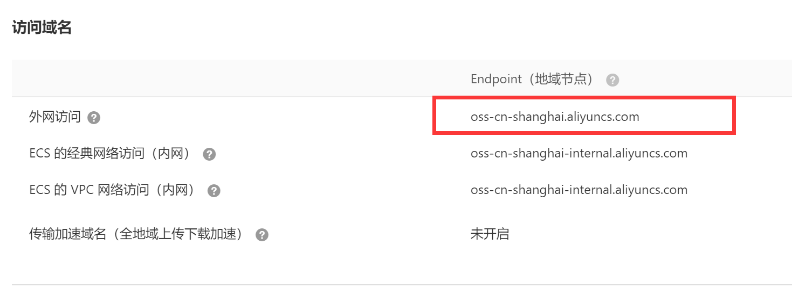
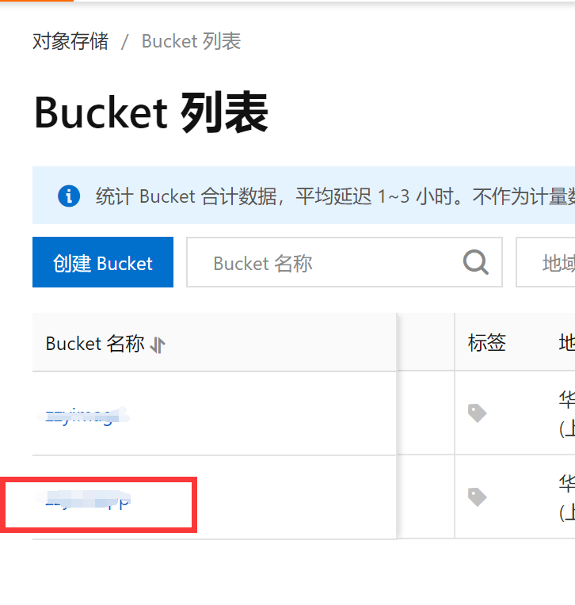

# 使用阿里云oss

## 开通阿里云oss

[详见](https://help.aliyun.com/document_detail/178511.html)

### 配置跨域访问



### 获得 AccessKey 



## JAVA支持

### Controller

```java
/**
	 * 阿里云通用上传请求
	 */
	@PostMapping("/oss/common/upload")
	public AjaxResult OSSuploadFile(MultipartFile file) throws Exception {
		String fileName = file.getOriginalFilename();
		String suffixName = fileName.substring(fileName.lastIndexOf("."));
		// 生成文件名称通用方法
		SimpleDateFormat sdf = new SimpleDateFormat("yyyyMMdd_HHmmss");
		Random r = new Random();
		StringBuilder tempName = new StringBuilder();
		tempName.append(sdf.format(new Date())).append(r.nextInt(100)).append(suffixName);
		String newFileName = tempName.toString();

		FileOssUtil.uploadFile(newFileName, file);

		AjaxResult ajax = AjaxResult.success();
		ajax.put("fileName", newFileName);
		ajax.put("url", "https://zzyuniapp.oss-cn-shanghai.aliyuncs.com/" + newFileName);
		return ajax;

	}
```

### FileOssUtil

```java
// 阿里云API的内或外网域名
	private static String endpoint = "https://oss-cn-shanghai.aliyuncs.com";

	// 阿里云API的密钥Access Key ID
	private static String accessKeyId = "LTAI5tAaqnopuNTHmQax123c";

	// 阿里云API的密钥Access Key Secret
	private static String accessKeySecret = "HNi4d4567Dta7UQ8nzZIPDDXAp2u5F";

	// 阿里云API的bucket名称
	private static String bucketName = "zzyun231";

	public static void uploadFile(String objectKey, MultipartFile multipartFile)
			throws OSSException, ClientException, FileNotFoundException {

		// 创建OSSClient的实例
		OSS ossClient = new OSSClientBuilder().build(endpoint, accessKeyId, accessKeySecret);
		try {
			if (multipartFile.getSize() != 0 && !"".equals(multipartFile.getName())) {
				// getInputStream()返回一个InputStream以从中读取文件的内容。通过此方法就可以获取到流
				InputStream multipartFileInputStream = multipartFile.getInputStream();
				PutObjectRequest putObjectRequest = new PutObjectRequest(bucketName, objectKey,
						multipartFileInputStream);
				ossClient.putObject(putObjectRequest);
			}
		} catch (IOException e) {
			e.printStackTrace();
		} finally {
			// 关闭流
			ossClient.shutdown();
		}
	}
```

endpoint：

bucketName：



### pom.xml

```xml
<dependency>
    <groupId>com.aliyun.oss</groupId>
    <artifactId>aliyun-sdk-oss</artifactId>
    <version>3.10.2</version>
</dependency>
```

