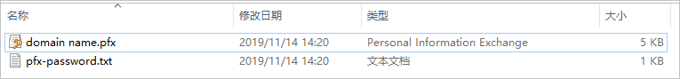

# 在SpringBoot上启用HTTPS

> 在SpringBoot上启用HTTPS

通过配置SSL证书为Spring Boot启用HTTPS，实现网络通信数据的加密传输。本文介绍在Spring Boot上启用HTTPS的具体步骤。

## 前提条件

- SSL证书的加密算法为RSA或ECC，并且证书为已签发状态。

  > **说明** 如果您证书的加密算法为SM2（国密算法），该证书无法配置在Spring Boot上。您需要吊销该证书并重新申请加密算法为RSA或ECC的证书。关于吊销证书和申请证书的操作，请参见[吊销SSL证书](https://help.aliyun.com/document_detail/98577.htm#concept-v5s-lxn-yfb)和[提交证书申请](https://help.aliyun.com/document_detail/98574.htm#concept-wxz-3xn-yfb)。

- 您的Spring Boot已经开启了443端口（HTTPS服务的默认端口）。

- 已准备好远程登录工具（例如PuTTY、Xshell），用于登录您的Web应用服务器。

## 操作步骤

1. 登录[SSL证书控制台](https://yundunnext.console.aliyun.com/?p=cas)。

2. 在左侧导航栏，单击**SSL证书**。

3. 定位到要下载的证书，单击**操作**列下的**下载**。

4. 在**证书下载**面板，单击**Tomcat**服务器**操作**列下的**下载**。

   该操作会将Tomcat服务器证书压缩包下载到本地，并保存在浏览器的默认下载位置。

5. 访问浏览器的默认下载目录，解压已下载的证书压缩包文件。

   解压后您将会获得以下文件。

   - 证书文件（domain name.pfx）
   - 密码文件（pfx-password.txt）

   > **说明**
   >
   > - Spring Boot支持配置PFX和JKS格式的证书，本文以PFX格式的证书为例。
   > - 本文中证书名称以domain name为示例。
   > - 每次下载证书都会产生新的密码。该密码仅匹配本次下载的证书。如果需要更新证书文件，同时也要更新匹配的密码。

6. 将解压后的证书文件和密码文件拷贝到Spring Boot项目的根目录src/main/resources/下。

7. 修改配置文件application.properties或application.yml

   - 参考以下示例配置

     application.properties

     中的参数：

     ```yaml
     server.port = 443    #HTTPS协议默认端口号为443，需要使用其他端口时，您可以在此处自定义。
     server.ssl.key-store: classpath = server.p12
     server.ssl.key-store-password = ********    #填写pfx-password.txt文件内的密码。
     server.ssl.keyStoreType = PKCS12
     ```

   - 参考以下示例配置

     application.yml

     中的参数：

     ```yaml
     server:
       port: 443    #HTTPS协议默认端口号为443，需要使用其他端口时，您可以在此处自定义。
       ssl:
         key-alias: tomcat
         key-store-password: ********    #填写pfx-password.txt文件内的密码。
         key-store-type: PKCS12
         key-store: classpath:keystore.p12
     ```

8. 执行`mvn spring-boot:run`命令重启Spring Boot服务。

   

