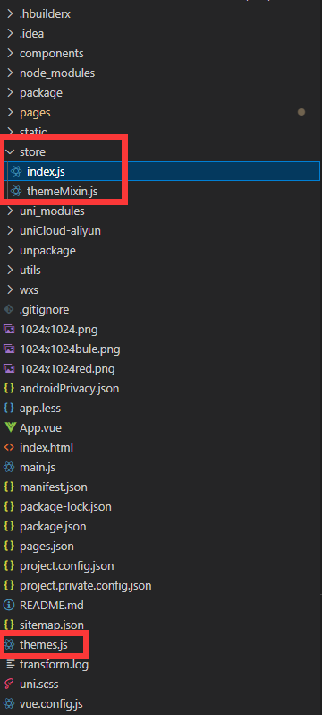

# uniapp怎么制作并一键切换主题

>  在UniApp中制作并实现一键切换主题可以为应用增加灵活性和个性化。主题文本还可以通过接口获取，以下是一个指南，使用vuex和混入制作并实现一键切换UniApp主题   


## 目录结构



themes.js：样式包

index.js：vuex

themeMixin.js：混入


## 代码案例

### themes.js

```javascript
export const themes = {
    ylrcw: {
        theme: `
            --primary: #3978E8;
            `,
        tab_list: [
            {
                title: "首页",
                img: "/tab_bar_com/comfoot1.png",
                act_img: "/tab_bar_com/comfoot1_blue.png",
                is_act: 0,
                link: "/pages/com_index/com_index",
            },
        ],
    },
    hszp: {
        theme: `
            --primary: #3978E8;
            `,
        tab_list: [
            {
                title: "首页",
                img: "/tab_bar_com/comfoot1.png",
                act_img: "/tab_bar_com/comfoot1_blue.png",
                is_act: 0,
                link: "/pages/com_index/com_index",
            },
        ],
    },
};

```


### index.js:

```javascript
import Vue from "vue";
import Vuex from "vuex";

Vue.use(Vuex);

const store = new Vuex.Store({
    state: {
        themeName: "ylrcw",
        themeStyle: {
           
        },
    },
    getters: {
        theme(state) {
            const windowWidth = uni.upx2px(100)/100 
            // 添加rpx转px比例 --rpx-to-px-ratio 属性到样式字符串
            const ratioStyle = `--rpx-to-px-ratio: ${windowWidth.toFixed(2)};`;
            let currentThemeStyle = state.themeStyle[state.themeName]&& state.themeStyle[state.themeName].theme;
            currentThemeStyle = `${ratioStyle}\n${currentThemeStyle}`;
            return currentThemeStyle;
        },
    },
    mutations: {
        setTheme(state, themeName = "ylrcw") {
            state.themeName = themeName;
        },
        setThemeStyle(state, themeStyle) {
            state.themeStyle = themeStyle;
        },
    },
});

export default store;

```


### themeMixin.js

```javascript
// 将主题进行混入，方便在组件中使用
import {
    mapState,
    mapGetters
  } from 'vuex'
  export default {
    install(Vue) {
      Vue.mixin({
        computed: {
          ...mapState({
            themeName: 'themeName'
          }),
          ...mapGetters({
            theme: "theme"
          })
        }
      })
    }
  }
  
```


### App.vue

```
<script>
import { themes } from "./themes.js";
import { themeType } from "./utils/config/baseurl";
onLaunch(options) {
        this.$store.commit("setThemeStyle", themes);
        this.$store.commit("setTheme", themeType);
        cache.set("themeType", themeType);
}
```


### main.js

```javascript
// 引用 Vuex 文件
import store from './store'
import mixin from './store/themeMixin.js'

Vue.use(mixin)

const app = new Vue({
    store,
    ...App
});

```


### baseurl.js&&util.js

```javascript
let themeType = 'ypw'
export { themeType };
//返回主题的值
export const getThemeValue = (theme, key) => {
    const lines = theme.split(";");
    for (let i = 0; i < lines.length; i++) {
        let line = lines[i].trim();
        if (line.startsWith(key + ":")) {
            return line.substring(line.indexOf(":") + 1).trim();
        }
    }
    return null;
};
```


## 怎么使用

```vue
<template>
    <view :style="theme"> </view>
</template>
<script>
getThemeValue(this.theme, "--get_location_selected_list_img");
</script>
<style lang="scss">
.com_jobedit_step_one {
    background-image: var(--com_jobedit_step_one_bg);
}
</style>

```

