# vscode插件大全，最完美配置vscode教程


## 代码美化

- Beautify: 一个用于美化代码的插件，支持多种语言格式化。
- Prettier - Code formatter: 一款代码格式化工具，支持大多数语言，并提供多种格式化配置选项。

## 代码提示

- python snippets: 为Python语言提供代码片段。
- Reactjs code snippets: 为 ReactJS 提供常用代码片段。
- Vue 3 Snippets: 为 Vue 3 提供常用代码片段。
- Vue VSCode Snippets: 为 Vue 2 提供常用代码片段。
- wechat-snippet: 为微信小程序提供代码片段。
- GitHub Copilot Nightly: 由 GitHub 开发的 AI 代码助手，提供代码自动生成功能。

  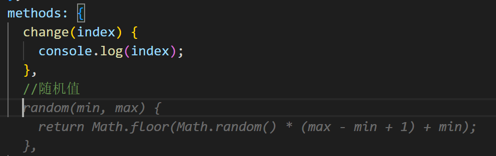

## 代码检查

- ESLint: JavaScript 代码检查工具。

- Pylance: Microsoft 出品的 Python 语言服务器，支持代码补全、类型检查等。

- Error Lens: 在代码中直接显示错误和警告信息。

  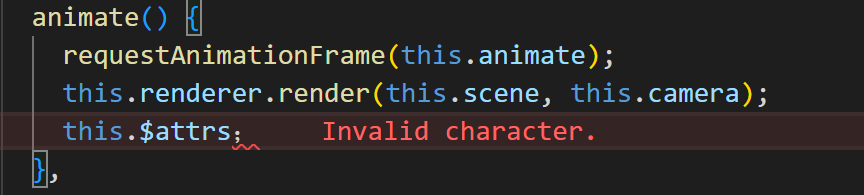

- koroFileHeader: 为代码文件添加头部注释。

  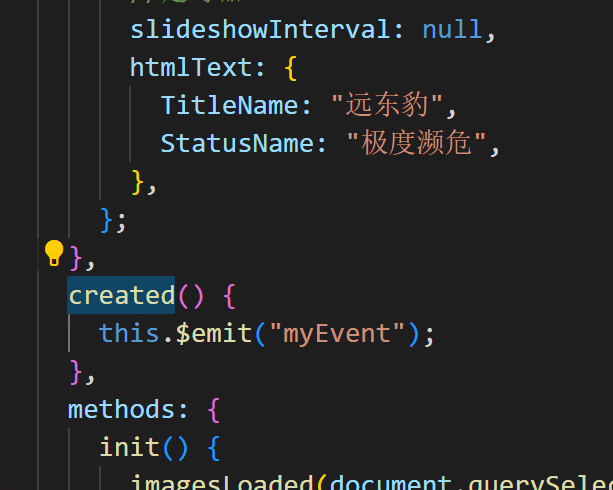

- Search node_modules: 快速查找项目中的 node_modules 目录。

  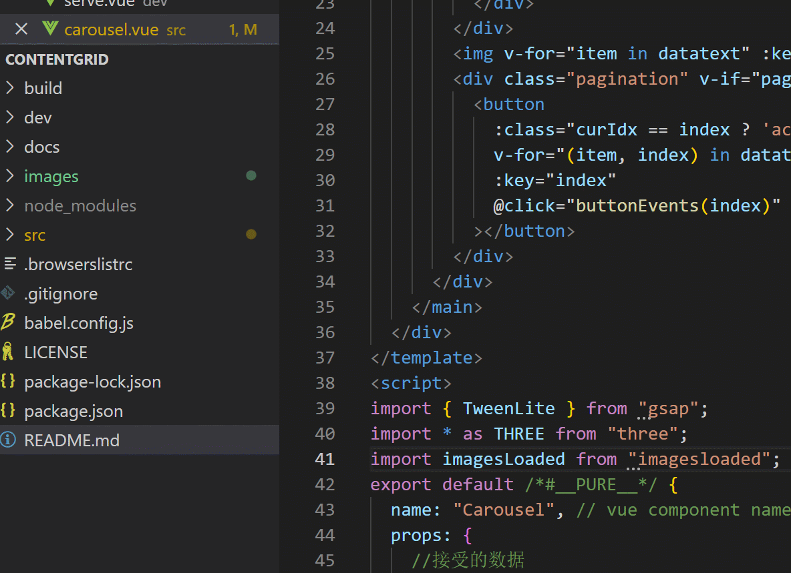

  

## 文件操作

- Auto Rename Tag: 自动重命名 HTML/XML 标签的插件。

  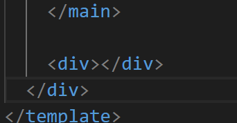

- file-jump: 快速跳转到工作区内的文件。

  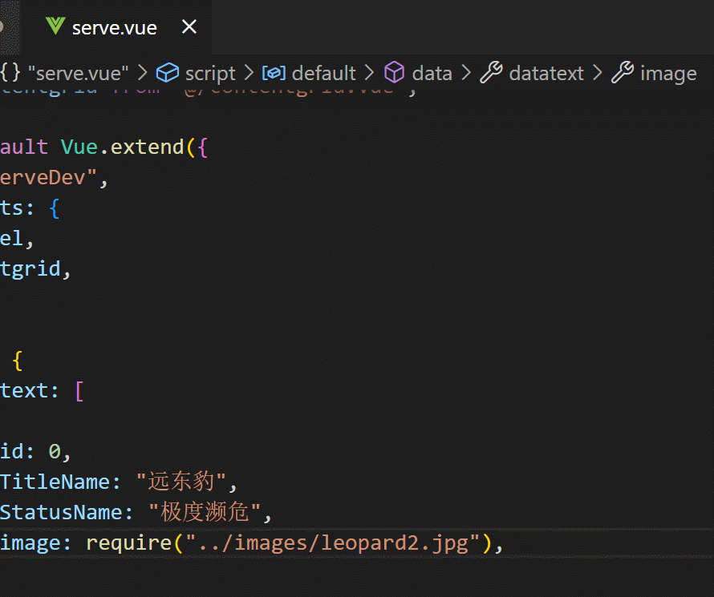

- SFTP: 支持 SFTP 和 FTPS 协议的文件传输工具。

  ```json
  {
      "host": "",    //ip 
      "port": 22,    //端口
      "username": "", //服务器账号
      "password": "",//服务器密码
      "protocol": "sftp", 
      "agent": null,  
      "privateKeyPath": null,
      "passphrase": null,
      "passive": false,
      "interactiveAuth": false,
      "remotePath": "/www/wwwroot/vuepress/dist", //需要同步的服务器文档位置 
      "context": "c:/Users/zzy19/Desktop/md/press/dist",        //本地位置
      
      "uploadOnSave": true,  
      "syncMode": "update",
      "watcher": {           
          "files": false,    
          "autoUpload": false,
          "autoDelete": false
      },
      "ignore": [           
          "**/.vscode/**",
          "**/.git/**",
          "**/.DS_Store"
      ]
  }
  ```
  
  SFTP使用
  
  首先使用快捷键ctrl +shift+p 调出配置 选择Sftp会自动生成配置文件，自己填写好账号密码以及其他配置信息就可以
  
  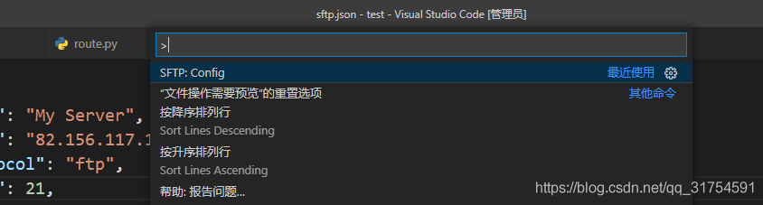
  
  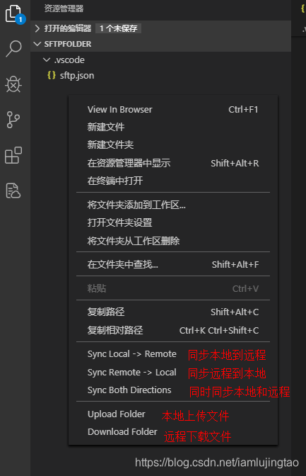
  
  

## 前端开发

- CSS Navigation: 快速浏览 CSS 样式。

  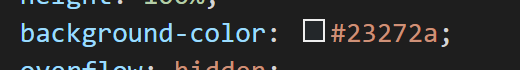

- Live Sass Compiler: 实时编译 Sass/SCSS 文件。

  

  

- Live Server: 实时预览 Web 页面。

  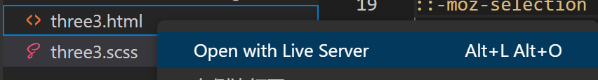

  

- Markdown All in One: 提供 Markdown 编辑支持，包括预览、自动补全等功能。

- Markdown Preview Github Styling: 为 Markdown 预览提供 Github 风格。

- Markdown Preview Mermaid Support: 为 Markdown 预览提供 Mermaid 图表支持。

- Vetur: 为 Vue 2/3 提供编辑支持。

- vue-helper: 为 Vue 2 提供代码提示和自动补全。

- WXML - Language Service: 为小程序 WXML 提供代码提示和自动补全。

- YAML: 支持 YAML 文件编辑和代码提示。

## 代码截图

- CodeSnap: 通过代码生成漂亮的图片和 SVG。

  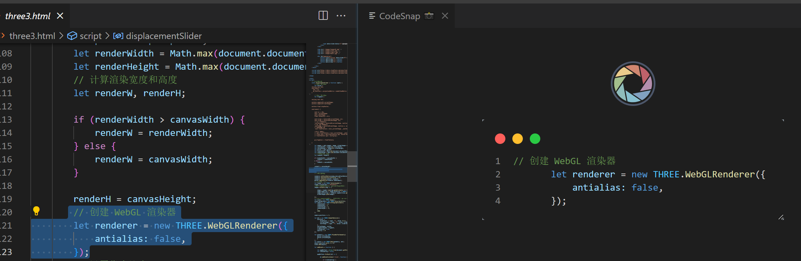

## 其他

- Image preview: 支持预览多种图片格式。

  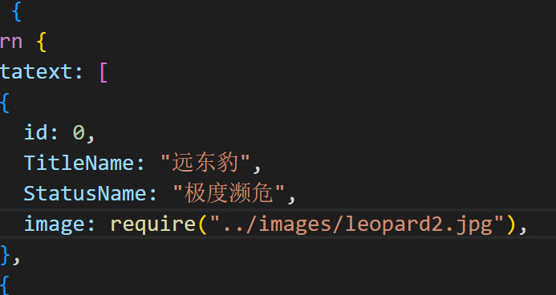

- Jupyter: vscode的python扩展。

- Jupyter Keymap: vscode的python扩展，为 Jupyter Notebook 提供快捷键支持。

- Path Intellisense: 路径智能提示。

  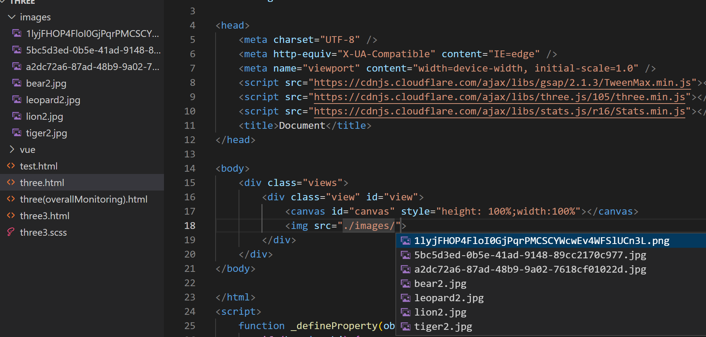

- Python: 支持 Python 语言的开发环境。

- Prettier - Code formatter: 一款代码格式化工具，支持大多数语言，并提供多种格式化配置选项。

  

## 微信小程序开发

- wechat-snippet: 提供微信小程序的代码片段。
- WXML - Language Service: 为小程序 WXML 提供代码提示和自动补全。