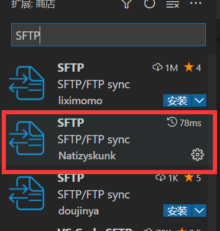

# vscode插件集锦

### 服务器同步插件

搜索插件SFTP




> 注意：请下载红框中的插件

```json
{
    "host": "",    //ip 
    "port": 22,    //端口
    "username": "", //服务器账号
    "password": "",//服务器密码
    "protocol": "sftp", 
    "agent": null,  
    "privateKeyPath": null,
    "passphrase": null,
    "passive": false,
    "interactiveAuth": false,
    "remotePath": "/www/wwwroot/vuepress/dist", //需要同步的服务器文档位置 
    "context": "c:/Users/zzy19/Desktop/md/press/dist",        //本地位置
    
    "uploadOnSave": true,  
    "syncMode": "update",
    "watcher": {           
        "files": false,    
        "autoUpload": false,
        "autoDelete": false
    },
    "ignore": [           
        "**/.vscode/**",
        "**/.git/**",
        "**/.DS_Store"
    ]
}
```

#### SFTP使用

首先使用快捷键ctrl +shift+p 调出配置 选择Sftp会自动生成配置文件，自己填写好账号密码以及其他配置信息就可以


