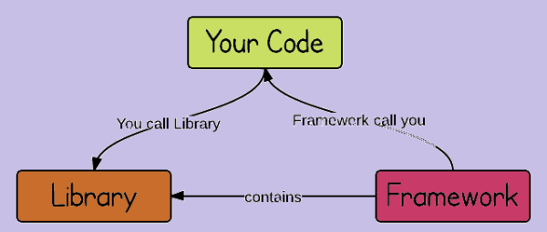
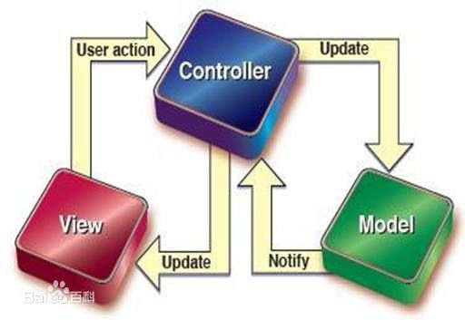

::: v-pre
# Vue基本概念

> Vue基本概念


## 课程介绍

- Vue基础知识
- Vue全家桶（vue/vue-router/vuex/axios）
- 组件化开发
- webpack - 前端模块化打包构建工具
- ES6 - [ECMAScript 6 入门](http://es6.ruanyifeng.com/)
- Vue项目

## vue介绍

- [vue 中文网](https://cn.vuejs.org/)
- [Vue.js 是什么](https://cn.vuejs.org/v2/guide/index.html#Vue-js-%E6%98%AF%E4%BB%80%E4%B9%88)
- Vue (读音 /vjuː/，类似于 **view**) 是一套用于构建用户界面的**渐进式框架**。 
- 建议：**通读一遍Vue官网教程中的基础内容**

## 库和框架的概念



- [我们所说的前端框架与库的区别？](https://zhuanlan.zhihu.com/p/26078359?group_id=830801800406917120)

### Library

> 库，本质上是一些函数的集合。每次调用函数，实现一个特定的功能

- 代表：jQuery
- 使用库的时候，把库当成工具使用，需要自己控制代码的执行逻辑。

### Framework

> 框架，是一套完整的解决方案，使用框架的时候，需要把你的代码放到框架合适的地方，框架会在合适的时机调用你的代码

- 框架规定了自己的编程方式，是一套完整的解决方案
- 使用框架的时候，由框架控制一切，我们只需要按照规则写代码

### 库和框架的区别

+ 使用库的时候，很自由，只要调用库提供的各种各样的方法就行，也可以不用其他的一些方法
+ 使用框架的时候，需要按照框架的规则写代码，限制会非常多，但同时框架的功能也很强大，可以极大的提升开发的效率。


## MVVM的概念

参考资料：[从Script到Code Blocks、Code Behind到MVC、MVP、MVVM](https://www.cnblogs.com/indream/p/3602348.html)

### MVC

- MVC是一种软件架构模式，也有人叫做设计模式
- M: Model 数据模型（专门用来操作数据，数据的CRUD）
- V：View 视图（对于前端来说，就是页面）
- C：Controller 控制器（是视图和数据模型沟通的桥梁，用于处理业务逻辑）



### MVVM

MVVM，一种更好的UI模式解决方案

- M：model数据模型(ajax获取到的数据)
- V：view视图（页面）
- VM：ViewModel 视图模型

### MVC vs MVVM

- MVC模式，将应用程序划分为三大部分，实现了职责分离，需要自己实现controller的代码，需要操作DOM
- MVVM通过`数据双向绑定`让数据自动地双向同步
  - V（修改视图） -> M（数据自动同步）
  - M（修改数据） -> V（视图自动徒步）


### Vue中的MVVM

虽然没有完全遵循 MVVM 模型，Vue 的设计无疑受到了它的启发。因此在文档中经常会使用 vm (ViewModel 的简称) 这个变量名表示 Vue 实例

注意：

**1. 在vue中，不推荐直接手动操作DOM！！！** 

**2. 在vue中，通过数据驱动视图，不要在想着怎么操作DOM，而是想着如何操作数据！！**

## vue初体验

### 基本使用步骤

- 安装：`npm install vue` 
- 注意：开发期间使用未压缩版vue.js！！！重说三

```html
<div id="app">
    <!-- 3.可以通过{{}}显示vue中的数据 -->
    <h1>{{msg}}</h1>
</div>

<!-- 1. 引入vue.js -->
<script src="./node_modules/vue/dist/vue.js"></script>

<script>
    // 2. 创建vue实例，需要指定el和data属性
    let vm = new Vue({
        // 指定vue监管的视图区域,只要id为app的div内部才会受vue的管理
        el: '#app',
        // 提供了vue中使用的数据
        data: {
            msg: 'hello vue'
        }
    })
</script>
```

问题1：把`{{msg}}`写到`div#app`外能生效么？

问题2：el能否写成ele, data能否写成datas? 框架的限制很多，但是习惯就好了！

### 插值表达式

插值表达式：`{{}}`，也叫Mustache语法，小胡子语法，因为长得像胡子

- 解释：使用`{{}}`（插值表达式）从`data`中获取数据，并展示在模板中
- 说明：`{{}}`中只能出现JavaScript表达式
- 说明：数据对象的属性值发生了改变，插值处的内容都会更新

```html
<h1>Hello, {{ msg }}.</h1>
<p>{{ isOk ? 'yes': 'no' }}</p>
<p>{{ 1 + 2 }}</p>

<!-- ！！！错误示范！！！ -->
<h1 title="{{ if(){} }}"></h1>
<h1 title="{{ err }}"></h1>
```

## vue指令

- 解释：指令 (Directives) 是带有 `v-` 前缀的特殊属性，可以在html标签中使用，可以看成特殊的html属性
- 作用：指令提供了一些特殊的功能，当指向绑定到标签上时，可以给标签增加一些特殊的行为

### v-bind指令（html标签指令）

- 描述：插值表达式不能用在html的属性上，如果想要动态的设置html元素的属性，需要使用v-bind指令
- 作用：动态的设置html的属性
- 语法：`v-bind:title="msg"`
- 简写：`:title="msg"`

```html
<!-- 完整语法 -->
<a v-bind:href="url"></a>
<!-- url为data属性值 -->
<!-- 缩写 -->
<a :href="url"></a>
```

```vue
<a v-bind:属性名="属性值"> </>
```


### v-model指令（表单数据指令）

v-model: https://cn.vuejs.org/v2/guide/forms.html

- 作用：在表单元素上创建双向数据绑定
- 说明：监听用户的输入事件以更新数据
- 思考：如何在JS代码中获取到文本框的值？？？

```html
<input type="text" v-model="message" placeholder="edit me">
<p>Message is: {{ message }}</p>
```

#### 双向数据绑定

- 双向数据绑定：将DOM与Vue实例的data数据绑定到一起，彼此之间相互影响
  - 数据的改变会引起DOM的改变
  - DOM的改变也会引起数据的变化
- 原理：数据劫持，`Object.defineProperty`中的`get`和`set`方法
  - `getter`和`setter`：访问器
  - 作用：指定`读取或设置`对象属性值的时候，执行的操作
- 注意：`Object.defineProperty`方法是ES5中提供的，IE8浏览器不支持这个方法。因此，Vue支持IE8及其以下版本浏览器
- [Vue - 深入响应式原理](https://cn.vuejs.org/v2/guide/reactivity.html)
- [MDN - Object.defineProperty()](https://developer.mozilla.org/en-US/docs/Web/JavaScript/Reference/Global_Objects/Object/defineProperty)

```js
/*
  语法
*/
var obj = {}
Object.defineProperty(obj, 'msg', {
  // 设置 obj.msg 执行的操作
  set: function () {},
  // 读取 obj.msg 执行的操作
  get: function () {}
})
```

#### Vue双向绑定的极简实现

- [剖析Vue原理&实现双向绑定MVVM](https://segmentfault.com/a/1190000006599500)

```html
<!-- 示例 -->
<input type="text" id="txt" />
<span id="msgBox"></span>

<script>
const txt = document.getElementById('txt')
const msgBox = document.getElementById('msgBox')
const obj = {}

// 给对象obj添加msg属性，并设置setter访问器
Object.defineProperty(obj, 'msg', {
  // 设置 obj.msg 执行的操作
  set: function (curVal) {
    txt.value = curVal
    msgBox.innerText = curVal
  }
})

// 监听文本框的改变
txt.addEventListener('input', function (event) {
  obj.msg = this.value
})
</script>
```

### v-on指令

<https://cn.vuejs.org/v2/guide/events.html>

- 作用：绑定事件
- 语法：`v-on:click="say"` or `v-on:click="say('参数', $event)"`
- 简写：`@click="say"`
- 说明：绑定的事件从`methods`中获取
- 案例：跑马灯

```html
<!-- 完整语法 -->
<a v-on:click="doSomething"></a>
<!-- 缩写 -->
<a @click="doSomething"></a>
```

#### 事件修饰符

```html
<a @alick.stop="clickFn" href="http://www.baidu.com">点</a>
```


- `.stop`       阻止冒泡，调用 event.stopPropagation()
- `.prevent`    阻止默认行为，调用 event.preventDefault()
- `.capture`    添加事件侦听器时使用事件`捕获`模式
- `.self`       只当事件在该元素本身（比如不是子元素）触发时，才会触发事件
- `.once`       事件只触发一次

#### 按键修饰符

在监听键盘事件时，我们经常需要检查常见的键值。Vue 允许为 `v-on` 在监听键盘事件时添加按键修饰符： 

@keyup

```js
.enter
.tab
.delete (捕获“删除”和“退格”键)
.esc
.space
.up
.down
.left
.right
```


### v-text指令

- 解释：更新元素的 `textContent`。如果要更新部分的 `textContent` ，需要使用 `{{ Mustache }}` 插值。 

```html
<h1 v-text="msg"></h1>
```

### v-html指令

- 解释：更新DOM对象的 innerHTML,html标签会生效

```html
<h1 v-html="msg"></h1>
```

**在网站上动态渲染任意 HTML 是非常危险的，因为容易导致 [XSS 攻击](https://en.wikipedia.org/wiki/Cross-site_scripting)。只在可信内容上使用 `v-html`，**永不**用在用户提交的内容上。** 

### v-for

- 作用：基于源数据多次渲染元素或模板块

```html
<!-- 1 基础用法 -->
<div v-for="item in items">
  {{ item.text }}
</div>

<!-- item 为当前项，index 为索引 -->
<p v-for="(item, index) in list">{{item}} -- {{index}}</p>

<!-- item 为值，key 为键，index 为索引 -->
<p v-for="(item, key, index) in obj">{{item}} -- {{key}}</p>
<p v-for="item in 10">{{item}}</p>

```

#### key属性

- 推荐：使用 `v-for` 的时候提供 `key` 属性，能够提升列表渲染的性能
- 说明：使用 key，VUE会基于 key 的变化重新排列元素顺序，并且会移除 key 不存在的元素。
- [vue key](https://cn.vuejs.org/v2/guide/list.html#key)
- [vue key属性的说明](https://www.zhihu.com/question/61064119/answer/183717717)

```html
<div v-for="item in items" :key="item.id">
  <!-- 内容 -->
</div>
```

### v-if 和 v-show

- [条件渲染](https://cn.vuejs.org/v2/guide/conditional.html)
- `v-if`：根据表达式的值的真假条件，销毁或重建元素，无法在审查元素中看到，直接删除元素
- `v-show`：根据表达式之真假值，切换元素的 display CSS 属性，达到元素隐藏显示调整，可以在审查元素中看到 

```html
<p v-show="isShow">这个元素展示出来了吗？？？</p>
<p v-if="isShow">这个元素，在HTML结构中吗？？？</p>
```

#### 样式处理-class和style

- 使用方式：`v-bind:class="expression"` or `:class="expression"`
- 表达式的类型：字符串、数组、对象（重点）
- 语法：

```html
<!-- 1 -->
<!-- 重点 -->
<div v-bind:class="{ active: true }"></div> ===>
<div class="active"></div>

<!-- 2 -->
<div :class="['active', 'text-danger']"></div> ===>
<div class="active text-danger"></div>

<!-- 3 -->
<div v-bind:class="[{ active: true }, errorClass]"></div> ===>
<div class="active text-danger"></div>


--- style ---
<!-- 1 -->
<div v-bind:style="{ color: activeColor, 'font-size': fontSize + 'px' }"></div>
<!-- 2 将多个 样式对象 应用到一个元素上-->
<!-- baseStyles 和 overridingStyles 都是对象 -->
<div v-bind:style="[baseStyles, overridingStyles]"></div>
```

### v-else指令

- **不需要表达式**

- **限制**：前一兄弟元素必须有 `v-if` 或 `v-else-if`。

- **用法**：

  为 `v-if` 或者 `v-else-if` 添加“else 块”。

  ```html
  <div v-if="Math.random() > 0.5">
    Now you see me
  </div>
  <div v-else>
    Now you don't
  </div>
  ```

  **参考**：[条件渲染 - v-else](https://cn.vuejs.org/v2/guide/conditional.html#v-else)

### v-else-if指令

- **类型**：`any`

- **限制**：前一兄弟元素必须有 `v-if` 或 `v-else-if`。

- **用法**：

  表示 `v-if` 的“else if 块”。可以链式调用。

  ```html
  <div v-if="type === 'A'">
    A
  </div>
  <div v-else-if="type === 'B'">
    B
  </div>
  <div v-else-if="type === 'C'">
    C
  </div>
  <div v-else>
    Not A/B/C
  </div>
  ```

  **参考**：[条件渲染 - v-else-if](https://cn.vuejs.org/v2/guide/conditional.html#v-else-if)

### 提升性能：v-pre

- 说明：跳过这个元素和它的子元素的编译过程。可以用来显示原始 Mustache 标签。跳过大量没有指令的节点会加快编译。

```html
<span v-pre>{{ this will not be compiled }}</span>
```

### 提升性能：v-once

- 说明：只渲染元素和组件一次。随后的重新渲染，元素/组件及其所有的子节点将被视为静态内容并跳过。这可以用于优化更新性能。

```html
<span v-once>This will never change: {{msg}}</span>
```

### 解决插值闪烁:v-cloak

这个指令保持在元素上直到关联实例结束编译。和 CSS 规则如 `[v-cloak] { display: none }` 一起用时，这个指令可以隐藏未编译的 Mustache 标签直到实例准备完毕。

```css
[v-cloak] {  display: none; }
```

```html
<div v-cloak>
  {{ message }}
</div>
```

不会显示，直到编译结束。

## 案例：todomvc


## 计算属性

> 计算属性：当计算属性依赖的数据发生改变的时候，计算属性会重新计算一次，如果计算属性依赖的属性没有发生改变，那么计算属性就不会重新计算。

### 基本使用

```js
var vm = new Vue({
      el: '#app',
      data: {
        n1:'',
        n2:''
      },
      //n3依赖与n1和n2的值，当n1 和 n2发生改变的时候，这个函数就会执行。
    	//返回值就是n3的值
      computed: {
        n3(){
          return +this.n1 + +this.n2;
        }
      }
    });
```

**计算属性是基于它们的依赖项进行缓存的** 

如果页面中需要使用多次计算属性的值，只会计算一次，计算属性只有在它的相关依赖发生改变时才会重新求值。 

**计算属性不能与data中的属性同名，因为无论是data中的属性还是计算属性，最终都是挂载到vm上的**

## watch监视数据的变化

> vue实例中提供了一个watch属性，用于监听vue实例中的属性的变化。
>
> watch对应了一个对象，键是观察的属性，值是对应的回调函数。

### 基本使用

- 基本使用

```js
//第一个参数：当前值
//第二个参数：上一次的值
username: function(curr, old) {

}
```

- 表单校验效果

```js
// watch: 监视数据的变化
watch: {
    // 监视msg，只要msg属性的值发生改变，function就会执行
    // value: 当前值  oldValue:上一次的值
    msg: function(value) {
        if (value.length >=3 && value.length <= 6) {
            this.tips = '正确'
        } else {
            this.tips = '密码格式不正确'
        }
    }
}
```

### 监视对象

> 监视对象的时候，需要加上`deep: true`
>
> 为了发现对象内部值的变化，可以在选项参数中指定 `deep: true` 

- 如果是一个对象，无法监听到对象内部值的变化

```js
  <script>
    var vm = new Vue({
      el: '#app',
      data: {
        user: {
          name:'zs',
          age: 18
        }
      },
      watch: {
        user: function(curr, old) {
          console.log(curr, old);
        }
      }
    });
  </script>


<input type="text" v-model="user.name">
<input type="text" v-model="user.age">
```

- 需要加上deep

```js
watch: {
    user: {
        deep: true,
            handler: function(curr, old) {
                //注意：如果监听的是对象，新值与旧值都是相同的，因为指向了同一个对象。
                //https://cn.vuejs.org/v2/api/#vm-watch
                console.log(curr.age, curr.name);
            }
    }
}
```

- **immediate** 属性,立马进行监听

```js
watch: {
    user: {
        deep: true,
        immediate:true,
        handler: function(curr, old) {
          console.log(curr.age, curr.name);
        }
    }
}
```

## 生命周期与钩子函数

### 生命周期介绍（中文图示）


- [vue生命周期钩子函数](https://cn.vuejs.org/v2/api/#选项-生命周期钩子)
- 简单说：**一个实例从开始到最后消亡所经历的各种状态，就是一个实例的生命周期**

实例生命周期函数的定义：从组件被创建，到组件挂载到页面上运行，再到页面关闭组件被卸载，这三个阶段总是伴随着组件各种各样的事件，那么这些事件，统称为组件的生命周期函数！

- 生命周期的钩子函数：框架提供的函数，能够让开发人员的代码，参与到组件的生命周期中。也就是说，通过钩子函数，就可以控制组件的行为
- 注意：vue再执行过程中会自动调用`生命周期钩子函数`，我们只需要提供这些钩子函数即可
- 注意：钩子函数的名称都是固定的！！！

### 钩子函数 - beforeCreate()

- 说明：在实例初始化之后，数据观测 (data observer) 和 event/watcher 事件配置之前被调用
- 注意：此时，无法获取 data中的数据、methods中的方法

### 钩子函数 - **created()**

- 注意：这是一个常用的生命周期，可以调用methods中的方法、改变data中的数据
- [vue实例生命周期 参考1](https://segmentfault.com/a/1190000008879966)
- [vue实例生命周期 参考2](https://segmentfault.com/a/1190000008010666)
- 使用场景：发送请求获取数据

### 钩子函数 - beforeMounted()

- 说明：在挂载开始之前被调用

### 钩子函数 - **mounted()**

- 说明：此时，vue实例已经挂载到页面中，可以获取到el中的DOM元素，进行DOM操作

### 钩子函数 - beforeUpdated()

- 说明：数据更新时调用，发生在虚拟 DOM 重新渲染和打补丁之前。你可以在这个钩子中进一步地更改状态，这不会触发附加的重渲染过程。

### 钩子函数 - updated()

- 说明：组件 DOM 已经更新，所以你现在可以执行依赖于 DOM 的操作。

### 钩子函数 - beforeDestroy()

- 说明：实例销毁之前调用。在这一步，实例仍然完全可用。
- 使用场景：实例销毁之前，执行清理任务，比如：清除定时器等

### 钩子函数 - destroyed()

- 说明：Vue 实例销毁后调用。调用后，Vue 实例指示的所有东西都会解绑定，所有的事件监听器会被移除，所有的子实例也会被销毁。

## axios

> Axios 是一个基于 promise 的 HTTP 库，可以用在浏览器和 node.js 中。
>
> vue1.x的时候vue提供了一个包，vue-resource 专门用于发送ajax请求，但是vue2.x的时候，vue的作者的自己发了一个文章，推荐大家都使用axios库来发送ajax请求。

vue自身没有提供发送ajax请求的工具

Axios 是一个基于 promise 的 HTTP 库，可以用在浏览器和 node.js 中。 

- Promise based HTTP client for the browser and node.js
  - 以Promise为基础的HTTP客户端，适用于：浏览器和node.js
  - 封装ajax，用来发送请求，异步获取数据
- 安装：`npm i -S axios`
- [axios github]()

## todomvc-axios版本

## 过滤器 filter

- 作用：文本数据格式化
- 两种过滤器：1 全局过滤器 2 局部过滤器

### 全局过滤器

- 说明：通过全局方式创建的过滤器，在任何一个vue实例中都可以使用

```js
Vue.filter('filterName', function(value) {
  // value 表示要过滤的内容
})
```

- 示例：

```html
<div>{{ dateStr | date }}</div>
<div>{{ dateStr | date('YYYY-MM-DD hh:mm:ss') }}</div>

<script>
  Vue.filter('date', function(value, format) {
    // value 要过滤的字符串内容
    // format 过滤器的参数
  })
</script>
```

### 局部过滤器

- 说明：局部过滤器是在某一个vue实例的内容创建的，只在当前实例中起作用

```js
{
  data: {},
  // 通过 filters 属性创建局部过滤器
  filters: {
    filterName: function(value) {}
  }
}
```

## 响应式数据的说明

> 响应式数据: 把data中的数据挂到vm身上，vm身上的这个数据其实就是响应式的
>
> 一旦数据发生了改变，页面中的内容也会跟着改变

### 动态添加的数据是无效的以及$set的使用

- data中的数据一定要先声明，再使用，动态给对象添加的属性不是响应式的

```js
<div id="app">
    <p>{{person.name}}---{{person.age}}---{{person.gender}}</p>
</div>

<script src="vue.js"></script>
<script>
    var vm = new Vue({
        el: '#app',
        data: {
            person: {
                name: 'zs',
                age: 18
            }
        }
    })
</script>

// 动态给data中添加的数据是无效的
// 在vue实例创建的时候，会把data中的数据绑定到vm上，所以data中的数据是响应的
// 但是动态绑定的数据不是响应是的。
vm.person.gender = '男'
```

- 如果想要动态绑定数据，并且是响应式的,需要使用`vm.$set方法`

```js
this.$set(this.person, 'gender', '男')
```


结论：

- 如果是对象，动态给对象添加或者删除一个属性，vue是检测不到的，所以不是响应的，如果想用动态添加的数据是响应式，需要使用`Vue.set(obj, key, value)` `vm.$set(obj, key ,value)`
- 如果是数组，通过数组的下标或者是数组的长度，vue也是检测不到，所以操作也不是响应式的
  - 使用`Vue.set`方法
  - 数组的变异的方法，这个方法会改变原数组，能够触发vue的更新。

### 异步DOM更新以及$nextTick的说明

在vue中数据发生了改变，DOM中的数据也会跟着发生改变，但是这个过程是异步的

vue的数据发生改变之后，DOM不会立即更新，会等到下一次渲染工作执行的时候才会更新DOM

目的：为了提高渲染的性能

```js
clickFn () {
    // 数据变化了， view中的内容也要跟着变
    this.msg = '你好啊，vue1'
    this.msg = '你好啊，vue2'
    this.msg = '你好啊，vue3'
    this.msg = '你好啊，vue4'
    this.msg = '你好啊，vue5'

    // 为什么：DOM操作是非常消耗性能的，简单DOM的操作能够提升我们的性能，如果每次操作数据，都立即更新DOM，无疑性能会非常的低，所以vue中会等待数据都修改完成
    let result = document.querySelector('p').innerHTML
    console.log(result)
}
```

- `$nextTick`方法会在DOM更新之后执行

```js
 // 在实际开发中，有可能需要在数据改变之后，获取到更新之后的DOM数据
// 这个时候可以使用 $nextTick函数
// 当vue更新完DOM后，会自动调用$nextTick函数，确保在这个函数中可以获取到DOM结构是最新的
this.$nextTick(function() {
    let result = document.querySelector('p').innerHTML
    console.log(result)
})
```
## 组件化开发

### 组件的概念

> 组件 (Component) 是 Vue.js 最强大的功能之一。组件可以扩展 HTML 元素，封装可重用的代码。在较高层面上，组件是自定义元素，Vue.js 的编译器为它添加特殊功能。 
>
> 在vue中都是组件化开发的，组件化开发就是把一个完整的页面分割成一个一个的小组件。

组件的优点：

+ 容易维护
+ 复用

```
vue组件分为全局组件和局部组件
全局组件：在所有的vue实例中都能使用
局部组件：只有在当前vue实例中能够使用
```

### 全局组件

+ 定义

```js
//要注册一个全局组件，可以使用 Vue.component(tagName, options)。
//注册一个全局的组件
// Vue.component(tagName, options)
Vue.component("hello", {
    template: '<h3>我是全局组件！</h3>'
});
```

+ 使用

```html
全局组件可以在所有的实例中使用
<div id="app">
    <hello></hello>
</div>
```

+ 注意点：组件的模板有且仅有一个根元素

```html
template: '<h3>我是全局组件！</h3><p>有两个根元素</p>';  //错误的用法
template: '<div><h3>我是全局组件！</h3><p>有两个根元素</p></div>';
```

+ 如果有很多的内容，template可以使用字符串模版

```js
Vue.component("my-button", {
    template: `
        <div>
        <h1>我是一个标题</h1>
        <p>我是一个段落</p>
        </div>
	`
});
```

### 局部组件

```js
//在vue实例的内部，通过components属性来定义局部组件
components: {
    "my-button": {
        template: `
        <div>
        <h1>我是一个标题</h1>
        <p>我是一个段落</p>
        </div>
        `
    }
}
```

### 组件是特殊的vue实例

> 可以将组件看成是一个vue的实例，因此，在vue实例中能配置的属性，在组件中依旧能够配置。
>
> 比如：data,method,watch,computed,钩子函数等
>
> 注意：组件中data属性必须是一个函数，返回值才是data的数据

```js
//可以把组件看成一个vue实例
Vue.component("my-button", {
   template: `
    <div>
    	<h1 @click="add">我是一个标题</h1>
    	<p>{{msg}}</p>
    </div>
    `,
    //组件可以通过data属性提供组件自己的数据，注意，组件的data参数必须是一个函数，不能是用一个对象。
    data() {
        return {
        	msg: 'hello vue'
    	};
    },
    methods: {
        add() {
            console.log("哈哈");
        }
    }

});
```


+ 组件是一个独立封闭的个体，组件之间的数据是无法相互使用的

```js
var vm = new Vue({
    el: '#app',
    data: {
        outer: '我是实例的数据'
    },
});

//可以把组件看成一个vue实例
Vue.component("my-button", {
    template: `
    <div>
    <p>{{inner}}</p>  //正确，组件可以使用自己的数据
    <p>{{outer}}</p>  //报错，组件无法使用其他组件的数据
    </div>
    `,
    data() {
        return {
            inner: '我是组件的数据'
        };
    }
});
```

### vue-devTool浏览器插件的使用

> vue-devtools是一款基于chrome游览器的插件，用于调试vue应用，这可以极大地提高我们的调试效率。

默认插件必须在http协议下打开才能看到。

插件详细信息---》允许访问文件网址   ，这样file协议打开也能看到效果了

### 组件通讯

> 因为组件是一个独立的个体，组件无法使用到外部的数据
>
> 但是在真实开发中，多个组件之间是需要相互使用彼此的数据的，因此需要使用组件通讯的技术，让组件之间能够相互传值。

组件通讯分为三类

+ 父组件传递值给子组件
+ 子组件传递值给父组件
+ 非父子组件之间的传值

### 组件通讯-父传子

+ 定义两个组件

```js
Vue.component("parent", {
    template: `
    <div class="parent">
    <p>这是父组件</p>
    <son></son>
    </div>
    `,
    data () {
        return {
            car: '玛莎拉蒂',
            month: 1000000
        }
    }
});

Vue.component("son", {
    template: `
    <div class="son">
    <p>这是子组件</p>
    </div>
    `
});

<div id="app">
    <parent></parent>
</div>
```

+ 组件的通讯

```js
1. 在父组件的模版中，给子组件增加一个自定义的属性。
<son :car="car"></son>

2. 子组件通过props属性进行接收
//接收父组件传递过来的值
props: ['car']

3. 子组件使用父组件传递过来的值
template: `
<div class="son">
	<p>这是子组件</p>
	<p>这是父组件传递过来的值----{{car}}</p>
</div>
`,
```

+ 思考，怎么获取父组件的money

**注意：props负责获取父组件的传递过来的，props中的值是只读的，不允许修改**

### 组件通讯-子到父

> [参考链接](https://blog.csdn.net/jsxiaoshu/article/details/79058940)

整体思路

```js
1. 父组件给子组件注册一个自定义事件
2. 子组件触发这个自定义事件，触发事件时把数据传递给父组件
```

+ 父组件给子组件注册事件

```js
<son @fn='getData'></son>
methods: {
    //1. 父组件中定义了一个方法，用于获取数据
    getData () {
        console.log("父组件中提供的方法");
    }
}
```

+ 子组件触发自定义事件，并且把要传递的数据作为参数进行传递

```js
//$emit可以出发当前实例的事件
this.$emit('getData', this.car);
```

+ 父组件获取值

```js
methods: {
    //1. 父组件中定义了一个方法，用于获取数据
    getData (skill) {
        console.log("父组件中提供的方法", skill);
        this.skill = skill;
    }
}
```

### 案例-todomvc

### 组件通讯-非父子

> 非父子组件之间通过一个空的Vue实例来传递数据。

```js
const bus = new Vue();   //bus:公交车  事件总线
```

+ 核心逻辑

```js
组件A给组件B传值：
1. 组件A给bus注册一个事件，监听事件的处理程序
2. 组件B触发bus上对应的事件，把 值当成参数来传递
3. 组件A通过事件处理程序获取数据
```


+ 组件A给bus注册事件

```js
 //rose在组件创建的时候，给bus注册了一个事件
created () {
    bus.$on("get", (msg)=>{
        console.log("这是rose注册的事件", msg);
        this.msg = msg;
    });
}
```

+ 组件B触发bus的事件

```js
<button @click="send">表白</button>

methods: {
    send() {
        bus.$emit("get", this.msg);
    }
}
```

+ 组件A通过事件处理程序可以获取到传递的值

```js
bus.$on("get", (msg)=>{
    console.log("这是rose注册的事件", msg);
    this.msg = msg;
});
```

**注意点：1. 必须是同一辆公交车  2. 注册的事件和触发的事件必须保持一致**

### 案例：开关灯案例


### bus是一种通用的组件通讯方案

我们有三种组件通讯的方案

```js
1. 父传子
2. 子传父
3. 非父子（bus）

其实bus方案也适用于父传子和子传父的方案
```

## slot插槽

> 当组件中某一项需要单独定义，那么就应该使用solt 

### 单个slot

> 除非子组件模板包含至少一个 `<slot>` 插口，否则父组件的内容将会被丢弃 ,当子组件模板只有一个没有属性的 slot 时，父组件整个内容片段将插入到 slot 所在的 DOM 位置，并替换掉 slot 标签本身。 

在组件的模版中定义`slot`插槽

```js
Vue.component("modal", {
    template: `
    <div class="modal">
    	<p>温馨提示</p>
    	<div>
    		<slot></slot>
    	</div>
    	<button>关闭</button>
    </div>
`,
});
```

父组件传值

```js
<modal>你确定要退出系统吗？</modal>
<modal>你确定要删除这个内容吗？</modal>
```

### 具名插槽

> 如果一个组件中想使用多个slot那么此时就应该使用具名slot。 

```js
Vue.component("modal", {
    template: `
    <div class="modal">
    <slot name="header"></slot>
    <slot name="content"></slot>
    <slot name="footer"></slot>
    </div>
	`,
});
```

```html
<modal>
    <p slot="header">温馨提示</p>
    <div slot="content">你要删除内容吗</div>
    <button slot="footer">关闭</button>
</modal>
<modal>
    <p slot="header">提示</p>
    <div slot="content">你要删除这条记录吗</div>
    <button slot="footer">开启</button>
</modal>
```
:::


