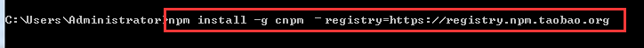
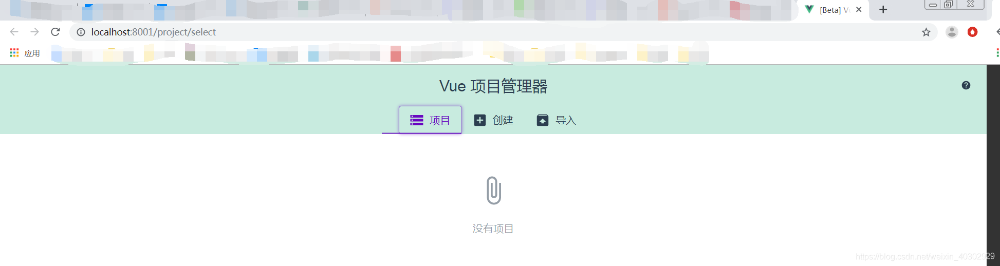

::: v-pre
# 如何搭建一个vue脚手架项目

> 如何搭建一个vue脚手架项目

## 命令行安装

### [**一、安装node环境**](https://www.cnblogs.com/yanxulan/p/8978732.html)

　　1、下载地址为：https://nodejs.org/en/

　　2、检查是否安装成功：如果输出版本号，说明我们安装node环境成功

　　

　　3、为了提高我们的效率，可以使用淘宝的镜像：http://npm.taobao.org/

　　输入：npm install -g cnpm –registry=https://registry.npm.taobao.org，即可安装npm镜像，以后再用到npm的地方直接用cnpm来代替就好了。

　　

　　检查是否安装成功：


　　

### **二、搭建vue项目环境**

#### 全局安装vue-cli

> 关于旧版本
>
> Vue CLI 的包名称由 `vue-cli` 改成了 `@vue/cli`。 如果你已经全局安装了旧版本的 `vue-cli` (1.x 或 2.x)，你需要先通过 `npm uninstall vue-cli -g` 或 `yarn global remove vue-cli` 卸载它。

```bash
npm install -g @vue/cli
# OR
yarn global add @vue/cli
```

#### 创建一个 项目

进入你的项目目录

> 新手建议使用vue ui
>
> vue ui的使用方法请点击

```bash
vue create hello-world
```


你会被提示选取一个 preset。你可以选默认的包含了基本的 Babel + ESLint 设置的 preset，也可以选“手动选择特性”来选取需要的特性。


这个默认的设置非常适合快速创建一个新项目的原型，而手动设置则提供了更多的选项，它们是面向生产的项目更加需要的。


如果你决定手动选择特性，在操作提示的最后你可以选择将已选项保存为一个将来可复用的 preset。我们会在下一个章节讨论 preset 和插件。

`vue create` 命令有一些可选项，你可以通过运行以下命令进行探索：

```bash
vue create --help
用法：create [options] <app-name>

创建一个由 `vue-cli-service` 提供支持的新项目


选项：

  -p, --preset <presetName>       忽略提示符并使用已保存的或远程的预设选项
  -d, --default                   忽略提示符并使用默认预设选项
  -i, --inlinePreset <json>       忽略提示符并使用内联的 JSON 字符串预设选项
  -m, --packageManager <command>  在安装依赖时使用指定的 npm 客户端
  -r, --registry <url>            在安装依赖时使用指定的 npm registry
  -g, --git [message]             强制 / 跳过 git 初始化，并可选的指定初始化提交信息
  -n, --no-git                    跳过 git 初始化
  -f, --force                     覆写目标目录可能存在的配置
  -c, --clone                     使用 git clone 获取远程预设选项
  -x, --proxy                     使用指定的代理创建项目
  -b, --bare                      创建项目时省略默认组件中的新手指导信息
  -h, --help                      输出使用帮助信息
```

### **三、vue项目目录讲解**

　　****

　　1、build：构建脚本目录

　　　　1）build.js  ==> 生产环境构建脚本；``

　　　　2）check-versions.js  ==> 检查npm，node.js版本；

　　　　3）utils.js  ==> 构建相关工具方法；

　　　　4）vue-loader.conf.js  ==> 配置了css加载器以及编译css之后自动添加前缀；

　　　　5）webpack.base.conf.js  ==> webpack基本配置；

　　　　6）webpack.dev.conf.js  ==> webpack开发环境配置；

　　　　7）webpack.prod.conf.js  ==> webpack生产环境配置；

　　2、config：项目配置

　　　　1）dev.env.js  ==> 开发环境变量；

　　　　2）index.js  ==> 项目配置文件；

　　　　3）prod.env.js  ==> 生产环境变量；

　　3、node_modules：npm 加载的项目依赖模块

　　4、src：这里是我们要开发的目录，基本上要做的事情都在这个目录里。里面包含了几个目录及文件：

　　　　1）assets：资源目录，放置一些图片或者公共js、公共css。这里的资源会被webpack构建；

　　　　2）components：组件目录，我们写的组件就放在这个目录里面；

　　　　3）router：前端路由，我们需要配置的路由路径写在index.js里面；

　　　　4）App.vue：根组件；

　　　　5）main.js：入口js文件；

　　5、static：静态资源目录，如图片、字体等。不会被webpack构建

　　6、index.html：首页入口文件，可以添加一些 meta 信息等

　　7、package.json：npm包配置文件，定义了项目的npm脚本，依赖包等信息``

　　8、README.md：项目的说明文档，markdown 格式

　　9、.xxxx文件：这些是一些配置文件，包括语法配置，git配置等

### **四、开始我们的第一个vue项目**

> 在components目录下新建一个views目录，里面写我们的vue组件

开始我们的第一个组件：

在views目录下新建First.vue

在router目录下的index.js里面配置路由路径

　

template 写 html，script写 js，style写样式

　　　　

输入ip： http://localhost:8010/#/first，查看页面效果

　

注意：

一个组件下只能有一个并列的 div，以下写法是错误：

　

数据要写在 return 里面，而不是像文档那样子写，以下写法错误：

　

#### 讲讲父子组件

在components目录下新建sub文件夹，用于存放一下可以复用的子组件。比如新建一个Confirm.vue组件

　

在父组件中引入子组件

引入：

```javascript
import Confirm from '../sub/Confirm'
```

注册：在`<script></script>`标签内的 name代码块后面加上 components: {Confirm}

使用：在`<template></template>`内加上<confirm></confirm>

完整代码：

　

父子组件通信

子组件：

　　　　

父组件：

　　　　

#### 使用路由搭建单页应用

1）按照以上方法，新建一个Second.vue组件

2）路由跳转：<router-link to="/second">去第二个页面</router-link>

　

　

路由跳转之后，注意观察路径变化：

　

可以看到，在html中解析成了a标签

　

这里只是简单的介绍了一下路由的使用，更多详细信息，请前往[官网](https://router.vuejs.org/zh-cn/)学习

## 图形化界面安装

### 创建项目

在命令行运行 vue ui，就会出现图形化管理

> 请在需要创建项目的目录输入命令，输入之后默认目录为输入命令的CMD目录




在界面上可以看到第一个tab项目，点击创建这个tab ，可以来创建一个新的vue项目

点击了创建之后可以看到一下内容，可以项目创建一个目录或者选择一个目录，然后选择一种包管理工具：可以使npm，也可以是yarn等


点击下一步后，出现预设插件和配置的界面，按照自己的需求选择就可以，此处选择了默认的。


点击创建项目后


### 安装插件

已安装的插件，也可以在右上角点击添加插件安装想要的插件。

 添加插件页面，也得要点击右下角的安装~

返回到插件就会看到刚才安装的插件了，如下所示：


最后我们来看下 通过vue ui生成的项目结构


### 运行项目

npm run serve


:::

