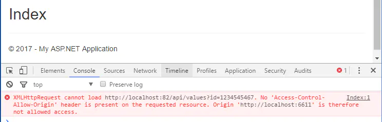
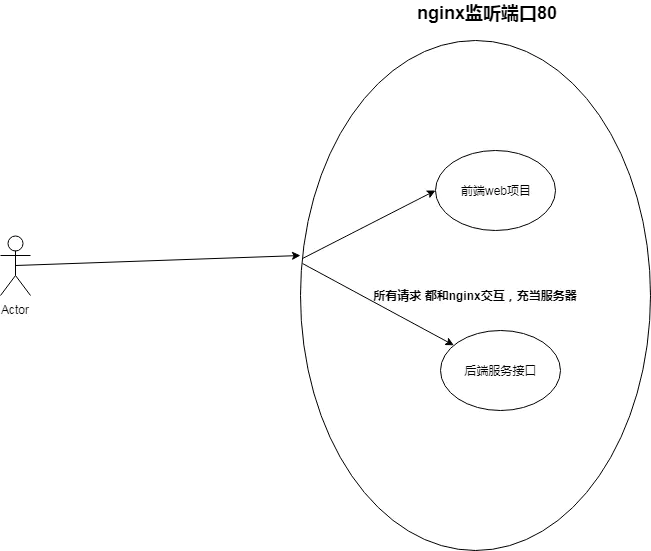

# 跨域及解决方法

### 什么是跨域

跨域：指的是浏览器不能执行其他网站的脚本。它是由浏览器的同源策略造成的，是浏览器对javascript施加的安全限制。

例如：a页面想获取b页面资源，如果a、b页面的协议、域名、端口、子域名不同，所进行的访问行动都是跨域的，而浏览器为了安全问题一般都限制了跨域访问，也就是不允许跨域请求资源。注意：跨域限制访问，其实是**浏览器的限制**。理解这一点很重要！！！

同源策略：是指协议，域名，端口都要相同，其中有一个不同都会产生跨域；


### 跨域访问示例

假设有两个网站，A网站部署在：http://localhost:81 即本地ip端口81上；B网站部署在：http://localhost:82 即本地ip端口82上。现在A网站的页面想去访问B网站的信息，A网站页面的代码如下（这里使用jquery的异步请求）

```javascript
$(function (){

  $.get("http://localhost:82/api/values", {},function (result) {

    $("#show").html(result);

  })})；
```



从错误信息可以看出以上出现了跨域问题！

### 如何解决跨域问题？

> 这里就要引入一个概念，叫做代理

#### 代理是什么？

以nginx代理为例



首先我们用nginx作为代理服务器和用户交互，这样用户就只需要在80端口上进行交互就可以了，这样就避免了跨域问题，因为我们都是在80端口上进行交互的；

nginx实现跨域的原理，实际就是把web项目和后端接口项目放到一个域中，这样就不存在跨域问题，然后根据请求地址去请求不同服务器（真正干活的服务器）；


#### 开发环境解决

如果是使用了Vue,React等使用了node.js技术的前端框架，可以使用node.js代理，从而解决跨域

以vue脚手架为例

在vue.config.js中

```javascript
devServer: {
    host: '0.0.0.0',
    port: port,
    open: true,
    proxy: {

      // 接口代理
      ['/xyw/prod-api']: {
        target:'http://www.baidu.com:8088',
        changeOrigin: true,
        pathRewrite: {
          ['^' + '/xyw/prod-api']: ''
        },

      },

    },
    disableHostCheck: true
  },
```

本项目所有接口为/xyw/prod-api开头的

统统发送到www.baidu.com:8088

比如：

请求接口 127.0.0.1:8080/xyw/prod-api/get/1

通过nodejs代理后  实际上是访问到了www.baidu.com:8088/get/1

也不会报跨域错误

> 注意！打包后nodejs所有的配置都将失效（因为打包之后就没有Nodejs了）
>
> 所以vue项目部署  只能使用nginx去代理  node.js只能做开发环境代理

#### 生产环境解决

nginx配置

```nginx
server {

    listen    80; #监听80端口，可以改成其他端口

    server_name localhost; # 当前服务的域名


   location / {
            root   /home/ruoyi/projects/dist; # dist文件夹位置
			try_files $uri $uri/ /index.html;
            index  index.html index.htm;
    }
    location /xyw/prod-api/{ # 代理所有以/xyw/prod-api开头的url访问
        proxy_set_header Host $http_host;
        proxy_set_header X-Real-IP $remote_addr;
        proxy_set_header REMOTE-HOST $remote_addr;
        proxy_set_header X-Forwarded-For $proxy_add_x_forwarded_for;
        proxy_pass http://localhost:8088/; # 统统指向本机下的8080服务
    }

#以下配置省略
}
```

<script>
export default {
    mounted () {
      this.$page.lastUpdated = "2022/1/14 下午6:09:09";
    }
  }
</script>