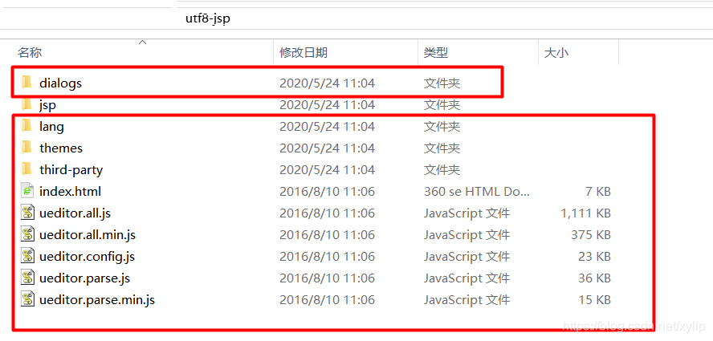
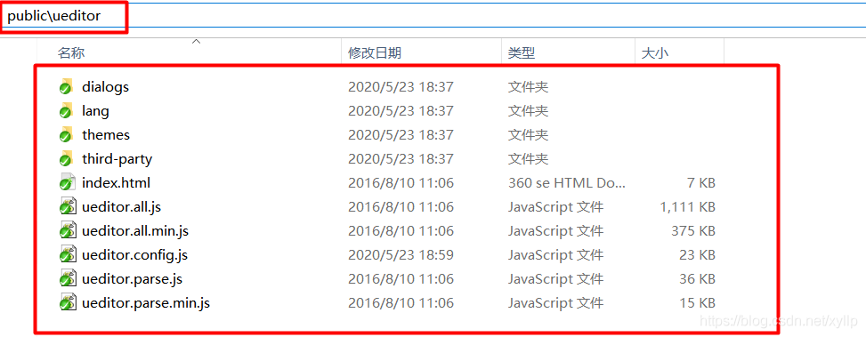
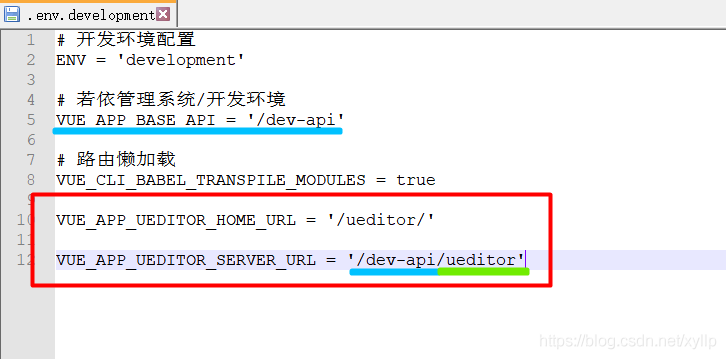

# vue2集成百度编辑器

## 准备UEditor

在 [github下载](https://github.com/zzy-life/vue-public-ueditor)UEditor(这里使用的是jsp版本)
解压红色框部分是前端需要的，jsp文件夹里面的是后台需要的



## [vue](https://so.csdn.net/so/search?from=pc_blog_highlight&q=vue)-ueditor-wrap组件

安装vue-ueditor-wrap

```
npm i vue-ueditor-wrap
```

在main.js引入vue-ueditor-wrap

```javascript
import VueUeditorWrap from 'vue-ueditor-wrap'
```

在main.js中进行全局组件挂载

```javascript
Vue.component('vue-ueditor-wrap', VueUeditorWrap)
```

参考[vue-ueditor-wrap的github](https://github.com/HaoChuan9421/vue-ueditor-wrap)

## 前端配置UEditor

在public目录下新建ueditor文件夹，将属于前端的ueditor内容复制到该文件夹内



在env文件中配置VUE_APP_UEDITOR_HOME_URL和VUE_APP_UEDITOR_SERVER_URL ，用于在vue文件中使用vue-ueditor-wrap

```
#富文本配置文件资源路径
VUE_APP_UEDITOR_HOME_URL = '/xyw/admin/ueditor/'

#富文本上传路径
VUE_APP_UEDITOR_SERVER_URL = '/xyw/ueditor'
```



说明：

红色部分：使用vue-ueditor-wrap需要配置的部分，这样做的好处是，当ueditor的服务器地址变化后，只需要修改环境配置文件即可，而不是到每个用到的页面去替换修改
蓝色部分：表示在哪个环境(开发环境，生产环境，…环境)的前缀，推荐配置的时候加上，这样进行NGINX反向代理或者接口访问的时候，可以统一入口url
绿色部分：ueditor后台访问地址

在vue.config.js中找到devServer配置Dev代理

```javascript
// webpack-dev-server 相关配置
  devServer: {
    host: '0.0.0.0',
    port: port,
    proxy: {
      
       // 加入ueditor请求服务端地址的代理
      [process.env.VUE_APP_UEDITOR_SERVER_URL]: {
        target: process.env.VUE_APP_BASE_API_ZZY,
        changeOrigin: true,
        pathRewrite: {
          ['^' + process.env.VUE_APP_UEDITOR_SERVER_URL]: '/ueditor'
        }
      },
      // 加入ueditor请求静态资源地址的代理
      [process.env.VUE_APP_UEDITOR_HOME_URL]: {
        target: process.env.VUE_APP_BASE_API_ZZY,
        changeOrigin: true,
        pathRewrite: {
          ['^' + process.env.VUE_APP_UEDITOR_HOME_URL]: ''
        }
      },
    },
    disableHostCheck: true
  },

```

- VUE_APP_UEDITOR_SERVER_URL 是富文本上传路径
- VUE_APP_UEDITOR_HOME_URL 是富文本配置文件资源路径
- VUE_APP_BASE_API_ZZY 是后端接口地址

## 后台配置UEditor

在项目路径下新建lib目录，并将jsp文件夹下的jar包拷贝进去，值得注意的是，你需要查看一下jsp文件夹下的jar包在项目里面是不是已经有了，如果有的话，就不需要拷贝进去了，其实就是缺哪个，拷贝哪个

因为我的项目里面已经有了其他的jar包，所以就只导入了ueditor-1.1.2.jar

修改pom文件引入本地jar包依赖

```xml
   <!-- 百度编辑器 -->
     		<dependency>
	            <groupId>com.blingblingbang</groupId>
	            <artifactId>ueditor</artifactId>
	            <version>1.1.2</version>
       	 	</dependency>

```

### 复制jsp文件夹config.json到服务器目录下

> 如果放到项目resource会导致打包部署之后访问不到
>
> 可以使用Nginx代理  可通过Url访问到文件就行

修改config.json的controller映射路径，设置图片访问前缀为空


## 配置类及Controller编写

### 配置类

> OSS存储请[参考](https://blog.csdn.net/xyllp/article/details/106311944)

- UEditorFile

```java
package com.ruoyi.project.cloud.config;

import lombok.Data;
import org.springframework.boot.context.properties.ConfigurationProperties;
import org.springframework.stereotype.Component;

@Data
public class UEditorFile {

    private String state;
	private String url;
	private String title;
	private String original;
}

```

- UEditorUpload

```java
@Component
public class UEditorUpload {
	@Autowired
	private ServerConfig serverConfig;
	private Log log = LogFactory.getLog(UEditorUpload.class);

	public UEditorFile uploadImage(MultipartFile file) throws IOException {
		log.info("UEditor开始上传文件");
		// 上传文件路径
		String filePath = RuoYiConfig.getUploadPath();
		// 上传并返回新文件名称
		String fileName = FileUploadUtils.upload(filePath, file);
		String url = serverConfig.getUrl() + fileName;

		UEditorFile uEditorFile = new UEditorFile();
		uEditorFile.setState("SUCCESS");
		uEditorFile.setUrl(url); // 访问URL
		uEditorFile.setTitle(fileName);
		uEditorFile.setOriginal(fileName);
		return uEditorFile;
	}
}
```

### Controller

```java
/**
 * 百度Ueditor 请求处理
 *
 * @author ruoyi
 */
@Slf4j
@RestController
// 前端配置的访问地址，必须和这里的相同，这样才能正确获取到ueditor配置

public class UeditorController extends BaseController {
	@Autowired
	private UEditorUpload uEditorUpload;

	/**
	 * 获取ueditor配置信息时会走此方法 由于ueditor并不能单独指定是通过那个URL获取配置 而是通过URL后面携带的action参数来进行识别
	 * 所以这里加上了if ("config".equals(action))的判断
	 * 
	 * @throws IOException
	 */
	@RequestMapping(value = "/ueditor", method = RequestMethod.GET)
	@CrossOrigin(origins = "*")
	public UEditorFile config(HttpServletRequest request, HttpServletResponse response, MultipartFile upfile)
			throws JSONException, IOException {

		String action = request.getParameter("action");
		System.out.println(action);
		if ("config".equals(action)) {
			response.setContentType("application/json");
//			
			// 服务器config.json资源存放路径
			String rootPath = RuoYiConfig.getProfile() + "/config";

			System.out.println(rootPath);
			try {
				ActionEnter actionEnter = new ActionEnter(request, rootPath);
				String exec = actionEnter.exec();
				System.out.println(exec);
				PrintWriter writer = response.getWriter();
				writer.write(exec);
				writer.flush();
				writer.close();
			} catch (IOException e) {
				log.error("获取ueditor配置失败");
			}

		} else {
			// 不是读配置，而是传文件
			return uEditorUpload.uploadImage(upfile);
		}
		return null;
	}

	@RequestMapping(value = "/ueditor", method = RequestMethod.POST)
	@CrossOrigin(origins = "*")
	public UEditorFile configs(HttpServletRequest request, HttpServletResponse response, MultipartFile upfile)
			throws JSONException, IOException {

		String action = request.getParameter("action");
		System.out.println(action);
		if ("config".equals(action)) {
			response.setContentType("application/json");
			String rootPath = ClassUtils.getDefaultClassLoader().getResource("").getPath() + "config";
			System.out.println(rootPath);
			try {
				ActionEnter actionEnter = new ActionEnter(request, rootPath);
				String exec = actionEnter.exec();
				System.out.println(exec);
				PrintWriter writer = response.getWriter();
				writer.write(exec);
				writer.flush();
				writer.close();
			} catch (IOException e) {
				log.error("获取ueditor配置失败");
			}

		} else {
			return uEditorUpload.uploadImage(upfile);
		}
		return null;
	}

}
```

## 使用

在需要用到的地方直接使用，myConfig是对ueditor的一些配置项进行自定义

```vue
<vue-ueditor-wrap v-model="这里是绑定的属性" :config="myConfig"></vue-ueditor-wrap>
```

在data里面配置myConfig

```javascript
      myConfig: {
        // 编辑器不自动被内容撑高
        autoHeightEnabled: false,
        // 初始容器高度
        initialFrameHeight: 400,
        // 初始容器宽度
        initialFrameWidth: "100%",
        // 这里的serverUrl，UEDITOR_HOME_URL用到的值就是在环境配置文件中统一设置的
        serverUrl: process.env.VUE_APP_UEDITOR_SERVER_URL,

        UEDITOR_HOME_URL: process.env.VUE_APP_UEDITOR_HOME_URL,
      },
```

## 常见问题

### 前端路径映射问题

在配置前端env文件时，建议路径加上相应的VUE_APP_BASE_API值
如：

```javascript
VUE_APP_BASE_API = '/dev-api'
VUE_APP_UEDITOR_SERVER_URL = '/dev-api/ueditor'
```

假设没有环境标识前缀：VUE_APP_UEDITOR_SERVER_URL = ‘/ueditor’
那么部署后将会导致项目路径为/dev-api/xxxx，而ueditor的访问路径为/ueditor
这样将导致NGINX反向代理时需要多配置一个映射，多项目部署时，将导致冲突

### 图片访问路径问题

当配置了自己的accessUrlPrefix后，在config.json中的imageUrlPrefix一定要配置成空字符串，否则结果将是config.json中的前缀+自己配置的前缀，最后导致图片无法正常显示。

### ueditor弹出窗被遮挡

找到ueditor.config.js的65行左右，修改zIndex的值大一些，这样就可以解决弹出窗被遮挡的问题


