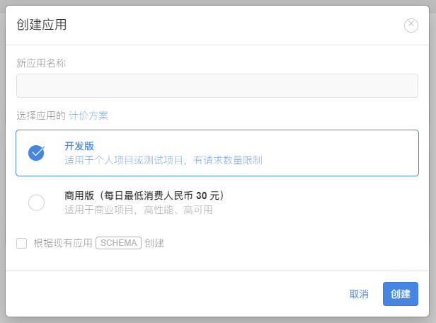

# vuepress评论插件

> vuepress 评论插件

::: v-pre


[原文链接](https://vuepress-theme-hope.github.io/v1/comment/zh/)

## 安装

```bash
npm i -D @mr-hope/vuepress-plugin-comment
```

## 使用

```js
// .vuepress/config.js
module.exports = {
  plugins: [
    [
      "@mr-hope/comment",
      {
        // 插件选项
      },
    ],
  ],
};
```

## 选择你要使用的代码托管平台

Vssue 支持通过 GitHub, Gitlab, Bitbucket 或者 Gitee 的 Issue 系统来为你的静态页面提供评论功能，你可以选择其中之一来使用。

前往 [支持的代码托管平台 - 创建 OAuth App](https://vuepress-theme-hope.github.io/v1/comment/zh/guide/supported-platforms.html) 查看详细指引。

完成这一步之后，你将会配置好一个 OAuth App，并得到对应的 `client id` 和 `client secret`，它们将会用于 Vssue 的使用。

- `owner`: 对应 repository 的拥有者帐号或者团队
- `repo`: 用来存储评论的 repository
- `clientId`: OAuth App 的 `client id`
- `clientSecret`: OAuth App 的 `client secret` (只有在使用某些平台时需要)

### GitHub

指南: [创建 GitHub OAuth App](https://vuepress-theme-hope.github.io/v1/comment/zh/guide/github.html)

#### GitHub REST API V3

- Vssue API 包: [@vssue/api-github-v3(opens new window)](https://www.npmjs.com/package/@vssue/api-github-v3)
- 特点 / 缺点:
  - 需要设置 [clientSecret](https://vuepress-theme-hope.github.io/v1/comment/zh/options/#clientsecret)
  - 评论无法排序
  - 评论可以编辑
  - 评论可以删除
  - 可以不登录浏览评论，但 API 有调用频率限制
- 开发者参考: [官方文档(opens new window)](https://developer.github.com/v3)

#### GitHub GraphQL API V4

- Vssue API 包: [@vssue/api-github-v4(opens new window)](https://www.npmjs.com/package/@vssue/api-github-v4)
- 特点 / 缺点:
  - 需要设置 [clientSecret](https://vuepress-theme-hope.github.io/v1/comment/zh/options/#clientsecret)
  - 评论可以排序
  - 评论可以编辑
  - 评论可以删除
  - 要求登陆后才能浏览评论
- 开发者参考: [官方文档(opens new window)](https://developer.github.com/v4)

### GitLab

指南: [创建 GitLab Application](https://vuepress-theme-hope.github.io/v1/comment/zh/guide/gitlab.html)

#### Gitlab API V4 (Gitlab v11.0+)

- Vssue API 包: [@vssue/api-gitlab-v4(opens new window)](https://www.npmjs.com/package/@vssue/api-gitlab-v4)
- 特点 / 缺点:
  - 评论可以排序
  - 评论可以编辑
  - 评论可以删除
  - 要求登陆后才能浏览评论
- 开发者参考: [官方文档(opens new window)](https://docs.gitlab.com/ce/api)

### Bitbucket

指南: [创建 Bitbucket OAuth Consumer](https://vuepress-theme-hope.github.io/v1/comment/zh/guide/bitbucket.html)

#### Bitbucket API V2

- Vssue API 包 [@vssue/api-bitbucket-v2(opens new window)](https://www.npmjs.com/package/@vssue/api-bitbucket-v2)
- 特点 / 缺点:
  - 评论可以排序
  - 评论可以编辑
  - 评论可以删除
  - 可以不登录浏览评论
  - 不能对评论做出 emoji 响应 (喜欢、点赞、踩 等)
- 开发者参考: [官方文档(opens new window)](https://developer.atlassian.com/bitbucket/api/2/reference)

### Gitee

指南: [创建 Gitee 第三方应用](https://vuepress-theme-hope.github.io/v1/comment/zh/guide/gitee.html)

#### Gitee API V5

- Vssue API 包: [@vssue/api-gitee-v5(opens new window)](https://www.npmjs.com/package/@vssue/api-gitee-v5)
- 特点 / 缺点:
  - 需要设置 [clientSecret](https://vuepress-theme-hope.github.io/v1/comment/zh/options/#clientsecret)
  - 评论无法排序
  - 评论可以编辑
  - 评论可以删除
  - 可以不登录浏览评论，但 API 有调用频率限制
  - 不能对评论做出 emoji 响应 (喜欢、点赞、踩 等)
- 开发者参考: [官方文档](

## 指南

此插件会全局注册评论组件  <CommentService /> 。

推荐将评论组件 ( <CommentService /> ) 插入在  <PageNav /> 组件后。

 <CommentService />  组件默认全局启用。你可以在特定页面的 frontmatter 中设置 `comment: false` 来局部禁用它。

如果你需要保持全局禁用，请在插件选项中设置 `comment` 为 `false`。这样你可以在特定页面的 frontmatter 中设置 `comment: true` 来局部启用它。

有三个评论插件可以选择: Waline、Vssue 和 Valine。

> 评论服务的比较
>
> - Waline 需要后端服务器以及额外的配置，支持页面访问量统计，无需登录账号即可评论。可以使用 Vercel。
> - Vssue 使用代码平台仓库的 issue 面板，需要用户登录或注册相应平台账号。
> - Valine 使用 leancloud，支持页面访问量统计，无需登录账号即可评论
>
> 如果你的站点面向大众而非程序员，推荐使用 Waline；反之推荐 Vssue。

### Waline

欢迎使用 Waline，只需几个步骤，你就可以在你的网站中启用 Waline 提供评论与浏览量服务。

#### LeanCloud 设置 (数据库)

1. [登录 (opens new window)](https://console.leancloud.app/login)或 [注册 (opens new window)](https://console.leancloud.app/register)`LeanCloud 国际版` 并进入 [控制台(opens new window)](https://console.leancloud.app/apps)

2. 点击左下角 [创建应用 (opens new window)](https://console.leancloud.app/apps)并起一个你喜欢的名字 (请选择免费的开发版):

   

3. 进入应用，选择左下角的 `设置` > `应用 Key`。你可以看到你的 `APP ID`,`APP Key` 和 `Master Key`。后续我们会用到这三个值。

   

> 注意
>
> 如果你正在使用 Leancloud 国内版 ([leancloud.cn (opens new window)](https://leancloud.cn/))，我们推荐你切换到国际版 ([leancloud.app (opens new window)](https://leancloud.app/))。否则，你需要为应用额外绑定**已备案**的域名:
>
> - 登录国内版并进入需要使用的应用
> - 选择 `设置` > `域名绑定` > `API 访问域名` > `绑定新域名` > 输入域名 > `确定`。
> - 按照页面上的提示按要求在 DNS 上完成 CNAME 解析。


#### Vercel 部署 (服务端)

[(opens new window)](https://vercel.com/import/project?template=https://github.com/walinejs/waline/tree/main/example)

1. 点击上方按钮，跳转至 Vercel 进行 Server 端部署。

2. 如果你未登录的话，Vercel 会让你注册或登录，请使用 GitHub 账户进行快捷登录。

3. 输入一个你喜欢的 Vercel 项目名称并点击 `Create` 继续:

   

4. 此时会让你创建 Team 账号，这里选择 `Skip` 即可：

   

5. 此时 Vercel 会基于 Waline 模板帮助你新建并初始化仓库，仓库名为你之前输入的项目名。

   

   一两分钟后，满屏的烟花会庆祝你部署成功。此时点击 `Go to Dashboard` 可以跳转到应用的控制台。

   

6. 点击顶部的 `Settings` - `Environment Variables` 进入环境变量配置页，并配置三个环境变量`LEAN_ID`, `LEAN_KEY` 和 `LEAN_MASTER_KEY` 。它们的值分别对应上一步在 LeanCloud 中获得的 `APP ID`, `APP KEY`, `Master Key`。

   

   > 提示
   >
   > 如果你使用 LeanCloud 国内版，请额外配置 `LEAN_SERVER` 环境变量，值为你绑定好的域名。

7. 环境变量配置完成之后点击顶部的 `Deployments` 点击顶部最新的一次部署右侧的 `Redeploy` 按钮进行重新部署。该步骤是为了让刚才设置的环境变量生效。

   

8. 此时会跳转到 `Overview` 界面开始部署，等待片刻后 `STATUS` 会变成 `Ready`。此时请点击 `Visit` ，即可跳转到部署好的网站地址，此地址即为你的服务端地址。

   

#### 客户端

##### 使用插件

在插件选项中设置 `type: 'waline'`，同时设置服务端地址 `serverURL` 为上一步获取到的值。

此时，将 Comment组件放置在你网站中合适的位置 (通常是页面的底部)，即可使用 Waline 评论功能。

> 提示
>
> 你也可以传入其他 Waline 支持的选项 (除了 `el`)。
>
> 详情请见 [Waline 配置](https://vuepress-theme-hope.github.io/v1/comment/zh/config/waline.html)

#### 评论管理 (管理端)

1. 部署完成后，请访问  serverURL组件的/ui/register 进行注册。首个注册的人会被设定成管理员。
2. 管理员登陆后，即可看到评论管理界面。在这里可以修改、标记或删除评论。
3. 用户也通过评论框注册账号，登陆后会跳转到自己的档案页。

- https://gitee.com/api/v5/swagger)

### 使用 Vssue

#### Vssue 配置

本插件通过 Vssue 提供的 [@vssue/vuepress-plugin-vssue (opens new window)](https://www.npmjs.com/package/@vssue/vuepress-plugin-vssue)来帮助你在 VuePress 中快速使用 Vssue。 

#### 使用插件

```js
// .vuepress/config.js

module.exports = {
  plugins: {
    "@mr-hope/comment": {
      type: "vssue",
      // 设置 `platform` 而不是 `api`
      platform: "github",

      // 其他的 Vssue 配置
      owner: "OWNER_OF_REPO",
      repo: "NAME_OF_REPO",
      clientId: "YOUR_CLIENT_ID",
      clientSecret: "YOUR_CLIENT_SECRET",
    },
  },
};
```

 Gitee repository 的 URL 模式为 `https://gitee.com/${owner}/${repo}` 

比如我新建了一个仓库 URL地址为

```http
https://gitee.com/time-doesnt-wait-for-me/vuepress
```

owner：time-doesnt-wait-for-me

repo ：vuepress

#### 使用 Vssue 组件

`Vssue` 已经注册为 Vue 组件，你可以在你的 VuePress Markdown 文件中直接使用它。

```markdown
<!-- README.md -->

# Vssue Demo

<Vssue title="Vssue Demo" />
```

### Valine

借助 Valine，插件实现了无后端开启阅读量展示与评论功能。

#### 获取 APP ID 和 APP Key

请先 [登录 (opens new window)](https://leancloud.cn/dashboard/login.html#/signin)或 [注册 (opens new window)](https://leancloud.cn/dashboard/login.html#/signup)LeanCloud, 进入控制台后点击左下角创建应用。

应用创建好以后，进入刚刚创建的应用，选择左下角的 `设置 > 应用 Key`，然后就能看到你的 `APP ID` 和 `APP Key` 了。

```js
options = {
  type: "valine",
  appId: "...", // your appId
  appKey: "...", // your appKey
};
```

将对应的 `APP ID` 和 `APP Key` 填入， Valine 即配置完成。

Valine 评论的其他配置将在 [配置](https://vuepress-theme-hope.github.io/v1/comment/zh/config/valine.html) 中列出。

> 提示
>
> 更多配置与使用，请见 [Valine 官方文档 (opens new window)](https://valine.js.org/)。

## 常见问题

### 评论区头像无法加载

因为gitee加入了图片防盗链功能，所以无法在外部加载gitee中的图片导致404

修改

node_modules\vssue\src\styles\_new-comment.styl


修改node_modules\vssue\src\styles\_comments.styl


:::


