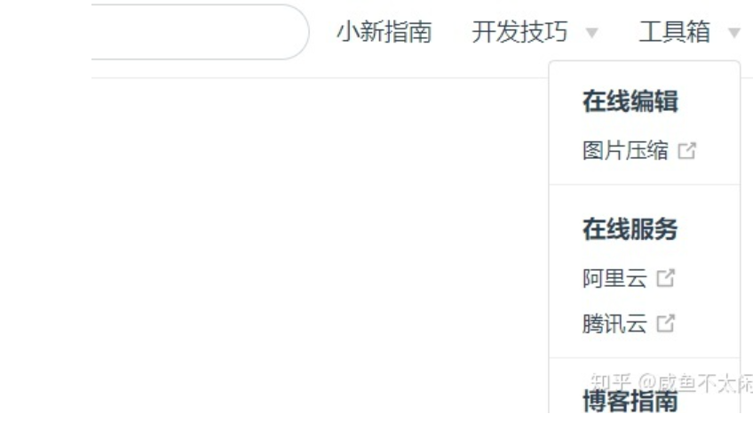

# 十分钟使用VuePress搭建博客中心

## 创建项目

### 创建并进入一个新目录

```bash
mkdir vuepress-starter && cd vuepress-starter
```

或手动创建

### 使用包管理器进行初始化

```bash
yarn init # npm init
```

### 将 VuePress 安装为本地依赖

```bash
yarn add -D vuepress # npm install -D vuepress
```

## 配置项目

### 在当前目录中创建docs目录

> 存放博客书籍内容

```text
mkdir docs
```

### 配置首页显示（以下为默认配置）

> docs下创建README.md

```text
---
home: true
heroImage: /img/logo.jpg
actionText: 快速上手 →
actionLink: /zh/guide/
features:
- title: 简洁至上
  details: 以 Markdown 为中心的项目结构，以最少的配置帮助你专注于写作。
- title: Vue驱动
  details: 享受 Vue + webpack 的开发体验，在 Markdown 中使用 Vue 组件，同时可以使用 Vue 来开发自定义主题。
- title: 高性能
  details: VuePress 为每个页面预渲染生成静态的 HTML，同时在页面被加载的时候，将作为 SPA 运行。
footer: MIT Licensed | Copyright © 2018-present You
--- 
```

### 在docs目录下创建.vuepress目录

```text
cd docs mkdir .vuepress
```

或手动创建

### 创建配置文件config.js

> 整个项目的核心配置文件，所有菜单、栏目相关的配置均配置在该模块中

```text
touch config.js
```

或手动创建

### 在config.js中加入内容

```js
module.exports = {
    title: '文档CMS',
    description: '文档管理中心',
    dest: './dist',
    port: '7777',
    head: [
        ['link', {rel: 'icon', href: '/logo.jpg'}]
    ],
    markdown: {
        lineNumbers: true
    },
    themeConfig: {
        nav: [{
            text: '小新指南', link: '/guide/'
        }],
        sidebar: {'/guide/':[
            {
                  title:'新手指南',
                  collapsable: true,
                  children:[
                    '/guide/notes/one',
                  ]
                },
                {
                  title:'文档CMS',
                  collapsable: true,
                  children:[
                    '/guide/notes/two',
                  ]
                }
            ]
        },
        sidebarDepth: 2,
        lastUpdated: 'Last Updated',
        searchMaxSuggestoins: 10,
        serviceWorker: {
            updatePopup: {
                message: "有新的内容.",
                buttonText: '更新'
            }
        },
        editLinks: true,
        editLinkText: '在 GitHub 上编辑此页 ！'
    }
}
```

### 在**vurepress-blog**目录下直接运行调试

```text
vuepress dev docs
```

### **导航栏配置**

- nav顶部导航栏配置

config.js中的themeConfig配置项nav单独拿出来配置

```text
touch nav.js
```

- 编辑nav.js

```js
module.exports = [
    {
        text: '小新指南', link: '/guide/'
    },
    {
        text: '开发技巧', link: '/dev/',
		items: [
            {text: '初级篇', link: '/dev/zero/'},
            {text: '进阶篇', link: '/dev/high/'},
        ]
    },
    {
        text: '工具箱',
        items: [
			{
                text: '在线编辑',
				items: [
					{text: '图片压缩', link: 'https://tinypng.com/'}
				]
            },
			{
                text: '在线服务',
				items: [
					{text: '阿里云', link: 'https://www.aliyun.com/'},
					{text: '腾讯云', link: 'https://cloud.tencent.com/'}
				]
            },
			{
                text: '博客指南',
				items: [
					{text: '掘金', link: 'https://juejin.im/'},
					{text: 'CSDN', link: 'https://blog.csdn.net/'}
				]
            }
        ]
    }
]
 
```

- 修改config.js中nav链接

```js
themeConfig: {     
  	nav: require("./nav.js"),
  	...
}
```

- 重新启动下看下效果



### **侧边栏配置**

sidebar是左侧标题导航，可以指定配置也可以设置为auto

- 主侧边栏配置，在.vuepress目录下，sidebar.js，分发指向不同的栏目侧边栏js

```js
module.exports = {
	'/guide/': require('../guide/sidebar')
}
```

- config.js中sidebar配置

```text
sidebar: require("./sidebar.js")
```

- 以为小新指南模块为例，/docs/guide/sidebar.js文件内容

```js
module.exports = [
		{
		  title:'小新指南',
		  collapsable: true,
		  children:[
			'/guide/notes/one',//指向md文档
		  ]
		},
		{
		  title:'进阶',
		  collapsable: true,
		  children:[
			'/guide/notes/two',
		  ]
		}
	]
```

- guide/notes/one two就是具体的md文档，编写one.md

```text
# 一级标题 
## 二级标题 
### 三级标题 
#### 四级标题
```

- 呈现效果


### **静态资源配置**

- vuepress目录下public目录，vuepress程序默认的图片目录是/docs/.vuepress/public
  ---.vuepress
  ------public
  ---------css
  ------------styles.css
  ---------img
  ------------logo.jpg
- 在config.js中引入

```js
head: [
        ['link', {rel: 'icon', href: '/img/logo.jpg'}],
        ['link', {rel: 'stylesheet', href: '/css/style.css'}],
		['script', {chartset: 'utf-8', src: '/js/main.js'}]
],
```


## **typora编写**

平常使用typora编写Markdown文档较多，编写后如何部署到vuepress中。

1. 文件-偏好设置，设置图片的相对路径

   

2. 文档编写完成后，md文档连同图片文件夹拷贝到vuepress需要显示的位置。如果想要在首页显示，直接放在README.MD处，名称替换为README

3. 调试运行会有问题，不能会正常编译

4. 安装一下包，用于处理图片路径问题

   ```js
   npm i markdown-it-disable-url-encode
   npm i mdurl
   ```

5. 注入到vuepress配置文件中，.vuepress/config.js

   ```js
   module.exports = {
     // .....
     markdown: {
       // ......
       extendMarkdown: md => {
         md.use(require("markdown-it-disable-url-encode"));
       }
     }
   };
   ```

   

## 部署

```text
vuepress build docs
```

```nginx
location /{
            #配置博客项目
            alias //www/wwwroot/vuepress/dist;#项目地址
            try_files $uri $uri/ /index.html;#后台路由管理
            #try_files $uri $uri/ /index.html;
            index index.html index.htm;
        }
```

## 我的源码

我已经上传的我的源码到svn，拉取之后可以直接build部署服务器

想拉取请关注公众号：时不待我

并回复：vuepress源码即可获取


<script>
export default {
    mounted () {
      this.$page.lastUpdated = "2022/3/34 下午14:09:09";
    }
  }
</script>