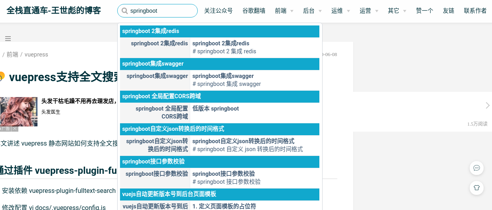

# 集成全文搜索插件

> vuepress集成全文搜索插件

## 安装依赖 

vuepress-plugin-fulltext-search 

```bash
 npm i vuepress-plugin-fulltext-search
```

## 修改配置

 vi docs/.vuepress/config.js

```javascript
  module.exports = {
  // ...
  plugins: ['fulltext-search'],
  }
```

搜索效果如下, 展示效果和 algolia 相似



## [官方文档](https://github.com/leo-buneev/vuepress-plugin-fulltext-search)

## 移动端适配问题

修改vuepress-plugin-fulltext-search源码components文件夹SearchBox.vue

```css
@media (max-width: $MQMobile)
  .search-box
    margin-right 0
    input
      left 1rem
    .suggestions
      min-width 300px//加入
      right 0
```

