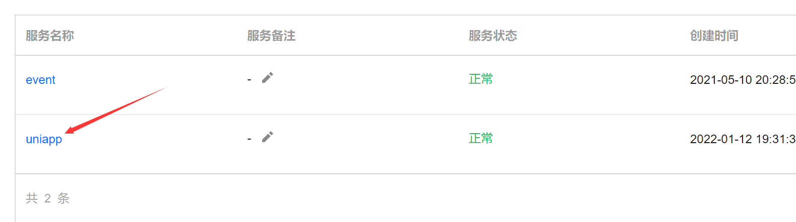
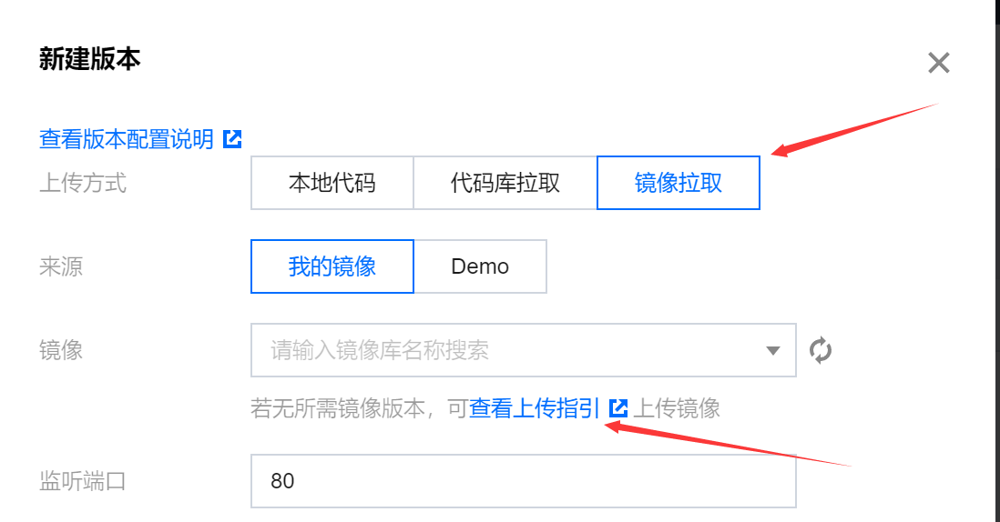
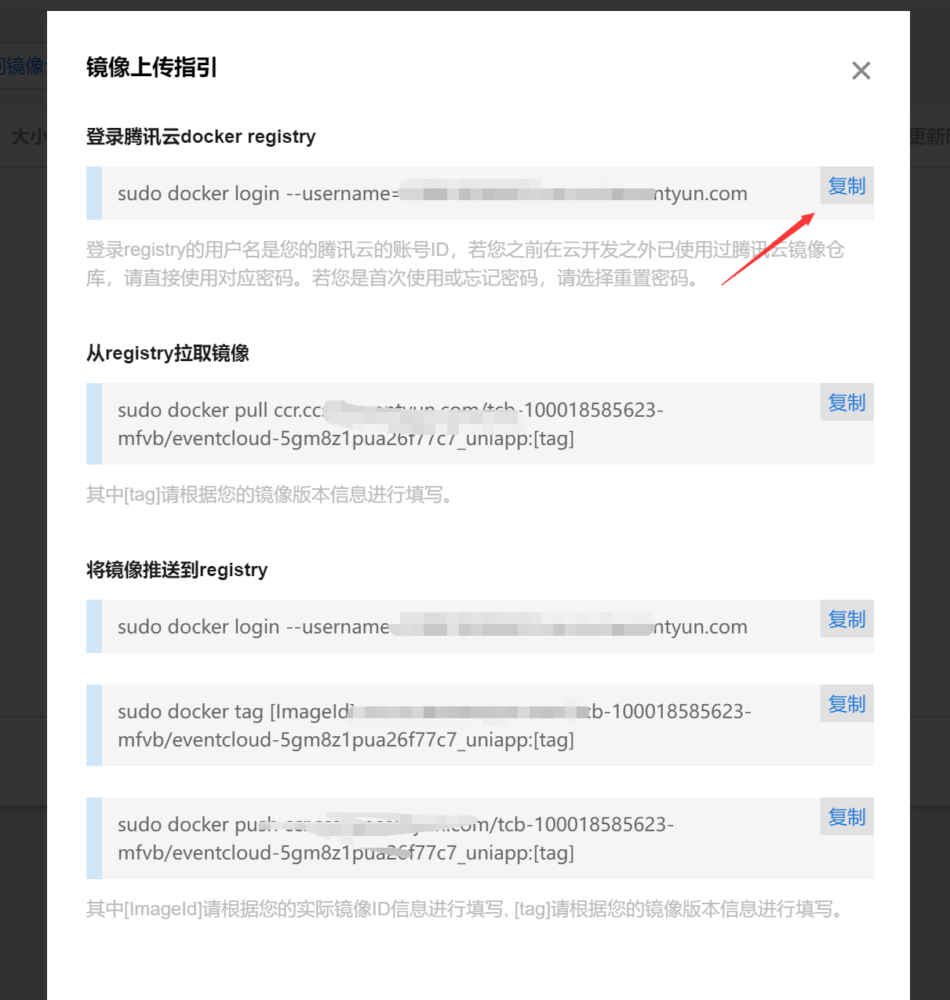
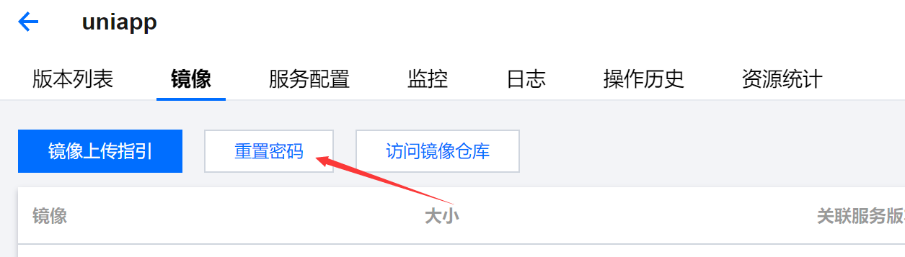
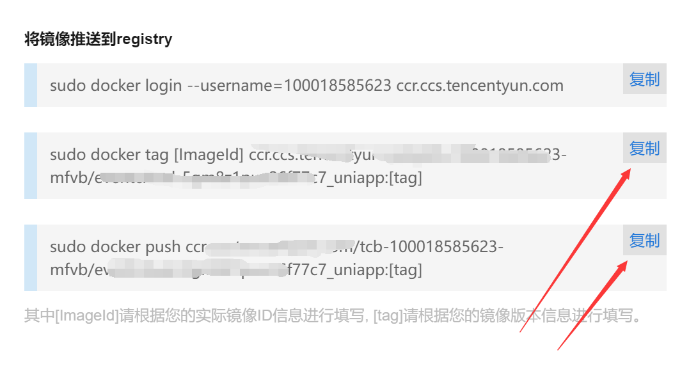
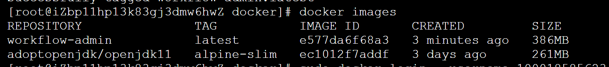
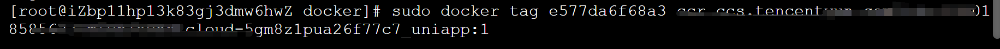
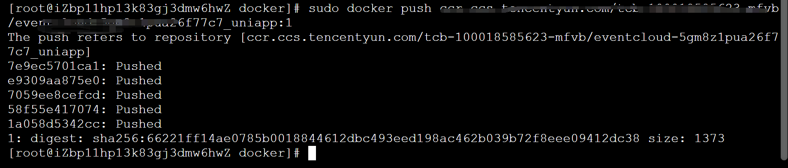
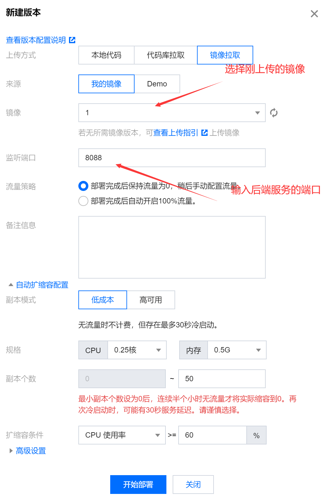
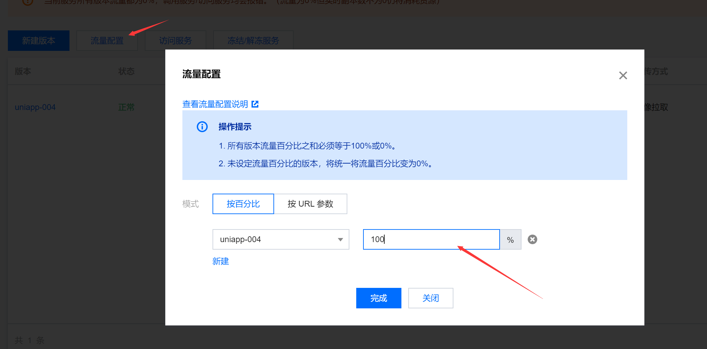

# 旧版云托管发布指南

> 重要！请事先保证镜像可以独立运行！镜像运行都报错是肯定部署失败的

## 镜像上传指引

### 点击服务名

### 点击新建版本

1. 点击镜像拉取
2. 查看上传指引

### 服务器输入命令登陆腾讯云仓库

登陆 **腾讯云docker registry** 

### 输入账号密码

忘记了可以点击

出现Login Succeeded则登陆成功

###  **将镜像推送到registry** 

[imageld]：镜像id

[tag]：版本号 第一版为1或1.1 随意  但不可重复

需修改成自己的镜像信息

如：

### 发布成功

### 部署

### 测试是否成功

配置流量

点击访问服务，将页面url复制到postman加入服务器接口地址请求接口

